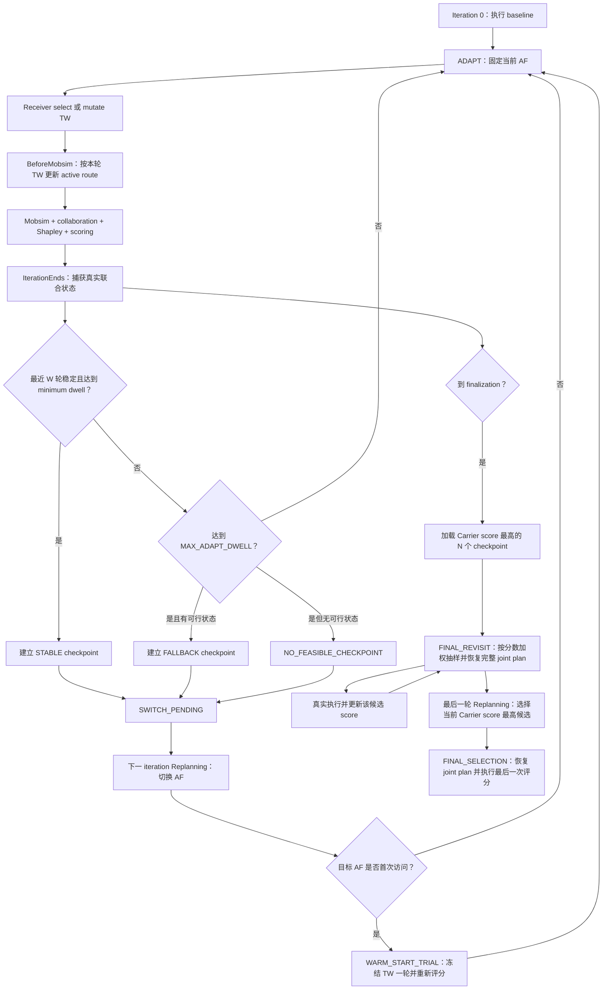
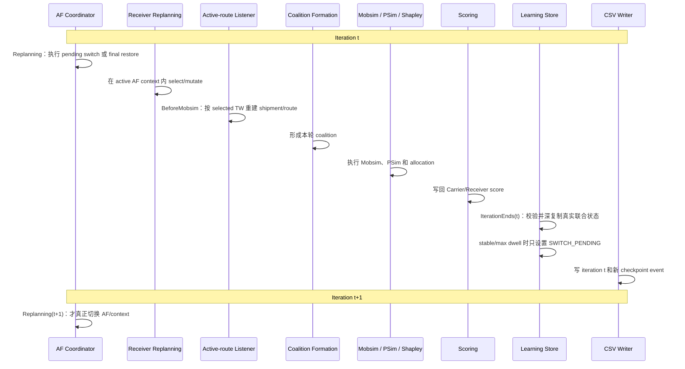

# Mutable Allocation Factor 协同学习机制技术文档

## 1. 文档目的

本文说明 `xp-collaboration` 中 mutable Allocation Factor（以下简称 AF）的完整实现。读者不需要先阅读 Java 源码，也应能回答以下问题：

- 为什么需要让 Carrier 内生选择 AF；
- Carrier 改变 AF 与 Receiver 放宽 Time Window（TW）之间如何形成反馈；
- 一个 AF 为什么必须停留若干 iteration；
- 什么状态可以保存为 checkpoint，什么状态绝对不能保存；
- 稳定解、探索 fallback 和 baseline fallback 有什么区别；
- Carrier、Receiver、route、Shapley allocation 和 score 在一个 iteration 中按什么顺序更新；
- 如何配置、运行和解释三个 mutable-only CSV；
- 为什么现有 fixed-AF Runs 不受影响。

当前实现的唯一运行入口是：

```text
org.matsim.contrib.freightcollaboration.run.RunMutableAfCollabReceiverDistantCarrier
```

实现位于 `codex/mutableAf` 分支。已有 fixed-AF `Run*.java` 没有接入本机制。

---

## 2. 经济目标与结果边界

### 2.1 要表达的机制

核心命题是：

> Carrier 提高 AF，相当于把更大比例的合作收益让给 Receiver。更有吸引力的报价可能诱导更多 Receiver 合作，或诱导 Receiver 放宽更大的 TW；由此产生的总成本节约可能大幅增加，使 Carrier 即使降低自身分成比例，也获得更高的绝对收益。

简化地写，某个 AF 下：

```text
Receiver 获得的 transfer = AF × Receiver 的 Shapley contribution
Carrier 保留的收益       = (1 - AF) × 总 Shapley value
```

AF 只直接改变收益分配；Receiver 随后的计划选择才会使 coalition、shipment、VRP route 和总 surplus 发生变化。因此 Carrier 不能用一次 iteration 判断 AF 的长期质量，而必须让 Receiver 在固定报价下适应一段时间。

### 2.2 学到的是什么

实现寻找的是：

> AF 条件下，Carrier–Receiver 在 MATSim 有限计划记忆、有限迭代和随机 replanning 中得到的可恢复局部响应状态。

当该状态通过操作性的滑动窗口判定时，输出称为 `STABLE_CHECKPOINT`。这不等于数学上已证明的全局 Stackelberg equilibrium，也不保证找到同一 AF 下所有局部均衡。

### 2.3 三种最终决策口径

默认机制保持 Carrier 内生选择 AF 的含义：最大化 Carrier 相对 baseline 的 gain。为了做 benchmark，还提供 Receiver welfare 和系统 surplus 两种口径：

| 配置值 | 目标 | 经济解释 |
|---|---|---|
| `carrier-best` | 最大化 Carrier gain | Carrier 自利报价，默认 |
| `receiver-best` | 最大化所有相关 Receiver aggregate gain | Receiver welfare benchmark |
| `best-surplus` | 最大化 realized cost savings | social-planner / system benchmark |

后两种属于协调者实验，不应解释为 Carrier 单方面的最优决策。

---

## 3. 与 fixed-AF 路径的隔离

### 3.1 Opt-in 原则

只有新 Run 才把 `MutableAllocationFactorConfigGroup` 加入 MATSim Config，并绑定 mutable-only 组件。没有该 ConfigGroup 的普通 Run 仍使用：

- `FreightCollaborationConfigGroup.ALLOCATION_FACTOR` 固定值；
- 原 allocation factory 路径；
- 原 Receiver-triggered Carrier replanning listener；
- 原 scoring factory；
- 原输出格式。

### 3.2 新 Run 的专用绑定

`RunMutableAfCollabReceiverDistantCarrier` 绑定：

```java
bind(CarrierStrategyManager.class)
    .toProvider(new MutableAfCarrierStrategyManagerProvider(mutableConfig));
bind(ReceiverStrategyManager.class)
    .to(MutableAfReceiverStrategyManager.class);
bind(MutableAfLearningStore.class).asEagerSingleton();
bind(CarrierScoringFunctionFactory.class)
    .to(MutableAfCarrierScoringFunctionFactory.class);

addControlerListenerBinding().to(MutableAfReplanningCoordinator.class);
addControlerListenerBinding().to(PreservingReceiverTriggeredCarrierReplanningListener.class);
addControlerListenerBinding().to(MutableAfLearningListener.class);
addControlerListenerBinding().to(MutableAllocationFactorStatsListener.class);
```

Carrier 的普通 MATSim replanning manager 在 mutable Run 中只执行 `KeepSelected`。AF 决策由联合状态 coordinator 负责，避免两个独立策略同时修改 Carrier plan memory。

### 3.3 明确不修改的模块

- 不修改 `contribs/freightreceiver` 的默认 listener 或策略；
- 不改变 fixed allocation 的构造器和 factory 语义；
- 不改变 `collaboration_data.xml` schema；
- 不修改 fixed-AF Run 的 CLI、默认值或输出。

共享 `CollaborationDataStore` 只增加了 iteration stamp，用于 mutable snapshot 的一致性验证；普通路径的 allocation 数值和输出不变。

---

## 4. 总体状态机

### 4.1 当前状态

```java
enum MutableAfPhase {
    BASELINE,
    ADAPT,
    SWITCH_PENDING,
    WARM_START_TRIAL,
    FINAL_REVISIT,
    FINAL_SELECTION
}
```

旧版的 `EVALUATE` 已从运行状态机删除。

### 4.2 整体流程



### 4.3 为什么删除重复 EVALUATE

旧流程在 ADAPT 判断稳定后，会拼出每个 Receiver 各自的 incumbent，冻结三轮再验证。这有两个问题：

1. 各 Receiver 的 individual best 可能来自不同 iterations，组合后是一个从未共同执行过的 TW profile；
2. 三轮固定 EVALUATE 重复运行 PSim/Shapley，成本较高，却没有增加行为探索信息。

新流程把“最近 W 个完整执行 iterations 是否稳定”作为证据。checkpoint 直接选自其中一个已经实际共同执行的 iteration，因此无需额外 EVALUATE。

---

## 5. 一个 iteration 的严格时间语义



### 5.1 关键不变量

`IterationEnds(t)` 可以创建 checkpoint 和设置 `SWITCH_PENDING`，但不得：

- 改变 Carrier selected plan；
- 改变 Receiver selected plan；
- 切换 factor；
- 恢复其他 context；
- 清空 score。

所有 plan/context 切换只发生在下一 iteration 的 Replanning 开头。

### 5.2 Listener priority

关键 priority：

| Listener | Priority | 作用 |
|---|---:|---|
| `MutableAfReplanningCoordinator` | `200` | 在 Receiver replanning 前执行 switch/final restore |
| `PreservingReceiverTriggeredCarrierReplanningListener` | `100` | BeforeMobsim 更新 active route |
| `FormFreightCoalitionListener` | `-10` | route 和 Receiver plans 就绪后形成 coalition |
| `MutableAfLearningListener` | `100` | IterationEnds 先捕获 score/allocation |
| 默认 Receiver reset | `0` | 之后清理临时 allocation |
| `MutableAllocationFactorStatsListener` | `-100` | 最后读取 immutable store 输出 |

---

## 6. 真实执行 Observation 与 Snapshot

### 6.1 `ExecutedJointObservation`

每个 post-baseline iteration 在 `IterationEnds` 生成轻量 observation：

```java
record ExecutedJointObservation(
    int executionIteration,
    int capturedAtIteration,
    Id<Carrier> carrierId,
    int factorIndex,
    int visit,
    double carrierScore,
    Map<Id<Receiver>, Double> receiverScores,
    double receiverAggregateScore,
    Set<Id<Receiver>> collaboratingReceivers,
    double totalSurplus,
    double signedTransfer,
    String executedReceiverProfileHash,
    String carrierRouteProfileHash,
    boolean participationFeasible
) {}
```

它用于稳定性统计、选择 objective 和诊断输出。

### 6.2 `ExecutedJointSnapshot`

可恢复 snapshot 在 observation 基础上增加：

```java
record ExecutedJointSnapshot(
    ExecutedJointObservation observation,
    double allocationFactor,
    List<ScheduledTour> carrierTours,
    Map<Id<Receiver>, ReceiverPlan> selectedReceiverPlans
) {}
```

构造时立即深复制：

- `ScheduledTour` 和内部 `Tour`；
- Receiver plan；
- TW、orders、products/carrier association；
- attributes；
- score。

后续 Receiver TW mutation、Carrier route replacement 或 plan removal 不会修改 checkpoint。

### 6.3 捕获前 fail-fast

创建 snapshot 前必须满足：

```java
selectedCarrierPlan != null
selectedCarrierPlan.factorIndex == activeFactorIndex
selectedCarrierPlan.score is finite
```

对每个 Receiver：

```java
selectedReceiverPlan != null
selectedReceiverPlan.contextFactorIndex == activeFactorIndex
selectedReceiverPlan.score is finite
selectedReceiverPlan.pendingEvaluation == false
```

还验证：

- Carrier plan 保存的 route profile 与本轮 selected Receiver profile 完全一致；
- `CollaborationDataStore.collaborationResultIteration == executionIteration`；
- 若本轮存在 active Carrier–Receiver coalition，必须存在本轮 PSim 生成的 characteristic function；
- active coalition 必须记录实际使用的 per-coalition AF，缺失记录不能按 `0` 或固定 AF 继续；
- mutable allocation 实际使用的 AF 与 active Carrier plan AF 一致；
- 同一 Carrier 的 `executionIteration` 严格递增。

任何不一致都抛出明确异常，不允许用旧 iteration 数据静默建立 checkpoint。

### 6.4 Profile hash 的含义

- `executedReceiverProfileHash`：Receiver ID、TW 和 order 行为签名的 hash；
- `carrierRouteProfileHash`：Carrier route 标记所对应的 Receiver profile hash。

两个 hash 用于诊断“Receiver 已变但 route 未更新”的错误。它们不是稳定性硬门槛。

---

## 7. 稳定性判定

### 7.1 Sliding window

每个 Carrier 当前 AF visit 维护最近 `W` 个真实 snapshot：

```java
Deque<ExecutedJointSnapshot> recent;
```

超过 `STABILITY_WINDOW` 后删除最旧项。AF 切换或同 AF 开启新 visit 时清空，绝不会把旧 visit observations 混入当前窗口。

### 7.2 相对波动

对 Carrier score 和 Receiver aggregate score 分别计算：

```java
relativeRange = Math.abs(max - min)
    / Math.max(1.0, Math.max(Math.abs(max), Math.abs(min)));
```

该公式同时处理：

- 正 score；
- 负 score；
- 接近 0 的 score，避免分母爆炸。

### 7.3 Receiver aggregate

```java
receiverAggregateScore = assignedReceiverIds.stream()
    .mapToDouble(id -> selectedPlanScore(id))
    .sum();
```

包含该 Carrier 的全部固定 Receiver 集合，而不是只对本轮合作者求和。因此不同 coalition size 的结果仍可比较。

### 7.4 Coalition 组成相似度

不再要求窗口内 `collaboratingReceivers` 完全相同。设窗口内各轮合作集合为
`C1 ... Cw`，定义：

```java
coalitionSimilarity = size(intersection(C1 ... Cw))
    / (double) size(union(C1 ... Cw));
```

若所有集合都为空，相似度定义为 `1.0`。默认要求：

```text
coalitionSimilarity >= COALITION_STABILITY_THRESHOLD = 0.70
```

这表示窗口内至少 70% 的“曾经参与合作的 Receiver”在每一轮都持续合作。少量 Receiver
进出不会阻止收敛，但持续轮换的 coalition 不会被误判为稳定。TW profile 可以继续有小变化，
它仅通过 score 和 coalition 结果间接影响稳定性。

### 7.5 Surplus 只做诊断

窗口仍记录 surplus 的 mean、min、max 和 sample variance，但 surplus 波动不是稳定硬门槛。原因是低 jsprit budget 和多次 PSim VRP 求解可能给 surplus 带来更明显的数值噪声。

### 7.6 完整条件

```java
stable = dwell >= effectiveMinimumDwell
    && window.size() == STABILITY_WINDOW
    && carrierRelativeRange <= tolerance
    && receiverRelativeRange <= tolerance
    && coalitionSimilarity >= coalitionThreshold
    && receiverParticipationFeasibleInEveryWindowIteration;
```

其中：

```text
首次访问：effective minimum = max(NEW_FACTOR_MIN_DWELL, STABILITY_WINDOW)
重访：    effective minimum = max(REVISIT_FACTOR_MIN_DWELL, STABILITY_WINDOW)
```

---

## 8. 参与约束

Observation 进入选择器之前先判定：

```text
Carrier score >= Carrier iteration-0 baseline
每个实际合作 Receiver score >= 该 Receiver iteration-0 baseline
```

比较允许 `PARTICIPATION_RELATIVE_TOLERANCE`：

```java
scale = max(1.0, abs(value), abs(baseline));
feasible = value + tolerance * scale >= baseline;
```

未合作 Receiver 不进入 collaboration participation constraint，但仍计入 aggregate welfare 和 CSV gain。

稳定窗口额外要求窗口内每一轮都没有合作 Receiver participation violation。Carrier 的
participation constraint 不作为窗口稳定性的硬门槛，但被提升为 checkpoint 的具体真实状态仍须同时
满足 Carrier 与合作 Receiver 的完整参与约束；否则继续 ADAPT，并在 max dwell 时按可行状态 fallback。

若一个 visit 中没有任何可行 observation，则到 max dwell 时：

```text
maturity = NO_FEASIBLE_CHECKPOINT
decision = MAX_DWELL_NO_FEASIBLE_SOLUTION
```

不会创建可用于最终选择的 checkpoint。

---

## 9. 统一方案选择器

### 9.1 Objective

`MutableAfSolutionSelector` 使用 baseline-aware metrics：

```java
carrierGain = carrierScore - carrierBaseline;

receiverAggregateGain = sum(
    receiverScore(receiver) - receiverBaseline(receiver)
);

selectionSurplus = fullCoalitionScore - emptyCoalitionScore;
```

mutable v1 只支持 `COST_SAVINGS`，因此 `selectionSurplus` 明确定义为越大表示 realized cost savings 越大。不能直接把 PSim 原始 full-coalition score 当作 surplus。

### 9.2 同一 comparator 的使用范围

统一 selector 同时用于：

- max-dwell visit fallback；
- finalization 未完成 visit 的 fallback；
- 同 AF、同 maturity checkpoint 更新；
- exploitation quality；
- eviction protection；
- 最终方案选择。

这防止学习过程中按 Carrier score 利用，最后却突然按 surplus 选结果。

### 9.3 确定性 tie-break

先过滤 `participationFeasible=false`，再依次比较：

1. configured objective，降序；
2. minimum Receiver gain，降序；
3. Carrier gain，降序；
4. Receiver aggregate gain，降序；
5. surplus，降序；
6. source iteration，较新优先；
7. factor grid index，较小优先。

相同 seed 和输入会得到相同选择。

---

## 10. Checkpoint

### 10.1 数据结构

```java
record FactorCheckpoint(
    int factorIndex,
    double factor,
    int visit,
    int sourceIteration,
    CheckpointReason reason,
    FactorMaturity maturity,
    MutableAfSelectionPolicy selectionPolicy,
    ExecutedJointSnapshot executedState,
    WindowStatistics windowStatistics,
    double objectiveValue,
    boolean participationFeasible
) {}
```

`sourceIteration` 必须等于 snapshot 的 `executionIteration`。

### 10.2 Reason

| Reason | 何时产生 |
|---|---|
| `STABLE_WINDOW` | 最近 W 轮满足稳定条件 |
| `MAX_DWELL_FALLBACK` | 达到 max dwell，选择本 visit 最佳可行真实状态 |
| `FINALIZATION_FALLBACK` | finalization 时结算尚未完成的 visit |

### 10.3 Maturity

| Maturity | 含义 |
|---|---|
| `UNVISITED` | 从未访问 |
| `ADAPTING` | 当前或历史 visit 尚在适应 |
| `STABLE_CHECKPOINT` | 通过滑动窗口判定 |
| `FALLBACK_CHECKPOINT` | 可行但未证明行为稳定 |
| `NO_FEASIBLE_CHECKPOINT` | visit 内没有参与可行状态 |
| `EVICTED` | live plan/context 已淘汰，只保留轻量统计 |

### 10.4 Stable checkpoint 的 source

窗口稳定时：

- 若当前 iteration 可行，直接保存当前真实状态；
- 若当前 iteration 不可行，在稳定窗口的可行 snapshots 中用统一 selector 选择；
- 窗口没有可行 snapshot，则继续 ADAPT，直到 max dwell 或出现可行状态。

不会把各 Receiver individual best 拼接。

### 10.5 Max dwell fallback

每轮只维护一个 `visitBest` 深 snapshot。达到 `MAX_ADAPT_DWELL` 时：

```java
if (visitBest != null) {
    createCheckpoint(MAX_DWELL_FALLBACK, FALLBACK_CHECKPOINT);
} else {
    maturity = NO_FEASIBLE_CHECKPOINT;
}
phase = SWITCH_PENDING;
```

无需永久保存 visit 内所有 15 个深 snapshot。

### 10.6 同 AF 更新优先级

```text
STABLE_CHECKPOINT > FALLBACK_CHECKPOINT
```

- 新 stable 总能替换旧 fallback；
- 新 fallback 不能覆盖旧 stable；
- stable 对 stable、fallback 对 fallback 时，用配置的统一 policy 保留更优者；
- 每个 checkpoint 事件都会立即写 CSV，即使它最终没有成为 retained checkpoint。

---

## 11. Carrier 与 Receiver 的有限记忆

### 11.1 Carrier live memory

严格不变量：

```text
一个 Carrier + 一个 AF grid index
→ 最多一个 live CarrierPlan
```

内部使用整数 `gridIndex`，而不是 `double`，避免 `0.7` 与 `0.7000000001` 被当成两个 AF。

`CarrierPlan.getScore()` 只是最近一次执行分数。AF 的可比较长期质量来自 checkpoint objective，不从任意 live plan score 推导。

Checkpoint 是 learning-store snapshot，不是第二个 MATSim CarrierPlan。

### 11.2 Receiver AF context

Receiver 活动 memory 只包含当前 AF 的 plans，以及一个受保护 outside option。每个 plan 带：

```text
mutableAf.gridIndex
mutableAf.contextGeneration
mutableAf.outsideOption
```

不同 AF 下的 score 不会放入同一个选择集合比较。

### 11.3 Receiver replanning

`MutableAfReceiverStrategyManager` 在 `ADAPT` 中使用：

```text
ExpBeta-like selection：0.7
TW upper-bound mutation：0.3
mutation step：1 hour
```

约束：

- TW lower bound 不变；
- TW upper bound 不得低于 immutable original upper bound；
- outside option 不得删除；
- 先删除相同行为签名的低分重复计划；
- 再删除最低分的非 selected、非 outside plan；
- 默认每 Receiver/AF 最多 5 plans；
- 默认 listener 传入 cumulative Receiver collection 时，按 `iteration + receiverId` 去重。

### 11.4 Revisit

重访已有 AF 时：

1. archive outgoing AF context；
2. 激活目标 live CarrierPlan；
3. 若有 checkpoint，恢复其 tours；
4. 恢复目标 AF 自己的 Receiver context；
5. 把 checkpoint 中真实共同执行的 selected Receiver plans 合并为 target context 的 selected 候选；
6. phase 直接进入 `ADAPT`。

重访不需要 `WARM_START_TRIAL`，因为这些 score 本来就是目标 AF 下获得的。

---

## 12. 首次访问 AF 的 WARM_START_TRIAL

### 12.1 为什么需要

首次访问新 AF 时，Carrier 希望复用 outgoing AF 已学到的 TW 行为；但 outgoing score 不能作为新 AF 的真实质量参与 Receiver selection。

解决方式是一轮冻结试运行：

```text
旧 AF selected TW
→ 深复制为新 AF context warm-start
→ Replanning 阶段暂时保留有限旧 score，避免默认 listener 拆箱 null
→ Receiver 一轮不 select/mutate/remove
→ BeforeMobsim 清空临时 score
→ 用新 AF 完整执行 collaboration/allocation/scoring
→ IterationEnds 得到新 AF 真实 score，清除 pending
→ 下一轮进入 ADAPT
```

### 12.2 Pending attributes

```text
mutableAf.pendingEvaluation = true
mutableAf.sourceFactorIndex = outgoing grid index
```

`mutableAf.gridIndex` 始终是目标 AF。

Pending plan：

- 不能参与 Receiver selection；
- 不能成为 incumbent；
- 不能进入稳定窗口 checkpoint；
- 不能参与 AF quality；
- 必须在 BeforeMobsim 被清空临时 score，并在本轮 scoring 后得到有限新 score。

### 12.3 Route 可复用

即使 AF 已变化，只要 warm-start TW profile 与 active plan 记录的 route profile 相同，Carrier route 可以复用，不必再次调用 jsprit。

这不影响 trial 的真实性：

```text
TW 不变 + route 不变 + AF 改变
→ allocation 使用新 AF
→ Carrier/Receiver signed transfer 和 score 仍会变化
```

普通 Receiver replanning interval 不得跳过 warm trial。即使本轮不 normally due，也会执行 shipment/route handling。

---

## 13. VRP 更新规则

`PreservingReceiverTriggeredCarrierReplanningListener` 只更新 selected active plan：

```java
String profile = selectedReceiverProfile(carrier, receivers);

if (profile.equals(previousProfile)
        && !active.getScheduledTours().isEmpty()) {
    reuseRoute();
} else {
    CarrierPlan solved = routeSolver.solve(carrier, scenario);
    replaceToursOnly(active, solved);
    active.setScore(null);
    active.attributes.routeProfile = profile;
}
```

规则：

- dormant AF plans 的 tours、score、attributes 不变；
- 每个需要更新的 Carrier 每轮最多 solve 一次；
- route/profile 不匹配必须 solve；
- tours 深复制，不共享可变 `Tour`；
- warm trial 即使 route 复用，也必须标记已经进入真实执行。

新 Run 启动 Controller 之前先生成 initial route 和唯一 initial-AF CarrierPlan，因此 `CollaborationDataStore` 初始化时 selected plan 已存在，不再出现 `selected plan might be null` 警告。

---

## 14. 探索、利用与淘汰

### 14.1 探索概率

```java
coverage = 1.0 - retainedFactorCount / (double) maxFactorPlans;

pExplore = clamp(
    MIN_EXPLORATION_PROBABILITY,
    MAX_EXPLORATION_PROBABILITY,
    MUTATION_WEIGHT * coverage
);
```

Memory 较空时倾向探索；满后仍保留最低探索概率。

### 14.2 探索动作

- 只选择当前 grid index 的相邻点；
- 内部点左右等概率；
- 边界只有一个合法方向；
- 邻居已 retained 时直接重访；
- 邻居未 retained 时创建新 factor plan；
- 如果 memory 满，先寻找合法淘汰对象。

### 14.3 利用动作

候选优先级：

1. 其他 retained `STABLE_CHECKPOINT`；
2. 若没有 stable，使用 retained `FALLBACK_CHECKPOINT`；
3. 两者都没有则强制探索。

Softmax 输入是当前 selection policy 的 checkpoint objective：

```java
normalized = (objective - minObjective) / (maxObjective - minObjective);
weight = exp(EXPLOITATION_BETA * (normalized - 1.0));
```

### 14.4 淘汰

保护对象：

- 当前 policy 下最优可行 stable checkpoint；
- 若无 stable，则保护最优可行 fallback checkpoint。

其余按以下顺序从差到好淘汰：

1. `NO_FEASIBLE_CHECKPOINT` / 无成熟 checkpoint；
2. fallback；
3. stable；
4. 同 tier objective 较低；
5. 更久未访问；
6. grid index 较小的确定性顺序。

被淘汰后删除：

- live CarrierPlan；
- Receiver context；
- 当前 ADAPT 使用的活动 plans。

仍保留：不可变 checkpoint snapshot、visits、checkpoint count、最后 objective/source/reason、
last visited、maturity 等摘要，历史 CSV 事件也不会删除。保留 checkpoint snapshot 是新的
`FINAL_REVISIT` 所必需的：即使某 AF 的 live plan 早已被淘汰，最后阶段仍可从 checkpoint
重建它。Carrier 的 MATSim plan memory 始终受 `MAX_FACTOR_PLANS` 限制；checkpoint archive
不等同于 live plan memory。

---

## 15. FINAL_REVISIT 与 FINAL_SELECTION

### 15.1 起始 iteration

```java
finalizationIteration = firstIteration
    + round((lastIteration - firstIteration)
        * DISABLE_INNOVATION_FRACTION);
```

默认 `0..100`、fraction `0.9`，在 Replanning(90) 开始 finalization。此时最新可用 observation 来自 IterationEnds(89)，Iteration 90 的 Receiver mutation 尚未发生。

### 15.2 结算当前 visit

如果当前 phase 仍是 `ADAPT`：

- 有 `visitBest`：建立 `FINALIZATION_FALLBACK`；
- 无可行 visitBest 且本 AF 无 checkpoint：标记 `NO_FEASIBLE_CHECKPOINT`。

然后才建立 final-revisit candidate pool。

### 15.3 候选池

从全部仍有不可变 snapshot 的 participation-feasible checkpoints 中，按 checkpoint 创建时的
Carrier score 降序选取最多 `MAX_FACTOR_PLANS` 个。这里包含 stable 和 fallback checkpoint；
最后阶段的目标是让 Carrier 在已经探索过的联合方案之间再次比较，而不是继续生成新方案。

选中的 checkpoint 被重建为 Carrier plan memory：

```text
一个 checkpoint factor -> 一个 CarrierPlan
Carrier plans 数量 <= MAX_FACTOR_PLANS
```

若没有任何可行 checkpoint，候选池只包含 iteration-0 baseline。

### 15.4 FINAL_REVISIT

从 finalization iteration 到 last iteration 之前，每轮执行：

1. 停止新 AF exploration；
2. Receiver strategy 完全 no-op，不 mutation、不 select、不创建 context plan；
3. 根据每个候选最新 Carrier score 计算 normalized softmax 权重；
4. 使用 MATSim seeded RNG 抽取一个 CarrierPlan；
5. 恢复该候选最新的完整 Receiver joint plans 和 Carrier tours；
6. Replanning 完成后、BeforeMobsim 开始时清空历史兼容 score；
7. 重建 shipments；若 checkpoint route 与 Receiver profile 一致则直接复用 tours；
8. 正常运行 collaboration、allocation 和 scoring；
9. 在 IterationEnds 捕获新真实 snapshot，并更新该候选的 Carrier/Receiver score。

权重为：

```java
normalized = range == 0 ? 1.0 : (score - minScore) / (maxScore - minScore);
weight = exp(EXPLOITATION_BETA * (normalized - 1.0));
```

因此高 Carrier score 候选更常被复访，但低分候选仍保留被重新评估的概率。checkpoint 原始
snapshot 保持不可变；复访结果保存在 mutable final-candidate 的 `latestExecuted` 中。

### 15.5 FINAL_SELECTION

在 `Replanning(lastIteration)`：

1. 在 final-revisit candidates 中选择“最新真实 Carrier score”最高者；
2. 相同分数时优先最近执行的候选，再按较小 factor index；
3. 精确恢复该候选的 Carrier tours 与完整 Receiver joint plans；
4. Receiver 保持 no-op；
5. BeforeMobsim 清空恢复时使用的历史 score；
6. 运行最后一次 Mobsim/PSim/allocation/scoring；
7. 最终输出保留该联合计划，并写入最终真实执行 score。

不会在最后一次评分后再次选择，避免 PSim 噪声造成 last-iteration plan 与选择时计划错位。

最终状态：

| finalStatus | 含义 |
|---|---|
| `FINAL_REVISIT_ACTIVE` | 正在复访可行 checkpoint 候选 |
| `FINAL_REVISIT_BASELINE_ONLY` | 没有可行 checkpoint，只能复访 baseline |
| `FINAL_SELECTION_STABLE` | 最后一轮选择源自 stable checkpoint 的候选 |
| `FINAL_SELECTION_FALLBACK` | 最后一轮选择源自 fallback checkpoint 的候选 |
| `NO_FEASIBLE_FACTOR_BASELINE_FALLBACK` | 无可行 factor，恢复 baseline |

输出同时保留：

- `checkpointSelectionScore`：`Replanning(lastIteration)` 做最终选择时，该候选最新的真实 Carrier score；
- `finalSelectionExecutedScore`：最后一次模拟评分写回的 Carrier score。

---

## 16. 配置说明

### 16.1 ConfigGroup 参数

`MutableAllocationFactorConfigGroup` 的代码默认值：

| 参数 | 默认 | 说明 |
|---|---:|---|
| `INITIAL_ALLOCATION_FACTOR` | `0.8` | initial AF，必须在 grid 上 |
| `MIN_ALLOCATION_FACTOR` | `0.0` | grid 下界 |
| `MAX_ALLOCATION_FACTOR` | `1.0` | grid 上界 |
| `ALLOCATION_FACTOR_STEP` | `0.1` | 相邻 AF 步长 |
| `MUTATION_WEIGHT` | `1.0` | exploration probability 倍率，不是每轮 mutation 权重 |
| `DISABLE_INNOVATION_FRACTION` | `0.9` | FINAL_REVISIT 起点占总迭代比例 |
| `MAX_FACTOR_PLANS` | `5` | ADAPT live AF plans 上限，也是 FINAL_REVISIT 候选上限 |
| `NEW_FACTOR_MIN_DWELL` | `6` | 首次访问 minimum dwell |
| `REVISIT_FACTOR_MIN_DWELL` | `3` | 重访 minimum dwell |
| `STABILITY_WINDOW` | `5` | 最近真实执行窗口长度 |
| `MAX_ADAPT_DWELL` | `15` | 单次 visit 最长 ADAPT |
| `STABILITY_RELATIVE_TOLERANCE` | `0.05` | Carrier/Receiver aggregate 最大 relative range |
| `COALITION_STABILITY_THRESHOLD` | `0.70` | 窗口 coalition 交集/并集相似度下限 |
| `SOLUTION_SELECTION_POLICY` | `carrier-best` | 统一选择 objective |
| `PARTICIPATION_RELATIVE_TOLERANCE` | `1e-6` | 参与约束数值容差 |
| `MIN_EXPLORATION_PROBABILITY` | `0.10` | 探索概率下限 |
| `MAX_EXPLORATION_PROBABILITY` | `0.80` | 探索概率上限 |
| `EXPLOITATION_BETA` | `4.0` | exploitation softmax 强度 |
| `MAX_RECEIVER_PLANS_PER_FACTOR` | `5` | 每 Receiver 当前 AF 计划上限 |
| `EVALUATION_WINDOW` | `3` | deprecated，读取但忽略 |

### 16.2 新 Run 的实验默认 grid

新 Run 为减少实验规模，覆盖 ConfigGroup 默认值为：

```text
initial = 0.80
min     = 0.10
max     = 0.90
step    = 0.05
cap     = 5
last iteration = 100
```

因此直接实例化 ConfigGroup 与直接运行新 Run 的 min/max/step 不完全相同。

### 16.3 校验规则

- `0 <= min < max <= 1`；
- step 为有限正数并整除 `[min,max]`；
- initial 位于 grid；
- `2 <= MAX_FACTOR_PLANS <= gridPointCount`；
- dwell/window 都为正；
- `MAX_ADAPT_DWELL` 不小于 stability window、new dwell、revisit dwell；
- tolerance 有限且非负；
- coalition stability threshold 在 `[0,1]`；
- probability 在 `[0,1]` 且 min 不大于 max；
- `EXPLOITATION_BETA > 0`；
- finalization 前必须至少容纳一次首次访问稳定窗口。

### 16.4 如何调参

#### 稳定判定过早

- 增大 `STABILITY_WINDOW`；
- 降低 `STABILITY_RELATIVE_TOLERANCE`；
- 增大 `NEW_FACTOR_MIN_DWELL`；
- 提高 jsprit/PSim 的确定性或 iteration budget。

#### 很少产生 stable checkpoint

- 将 tolerance 从 `0.05` 适度提高；
- 适度降低 `COALITION_STABILITY_THRESHOLD`，允许少量合作成员进出；
- 增大 `MAX_ADAPT_DWELL`；
- 检查 score 是否因模型随机性剧烈波动；
- 检查窗口中是否存在 Receiver participation violation。

#### AF 探索不足

- 提高 `MUTATION_WEIGHT`；
- 提高 `MIN_EXPLORATION_PROBABILITY`；
- 增大 `MAX_FACTOR_PLANS`。

#### 过度探索、很少重访成熟 AF

- 降低 minimum/maximum exploration probability；
- 提高 `EXPLOITATION_BETA`；
- 降低 memory cap，促使差 factor 淘汰。

---

## 17. CLI 使用说明

### 17.1 示例

```bash
java ... RunMutableAfCollabReceiverDistantCarrier \
  --initial-allocation-factor=0.80 \
  --allocation-factor-min=0.10 \
  --allocation-factor-max=0.90 \
  --allocation-factor-step=0.05 \
  --allocation-factor-max-plans=5 \
  --allocation-factor-new-dwell=6 \
  --allocation-factor-revisit-dwell=3 \
  --allocation-factor-stability-window=5 \
  --allocation-factor-max-dwell=15 \
  --allocation-factor-stability-relative-tolerance=0.05 \
  --allocation-factor-coalition-stability-threshold=0.70 \
  --allocation-factor-selection-policy=carrier-best \
  --allocation-factor-min-exploration-probability=0.10 \
  --allocation-factor-max-exploration-probability=0.80 \
  --allocation-factor-exploitation-beta=4.0 \
  --receiver-plans-per-factor=5 \
  --allocation-factor-freeze-fraction=0.90 \
  --last-iteration=100
```

### 17.2 全部 mutable-only CLI

| CLI | 对应配置 |
|---|---|
| `--initial-allocation-factor` | initial AF |
| `--allocation-factor-min` | AF min |
| `--allocation-factor-max` | AF max |
| `--allocation-factor-step` | grid step |
| `--allocation-factor-mutation-weight` | exploration multiplier |
| `--allocation-factor-freeze-fraction` | finalization fraction |
| `--allocation-factor-max-plans` | live factor cap |
| `--allocation-factor-new-dwell` | new-factor min dwell |
| `--allocation-factor-revisit-dwell` | revisit min dwell |
| `--allocation-factor-stability-window` | sliding W |
| `--allocation-factor-max-dwell` | max visit dwell |
| `--allocation-factor-stability-relative-tolerance` | range tolerance |
| `--allocation-factor-coalition-stability-threshold` | coalition 交集/并集相似度下限 |
| `--allocation-factor-selection-policy` | `carrier-best` / `receiver-best` / `best-surplus` |
| `--allocation-factor-min-exploration-probability` | pExplore min |
| `--allocation-factor-max-exploration-probability` | pExplore max |
| `--allocation-factor-exploitation-beta` | softmax beta |
| `--receiver-plans-per-factor` | Receiver memory cap |
| `--last-iteration` | MATSim last iteration |

旧参数：

```text
--allocation-factor-evaluation-window
```

继续接受并打印一次 warning，但不影响运行、状态机或 run ID。

### 17.3 Run ID

Run ID 包含：

```text
mutableAf-init...-min...-max...-step...-cap...-dwell...-stabW...-tol...-coal...-sel...-last...
```

不再包含 evaluation window，避免让已废弃参数看起来仍有实验意义。

---

## 18. 输出文件

### 18.1 `mutable_allocation_factor_stats.csv`

每 Carrier、每 iteration 一行。主要字段：

| 字段 | 含义 |
|---|---|
| `iteration` | Stats listener 收到的 iteration |
| `phase` | 当前 phase |
| `activeFactorIndex`, `activeFactor` | 当前 AF |
| `visit`, `dwell` | visit 编号和真实 observation 数 |
| `decision` | 最近状态机决策 |
| `routeReplanned` | 本轮是否实际 solve route |
| `executionIteration` | 最近已捕获真实执行 iteration |
| `carrierScore`, `carrierBaseline` | 当前/基准 Carrier score |
| `executedProfileHash` | 本轮 Receiver profile hash |
| `carrierRouteProfileHash` | route 对应 profile hash |
| `stabilityWindowSize` | 当前窗口大小 |
| `carrierWindowMin/Max/RelativeRange` | Carrier 稳定诊断 |
| `receiverWindowMin/Max/RelativeRange` | Receiver aggregate 稳定诊断 |
| `coalitionWindowSimilarity` | 窗口 coalition 交集/并集相似度 |
| `receiverParticipationWindowFeasible` | 窗口是否不存在合作 Receiver 参与约束违例 |
| `totalSurplus` | full minus empty cost savings |
| `signedTransfer` | Carrier 对 players 的 signed transfer |
| `selectionPolicy` | 统一选择 policy |
| `visitBestObjective` | 当前 visit 最佳可行 objective |
| `checkpointReason`, `checkpointSourceIteration` | 最近 checkpoint 事件 |
| `retainedFactorIndices` | live factor indices |
| `evictionEvent` | 本轮淘汰信息 |
| `finalStatus` | 最终 stable/fallback/baseline 状态 |
| `finalRevisitCandidateIndices` | 最终复访候选 factor indices |
| `finalRevisitSelectionCount` | 已完成的随机候选选择次数 |
| `checkpointSelectionScore` | 最后一轮选择前的候选最新 Carrier score |
| `finalSelectionExecutedScore` | 最后一轮实际执行后 Carrier score |

Warm-start 诊断字段仍保留：

```text
warmStartTrial
warmStartSourceFactorIndex
warmStartScoreClearedBeforeMobsim
```

### 18.2 `mutable_allocation_factor_local_optima.csv`

这是 append-only checkpoint event 日志。包括：

- `CHECKPOINT`；
- `EVICTION`；
- `FINAL_SELECTION`。

关键字段：reason、maturity、source iteration、policy、objective、Carrier/Receiver gains、surplus、participation、retained、final selection tier。

`stableWindow=true` 只表示 `STABLE_WINDOW` checkpoint。Fallback 不是 equilibrium。

### 18.3 `mutable_allocation_factor_receiver_outcomes.csv`

对每个 checkpoint event 的 Receiver 逐行输出：

- factor；
- checkpoint source iteration；
- Receiver ID；
- TW start/end；
- collaborating；
- evaluation score、baseline 和 gain。

Warm-start trial 不写入 local optimum 或 receiver outcomes，因为它不是 checkpoint。

### 18.4 哪个结果是权威结果

最终 AF/联合计划应联合读取：

1. local optima 中 `FINAL_SELECTION`；
2. stats 中 `finalStatus`、`checkpointSelectionScore` 和 `finalSelectionExecutedScore`；
3. 最终 iteration 的 Carrier/Receiver plan 输出。

根目录 pre-Mobsim 快照不应被当作最终评分状态。

---

## 19. 常见故障与诊断

### 19.1 `ReceiverPlan score=null at ReceiverControlerListener`

首次 AF 切换必须进入 `WARM_START_TRIAL`：Replanning 暂时保留有限兼容 score，BeforeMobsim 才清空。若仍出现 NPE，检查：

- 新 factor 是否绕过 learning store 直接创建；
- mutable Receiver manager 是否正确绑定；
- pending plan 是否在 Replanning 前被其他 listener 清空；
- 是否误用了 fixed Receiver-trigger listener。

### 19.2 `Collaboration result ... stamped iteration X but snapshot is Y`

说明 snapshot 正在读取旧 collaboration 数据。检查 `FreightCollaborationListener` 是否在当前 AfterMobsim 调用了：

```java
collaborationDataStore.reset(event.getIteration());
```

不要删除这个 fail-fast 或手工复用旧 allocation。

若异常是 `has no current-iteration characteristic-function result` 或
`has no recorded allocation factor`，说明 coalition 已形成，但本轮 PSim/allocation 没有完整执行；
应检查 `FreightCollaborationListener`、allocation model 和 listener 顺序，而不是向 store 手工填默认值。

### 19.3 `Carrier route profile does not match executed Receiver plans`

说明 Receiver selected plan 已改变，但 active Carrier route 没有按本轮 profile 更新。检查：

- Preserving route listener priority；
- Receiver replanning interval；
- shipment rebuild 是否发生；
- active plan 的 `mutableAf.routeProfile` 是否更新。

### 19.4 长期只有 FALLBACK

检查 stats 中：

- Carrier/Receiver relative range 哪一个超阈值；
- `coalitionWindowSimilarity` 是否低于配置阈值；
- `receiverParticipationWindowFeasible` 是否为 false；
- PSim/jsprit 随机性；
- max dwell 是否小于获得稳定窗口所需时间。

### 19.5 `NO_FEASIBLE_FACTOR_BASELINE_FALLBACK`

这不是程序失败，而是所有 retained/settled observations 都违反参与约束。检查 local optima 中 Carrier gain 和合作 Receiver gain。

### 19.6 Guice `MutableAllocationFactorConfigGroup was bound multiple times`

ConfigGroup 已由 MATSim `ExplodedConfigModule` 自动绑定。不要在 overriding module 再执行：

```java
bind(MutableAllocationFactorConfigGroup.class).toInstance(...);
```

新 Run 已避免重复绑定。

---

## 20. 测试与验证

重点测试覆盖：

- 五轮/5% sliding stability window；
- 负 score 和近零 denominator；
- coalition membership 变化；
- `IterationEnds(t)` 只设置 pending、Replanning(t+1) 才切换；
- checkpoint 精确保存 t 的 Receiver plan 和 Carrier route；
- 后续 mutation 不影响 checkpoint；
- 三种 selection policy 和确定性 tie-break；
- max dwell fallback、无可行状态和 final baseline；
- stable 优先于 fallback；
- finalization 先结算当前 visit；
- unseen warm trial 与 same-factor revisit；
- pending score 不参与 selection；
- route interval bypass 与 route reuse；
- bounded factor memory 和轻量 tombstone；
- CSV header、escaping 和 source iteration linkage；
- fixed-AF 路径回归。

验收命令：

```bash
mvn -pl contribs/xp-collaboration -am test
mvn -pl contribs/xp-collaboration -am verify -Pjacoco
```

建议连续运行两次，确认固定 seed 下结果一致、无线程泄漏和工作区输出污染。

---

## 21. 当前限制

第一版明确限制：

- 只支持 `CARRIER_RECEIVER + COST_SAVINGS`；
- 每个 Receiver 只能受一个 mutable Carrier 影响；
- 多 Carrier 仅支持 Receiver 集合互不重叠；
- 一个 AF 只保留一个 live CarrierPlan 和一个 recoverable checkpoint；
- 不寻找同 AF 的全部局部均衡；
- stability 是操作性判定，不是均衡证明；
- 最后一轮 PSim score 可能有噪声，但不会在执行后再次改变最终 plan 选择。

这些限制避免组合 AF context 爆炸，并使输出能够明确链接到真实 execution iteration。

---

## 22. 一个默认时序示例

假设 initial AF 为 `0.80`，`STABILITY_WINDOW=5`、`NEW_FACTOR_MIN_DWELL=6`：

| Iteration | Phase | 事件 |
|---:|---|---|
| 0 | BASELINE | 无 collaboration，记录基准 score/tours/plans |
| 1–5 | ADAPT | 固定 0.80，Receiver 学习；窗口逐步填满 |
| 6 | ADAPT | 满足 minimum dwell；若五轮窗口稳定，建立 sourceIteration=6 的 stable checkpoint |
| 6 ends | SWITCH_PENDING | 当前 0.80 plans 保持不动 |
| 7 replanning | WARM_START_TRIAL 或 ADAPT | 首次 AF 做 trial；重访 AF 直接 ADAPT |
| 7 ends | ADAPT | 首次 AF 得到第一条真实 observation，dwell=1 |
| 后续 | ADAPT | 达到稳定或 max dwell 后建立 checkpoint |
| 90 replanning | FINAL_REVISIT | 结算截至 89 的 visit，装载 Carrier score 最高的最多 5 个 checkpoint |
| 90–99 | FINAL_REVISIT | 按 score 加权抽取候选，恢复对应 joint plan，真实评分并更新候选 score |
| 100 replanning | FINAL_SELECTION | 选择最新 Carrier score 最高候选并恢复完整 joint plan |
| 100 ends | FINAL_SELECTION | 完成最后一次真实评分并输出，不再重新选择 |

最重要的解释规则是：

> 每个 checkpoint 都能追溯到一个真实 `sourceIteration`；在该 iteration 中，所保存的 Receiver plans、Carrier tours、coalition、allocation 和 scores 确实共同执行过。
