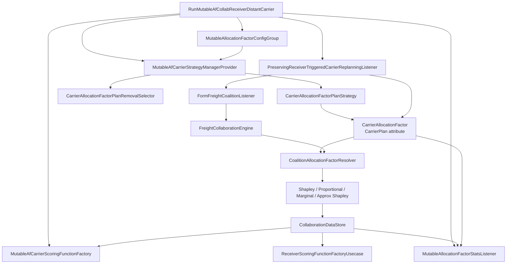
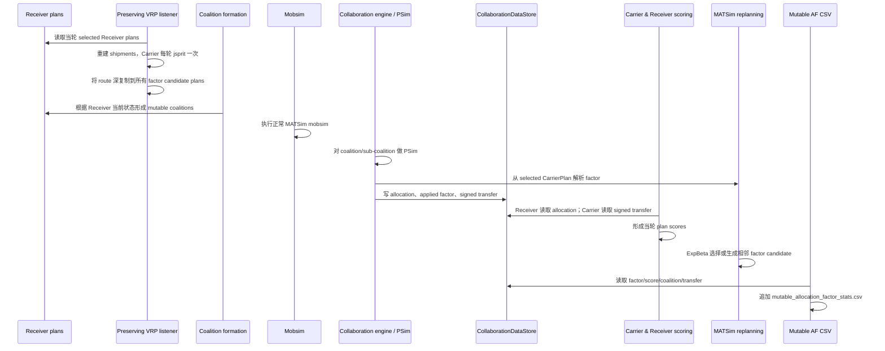

# Carrier 内生 Allocation Factor（Mutable AF）技术说明与使用指南

## 1. 文档范围

本文说明 `xp-collaboration` 中 Carrier–Receiver 合作的 **Mutable Allocation Factor（以下简称 Mutable AF）** 实现。

阅读本文不要求先阅读 Java 源码。本文会回答以下问题：

- 为什么要把 allocation factor 从外生常量改为 Carrier 可以学习的决策变量；
- allocation factor 存放在哪里，以及为什么将它放在 `CarrierPlan` 上；
- MATSim 每个 iteration 中，Receiver 计划、VRP、合作联盟、allocation、Carrier/Receiver score 和下一轮 replanning 如何连成反馈闭环；
- factor mutation、ExpBeta 选择、plan memory、plan removal 和 90% freeze 如何工作；
- 为什么需要一个不会清空 Carrier factor 历史的 receiver-triggered VRP listener；
- allocation engine 如何在不影响旧 run 的前提下，选择固定 factor 或 per-coalition factor；
- signed transfer 如何同时进入 Receiver score 和 Carrier score；
- 新增/修改了哪些类，各自负责什么；
- 如何通过新 run、CLI、Java Config 或 XML 配置使用该功能；
- 输出文件如何解释，以及如何判断最终 factor；
- 当前实现的边界、假设和已知注意事项。

本文描述的是当前工作区中的实现，主要入口为：

```text
org.matsim.contrib.freightcollaboration.run.RunMutableAfCollabReceiverDistantCarrier
```

### 建议阅读路线

- 如果主要目的是**直接运行实验**：先读第 6、11、12、16 节。
- 如果主要目的是**理解 iteration 闭环**：先读第 4、5、8、9、10 节。
- 如果准备**维护或扩展代码**：重点读第 7、8、9、10、13、15 节。
- 如果准备**解释研究结果**：重点读第 2、5、10、11、17 节。

---

## 2. 背景：原固定 Allocation Factor 的含义与限制

### 2.1 Allocation factor 是什么

在 Carrier–Receiver 合作中，Receiver 通过放宽时间窗、改变服务条件或选择是否合作，可能使 Carrier 的 VRP 成本发生变化。allocation model（例如 Shapley value）计算每个 Receiver 对合作价值的贡献，然后用 allocation factor 决定合作价值中有多少分给 Receiver。

设：

- `v(N)`：完整联盟产生的总合作价值/总 cost savings；
- `φ_i`：Receiver `i` 的 Shapley value；
- `a`：allocation factor，满足 `0 <= a <= 1`。

则当前 cost-savings 分配逻辑可以概括为：

```text
Receiver i 的分配 = a × φ_i
所有 Receiver 的 signed transfer = a × Σφ_i
Carrier 在 allocation map 中的保留份额 = (1 - a) × Σφ_i
```

对满足 efficiency 的 Shapley game，`Σφ_i = v(N)`，因此：

```text
Receiver 总分配 + Carrier 保留份额 = v(N)
```

### 2.2 原实现为什么是“外生”的

原有 run 在启动实验时把 factor 作为一个固定 `double` 写入：

```java
freightConfig.ALLOCATION_FACTOR = allocationFactor;
```

同一次 MATSim run 的所有 iteration 都使用这个值。若研究者想比较 `0.5`、`0.7`、`0.9`，需要分别运行多个实验。Carrier 本身没有将 factor 作为 plan choice，也不会根据历史 score 调整报价。

### 2.3 Mutable AF 希望解决的问题

Mutable AF 将 allocation factor 变成 Carrier 的内生策略变量：

1. Carrier 在自己的 plan memory 中保留多个 factor candidate；
2. MATSim replanning 在相邻离散网格点之间生成新 factor；
3. selected factor 改变本 iteration 的合作价值分配；
4. Receiver 因分配和时间窗 penalty 得到不同 score；
5. Receiver 下一轮可能选择不同计划或合作状态；
6. Receiver 的新计划改变下一轮 shipment、coalition 和 VRP；
7. Carrier 的路线成本、fee 和 signed transfer 共同形成 Carrier plan score；
8. MATSim 的选择机制逐步偏向历史表现更好的 factor；
9. 接近模拟结束时停止创新，转入 best-plan exploitation。

这里的“内生”不是连续优化器一次性求解析最优解，而是 **MATSim plan-based learning + 离散局部搜索**。

---

## 3. 设计目标与非目标

### 3.1 设计目标

- 每个 Carrier 拥有自己的 allocation factor；不同 Carrier 可以学习出不同值。
- factor 是 Carrier plan 的组成部分，能被 MATSim score、selection、replanning 和 plan memory 处理。
- factor mutation 只改变 factor，不直接改变 shipment、tour、时间窗或 departure time。
- Receiver 仍使用原有 Receiver replanning/plan selection 逻辑。
- factor 通过收益分配影响 score，再通过下一轮 Receiver 选择间接改变 coalition 和 VRP。
- Receiver 触发 VRP 重建时，不清空 Carrier 的 factor candidate history。
- 每个 Carrier 每次需要重建路线时只执行一次 jsprit；然后把同一路线深复制到全部 factor candidates。
- 不增加 PSim 所需的 sub-coalition 数量；factor 是 allocation 阶段的缩放参数，不是新的 coalition dimension。
- 新功能完全 opt-in；现有固定-factor run 不添加 mutable config 时继续走原路径。
- 不改变现有 `collaboration_data.xml` schema，Mutable AF 使用独立 CSV 输出。

### 3.2 当前版本明确不做什么

- 不做连续变量优化、梯度优化或贝叶斯优化；只搜索离散网格。
- 不允许一个 plan 同时保存多个 factor。
- 不为同一个 Carrier–Receiver coalition 设置多个 Carrier；该 coalition 必须且只能有一个 Carrier distributor。
- 不让 Receiver 直接决定 factor；factor 是 Carrier plan 的属性。
- 不让 factor 直接改变当前 iteration 的 VRP。factor 首先改变分配与 score，Receiver 的响应在下一轮才可能改变 VRP。
- Mutable 路径目前只允许 `COST_SAVINGS`，不支持 `COST`。
- LSP–Receiver coalition 不学习 mutable factor；即使 config 中存在 mutable module，LSP coalition 仍使用旧的固定 `FreightCollaborationConfigGroup.ALLOCATION_FACTOR`。
- 新 run 固定使用 exact Shapley；底层 resolver overload 虽可被其他 allocation model 使用，但新实验入口没有把 model 暴露成 CLI 选项。

---

## 4. 总体架构

### 4.1 核心组件图



### 4.2 最重要的设计决定：factor 属于 `CarrierPlan`

factor 存在每个 `CarrierPlan` 的 attributes 中：

```text
attribute name = freightCollaboration:allocationFactor
attribute value = java.lang.Double
```

通过 `CarrierAllocationFactor` 读写：

```java
CarrierAllocationFactor.set(plan, 0.8, mutableConfig);
double factor = CarrierAllocationFactor.require(plan, mutableConfig);
```

这意味着 Carrier 的 plan memory 概念上是：

| Plan | Physical route | Factor | Historical score | Selected |
|---|---|---:|---:|---|
| P0 | 当前 Receiver 条件下的 route copy | 0.70 | -820.0 | false |
| P1 | 当前 Receiver 条件下的 route copy | 0.80 | -805.0 | true |
| P2 | 当前 Receiver 条件下的 route copy | 0.90 | -830.0 | false |

同一轮完成 receiver-triggered VRP 重建后，所有 candidate 的物理路线一致，但 factor、历史 score、plan identity 和 selected 状态不同。

这样做的好处是：

- 可以直接使用 MATSim 的 plan score 和 plan selection；
- 每个 Carrier 自然拥有独立的 factor memory；
- factor 能随 CarrierPlan XML 一起输出，因为 Carrier plan writer 会写 plan attributes；
- 不需要在全局 config 中每轮改一个共享变量；
- 不会发生多个 Carrier 相互覆盖 factor 的问题。

---

## 5. 一个 iteration 内的完整运行逻辑

### 5.1 时序概览



### 5.2 Iteration 0：建立 baseline，不创新 factor

默认 controller 设置：

```text
firstIteration = 0
lastIteration  = 30
```

iteration 0 的关键步骤：

1. `PreservingReceiverTriggeredCarrierReplanningListener` 在 `BeforeMobsim` 执行。
2. 若 Carrier 还没有 plan，listener 运行 jsprit，创建第一个 plan。
3. 第一个 plan 获得 `INITIAL_ALLOCATION_FACTOR`，score 为 `null`，并被设为 selected。
4. `FormFreightCoalitionListener` 建立 grand coalition。
5. `FreightCollaborationListener` 在第一个 iteration 明确跳过 collaboration allocation。
6. 正常 scoring 给初始 Carrier plan 一个 baseline score。
7. Carrier strategy manager 此时只有 ExpBeta selection 权重为 1；factor mutation 权重仍为 0。

因此 iteration 0 的“未合作高分”不会被保存成另一个 factor candidate 的错误优势。同一个初始 plan 会在第一个真正合作 iteration 中重新得到 score，然后才允许从它生成相邻 factor。

### 5.3 Iteration 1 及之后：开始闭环学习

从第一个非 baseline 合作 iteration 开始：

1. Receiver selected plans 决定 shipment/time window。
2. Preserving listener 重建 Carrier route，但不删除 factor candidates。
3. Coalition listener 根据 Receiver 当前合作状态形成 mutable coalition。
4. 正常 mobsim 执行，产生旅行时间和 Carrier physical performance。
5. `FreightCollaborationEngine` 对 coalition 做 PSim，计算合作价值。
6. Engine 从该 coalition 唯一 Carrier 的 selected plan 读取 factor。
7. Allocation model 用 factor 缩放 Receiver 分配，并记录 signed transfer。
8. 正常 Carrier scoring 计算：

   ```text
   Carrier score
     = base route score
     + linked Receiver fees
     - signed player transfer
   ```

9. Receiver scoring 读取自己的 allocation，并结合固定费用、时间窗 relaxation penalty 等计算 score。
10. Replanning 阶段，Carrier 可能保留/选择旧 factor，也可能从 scored parent 生成一个相邻 factor。
11. Receiver 也根据本轮 score 选择下一轮计划。
12. 下一轮 `BeforeMobsim` 才会把 Receiver 的新选择转换为 shipment、coalition 和新 VRP。

### 5.4 为什么 factor 对 VRP 的影响有一轮滞后

factor 本身只改变合作价值如何分配，不改变当前 shipment 或 route。因此：

```text
iteration t selected factor
    ↓
iteration t allocation / Carrier score / Receiver score
    ↓
iteration t replanning 选择 Receiver 和 Carrier 的下一计划
    ↓
iteration t+1 Receiver selected plan / collaboration status
    ↓
iteration t+1 coalition + shipment + VRP
```

这是刻意的因果顺序。若在同一 iteration 中反复求 factor、Receiver response 和 VRP fixed point，会把当前实现变成另一个内部均衡求解器，也会显著增加计算量。

---

## 6. Mutable AF 配置模型

### 6.1 独立 config group

Mutable AF 使用独立的：

```text
MutableAllocationFactorConfigGroup
group name = mutableAllocationFactor
```

它没有把新参数塞进旧的 `FreightCollaborationConfigGroup`。是否存在这个 config module，也是 allocation engine 判断“固定 factor”还是“mutable factor”的 opt-in 开关。

### 6.2 参数总表

下表先列出 **config 类本身的默认值**：

| 参数 | Config 类默认值 | 合法范围/约束 | 含义 |
|---|---:|---|---|
| `INITIAL_ALLOCATION_FACTOR` | `0.8` | `[MIN, MAX]` 且必须在网格上 | Carrier 初始 factor；无 plan 时第一个 jsprit plan 使用它 |
| `MIN_ALLOCATION_FACTOR` | `0.0` | `0 <= min < max` | factor 搜索下界 |
| `MAX_ALLOCATION_FACTOR` | `1.0` | `min < max <= 1` | factor 搜索上界 |
| `ALLOCATION_FACTOR_STEP` | `0.1` | 有限正数，并精确划分 `[min,max]` | 相邻 factor 的间距；每次 mutation 只移动一步 |
| `MUTATION_WEIGHT` | `1.0` | 有限且 `> 0` | 探索期 factor mutation strategy 的 MATSim 权重 |
| `DISABLE_INNOVATION_FRACTION` | `0.9` | `(0,1]`，且必须产生非空创新窗口 | 在模拟进度的哪个比例冻结创新 |
| `MAX_FACTOR_PLANS` | `11` | 至少等于网格点数量 | 每个 Carrier 可保存的最大 factor candidate plan 数量 |

网格点数量计算为：

```text
gridPointCount = round((MAX - MIN) / STEP) + 1
```

例如 config 类默认网格：

```text
[0.0, 0.1, 0.2, ..., 0.9, 1.0]
gridPointCount = 11
```

### 6.3 新 run 的实际默认值

当前 `RunMutableAfCollabReceiverDistantCarrier.defaultOptions()` 会覆盖 config 类默认网格，实际无参数运行时使用：

| 参数 | 新 run 当前默认值 |
|---|---:|
| initial | `0.80` |
| min | `0.10` |
| max | `1.00` |
| step | `0.05` |
| mutation weight | `1.00` |
| freeze fraction | `0.90` |
| 自动计算的 max factor plans | `19` |

实际网格是：

```text
[0.10, 0.15, 0.20, ..., 0.95, 1.00]
```

新 run 在 `MutableOptions.createConfigGroup()` 中执行：

```java
config.setMaxFactorPlans(config.gridPointCount());
```

所以通过新 run 改 min/max/step 时，不需要单独配置 `MAX_FACTOR_PLANS`。

新 run 的 `printUsage()`、`defaultOptions()` 和对应测试均使用上述 `min=0.1`、`step=0.05` 默认网格。为了实验可复现，仍建议在正式实验中显式传入六个 Mutable AF CLI 参数。

### 6.4 网格合法性

必须同时满足：

```text
0 <= MIN < MAX <= 1
STEP > 0
(MAX - MIN) / STEP 为整数（允许 1e-9 浮点误差）
INITIAL 位于网格上
MAX_FACTOR_PLANS >= gridPointCount
MUTATION_WEIGHT > 0
0 < DISABLE_INNOVATION_FRACTION <= 1
```

合法例子：

```text
min=0.20, max=0.80, step=0.15
grid=[0.20, 0.35, 0.50, 0.65, 0.80]
initial=0.65
```

非法例子：

```text
min=0.0, max=1.0, step=0.3
```

因为 `1.0 / 0.3` 不是整数，无法得到同时精确包含 0 和 1 的等距网格。

### 6.5 Mutation weight 不是直接概率

探索期默认存在两个非零 Carrier strategy：

```text
ExpBeta selection weight = 1.0
Factor mutation weight   = MUTATION_WEIGHT
```

MATSim 按相对权重选择 strategy。因此在只有这两个非零策略时，factor mutation 的近似选择概率是：

```text
p(mutation) = MUTATION_WEIGHT / (1.0 + MUTATION_WEIGHT)
```

例子：

| `MUTATION_WEIGHT` | mutation 近似概率 | ExpBeta selection 近似概率 |
|---:|---:|---:|
| `0.25` | 20% | 80% |
| `1.0` | 50% | 50% |
| `2.0` | 66.7% | 33.3% |

它不是“factor 每轮增加多少”；步长由 `ALLOCATION_FACTOR_STEP` 决定。

### 6.6 Freeze iteration 如何计算

代码使用：

```java
int innovationStart = firstIteration + 1;
int freezeIteration = firstIteration + (int) Math.round(
    (lastIteration - firstIteration) * disableInnovationFraction
);
```

默认 `first=0`、`last=30`、`fraction=0.9`：

```text
innovationStart = 1
freezeIteration = round(30 × 0.9) = 27
```

策略阶段为：

| 阶段 | ExpBeta | Factor mutation | BestPlanSelector |
|---|---:|---:|---:|
| baseline 前/iteration 0 | `1` | `0` | `0` |
| iteration 1 到 freeze 前 | `1` | `MUTATION_WEIGHT` | `0` |
| freeze iteration 起 | `0` | `0` | `1` |

代码会拒绝没有有效创新窗口的 first/last/fraction 组合，例如 freeze 小于等于 `first + 1`。

### 6.7 XML 配置示例

如果不是使用新 run 的 CLI，也可以把 config group 写入 MATSim config：

```xml
<module name="mutableAllocationFactor">
    <param name="INITIAL_ALLOCATION_FACTOR" value="0.80" />
    <param name="MIN_ALLOCATION_FACTOR" value="0.10" />
    <param name="MAX_ALLOCATION_FACTOR" value="1.00" />
    <param name="ALLOCATION_FACTOR_STEP" value="0.05" />
    <param name="MUTATION_WEIGHT" value="1.00" />
    <param name="DISABLE_INNOVATION_FRACTION" value="0.90" />
    <param name="MAX_FACTOR_PLANS" value="19" />
</module>
```

但要注意：**仅把 module 写入 XML 并不足以完整启用功能**。自定义 run 还必须绑定 mutable Carrier strategy、mutable Carrier scoring 和两个 listener，详见第 12 节。

---

## 7. Factor plan strategy 的实现细节

### 7.1 Factor accessor：`CarrierAllocationFactor`

该工具类集中处理 plan attribute：

```java
OptionalDouble find(CarrierPlan plan)
double require(CarrierPlan plan)
double require(CarrierPlan plan, MutableAllocationFactorConfigGroup config)
void set(CarrierPlan plan, double factor)
void set(CarrierPlan plan, double factor, MutableAllocationFactorConfigGroup config)
```

校验分两层：

- 无 config 的方法保证 factor 是有限数且在 `[0,1]`；
- 带 config 的方法进一步保证 factor 位于配置网格。

若 attribute 不存在、不是数字或不在网格上，代码会明确抛出异常，不会静默使用 fallback。

### 7.2 Mutation：`CarrierAllocationFactorPlanStrategy`

策略执行流程：

```java
CarrierPlan parent = parentSelector.selectPlan(carrier);
CarrierPlan mutated = CarriersUtils.copyPlan(parent);
AttributesUtils.copyTo(parent.getAttributes(), mutated.getAttributes());

int currentIndex = config.indexOf(CarrierAllocationFactor.require(parent, config));
int nextIndex = chooseAdjacentIndex(currentIndex);

CarrierAllocationFactor.set(mutated, config.valueAt(nextIndex), config);
mutated.setScore(null);
carrier.addPlan(mutated);
carrier.setSelectedPlan(mutated);
```

重要语义：

- parent 必须存在且已经评分；`null` score 或 `NaN` 会失败。
- 使用 `CarriersUtils.copyPlan` 复制物理路线。
- 由于通用 `copyPlan` 不保证复制所有自定义 attributes，策略显式调用 `AttributesUtils.copyTo`。
- 新 plan 继承 parent 的其他 attributes，但 factor 被替换为相邻值。
- 新 plan score 设为 `null`，防止把 parent 的 score 错当成新 factor 的 score。
- 新 plan 被立即加入 memory 并设为 selected，以便下一 iteration 对它进行实际评估。

### 7.3 相邻网格变异与边界反射

内部网格点随机移动 `-1` 或 `+1`：

```text
0.70 → 0.65 或 0.75
```

边界使用反射而不是停留：

```text
MIN → MIN + STEP
MAX → MAX - STEP
```

因此 mutation 一定会产生不同 factor，不会在边界生成与 parent 完全相同的 candidate。

随机方向使用 `MatsimRandom.getRandom()`，受 MATSim global random seed 控制。新 run 使用：

```java
config.global().setRandomSeed(4711L + instance);
```

在相同 scenario、instance 和执行顺序下可重复。

### 7.4 Parent selection

Mutation strategy 的 parent selector 是 `ExpBetaPlanChanger`。因此：

- 高分 plan 更可能被选作 parent；
- 低分 plan 仍可能被探索；
- 搜索不是简单地只围绕当前 best factor 做 hill climbing；
- factor 网格可能通过多个历史 parent 被并行式探索。

### 7.5 Plan memory 和 removal

`CarrierAllocationFactorPlanRemovalSelector` 遵循以下顺序：

1. selected plan 永远不可删；
2. score 为 `null` 或 `NaN` 的未评估 plan 永远不可删；
3. 若某 factor 有重复 plan，删除其中 score 最低的可删除 plan；
4. 若没有重复 factor，删除所有可删除 scored plans 中全局 score 最低者；
5. 如果只能通过删除 selected/unscored plan 才能降到上限，明确抛错。

“重复 factor”统计会包括 selected plan 和 unscored plan。例如 selected factor 为 `0.8`，另有一个 scored `0.8`，后者属于 duplicate candidate。

这种策略优先保留 factor diversity，避免 memory 被多个相同 factor 占满。

---

## 8. 为什么需要 Preserving Receiver-triggered VRP Listener

### 8.1 原 listener 与 factor memory 的冲突

freightreceiver 原有 `ReceiverTriggersCarrierReplanningListener` 在 Receiver 触发 Carrier replanning 时会执行：

```java
carrier.clearPlans();
carrier.getShipments().clear();
carrier.getServices().clear();
```

对固定-factor run，这种做法可以直接抛弃旧 Carrier routes，再由 jsprit 创建新 plan。

对 Mutable AF，这会同时删除：

- 各 factor candidate；
- 每个 candidate 的历史 score；
- selected factor；
- MATSim 学习到的 plan memory。

于是 Carrier 永远无法跨 iteration 比较 factor。

### 8.2 新 listener 的启用方式

新 run 执行：

```java
receiverConfig.setReceiverTriggerCarrierReplanning(false);
```

这使原 listener 保持注册但立即返回。然后只在新 run 中注册：

```java
addControlerListenerBinding()
    .to(PreservingReceiverTriggeredCarrierReplanningListener.class);
```

旧 listener 本身没有被修改，所以现有 run 的 `clearPlans()` 行为不变。

### 8.3 执行优先级

Preserving listener：

```java
priority() = 100
```

`FormFreightCoalitionListener`：

```java
priority() = -10
```

MATSim 高 priority 先执行，因此顺序是：

```text
Receiver plans → shipment/VRP rebuild → coalition formation
```

coalition formation 看到的是当轮最新 Receiver plan 和 Carrier linkage。

### 8.4 Shipment 重建

listener 每次触发时：

1. 清空所有 Carrier 的 shipments 和 services，但不清空 plans；
2. 遍历每个 Receiver 的 selected plan；
3. 要求 selected plan 存在且至少有一个 delivery time window；
4. 遍历 `ReceiverOrder` 和其中的 product orders；
5. 用 origin、Receiver link、capacity、service duration 和第一个 delivery time window 重建 `CarrierShipment`；
6. capacity demand 为 0 的 shipment 不加入 Carrier。

### 8.5 每个 Carrier 只运行一次 jsprit

对每个 Carrier：

```java
VehicleRoutingProblem problem = ...;
VehicleRoutingAlgorithm algorithm = new SchrimpfFactory().createAlgorithm(problem);
algorithm.setMaxIterations(freightConfig.getVrpMaxIterations());
CarrierPlan solvedPlan = MatsimJspritFactory.createPlan(...);
NetworkRouter.routePlan(solvedPlan, costs);
```

这里的 jsprit iteration budget 来自 `FreightCollaborationConfigGroup.VRP_MAX_ITERATIONS`。新 run 设置为 `100`。

factor candidate 数量不会导致 jsprit 重复运行。无论 Carrier memory 中有 1 个还是 19 个 factor plans，该 Carrier 每次 listener 触发只求解一次 VRP。

### 8.6 如何把一次 VRP 结果应用到所有 factor plans

若 Carrier 尚无 plan：

- 直接使用 solved plan；
- 写入 initial factor；
- score 设为 `null`；
- 添加并选中。

若已有 factor candidates：

- 保存当前 selected plan 的对象引用；
- 不替换任何 candidate 对象；
- 不改变 candidate factor、score 或 attributes；
- 清空每个 candidate 的 scheduled tours；
- 对 solved plan 中每个 tour 调用 `tour.duplicate()`；
- 为每个 candidate 创建独立的 `ScheduledTour`；
- 最后恢复原 selected plan。

伪代码：

```java
for (CarrierPlan candidate : candidates) {
    candidate.getScheduledTours().clear();
    for (ScheduledTour solvedTour : solvedPlan.getScheduledTours()) {
        candidate.getScheduledTours().add(
            ScheduledTour.newInstance(
                solvedTour.getTour().duplicate(),
                solvedTour.getVehicle(),
                solvedTour.getDeparture()
            )
        );
    }
}
carrier.setSelectedPlan(previouslySelected);
```

这样不同 candidates 不共享可变 `Tour` 对象。

### 8.7 Receiver replanning interval

listener 使用 `ReceiverConfigGroup.receiverReplanningInterval`。默认值为 `1`。

触发条件是：

```text
iteration 0 总是触发；
后续 iteration 仅当 (iteration + 1) % interval == 0 时触发。
```

例如 interval 为 5 时，触发 iteration 为：

```text
0, 4, 9, 14, ...
```

若 interval 小于等于 0，listener 明确失败。

### 8.8 历史 score 的解释

listener 更新物理 route 时刻意保留 candidate 的历史 score。因此历史 score 表示：

> 该 factor 在它上一次被实际选中和评分时，在当时 Receiver/coalition 环境下的表现。

它不是在每次 Receiver 改变后立即对所有 factor candidates 重新评分。重新评分所有 candidates 会把每轮计算量乘以 factor 数量，与当前“一轮只评估 selected plan”的 MATSim 学习逻辑不同。

---

## 9. Allocation engine 的 opt-in 路径

### 9.1 固定路径和 mutable 路径的分流

`FreightCollaborationEngine` 检查 config 中是否存在：

```text
mutableAllocationFactor
```

若不存在，继续调用原 factory overload：

```java
AllocationUtils.createAllocationModel(
    model,
    dataStore,
    psimSupplier,
    coalitions,
    freightConfig.getAllocationFactor(),
    executor,
    parallelism
);
```

若存在，则创建 `CoalitionAllocationFactorResolver`：

```java
CoalitionAllocationFactorResolver resolver = coalition -> {
    if (coalition.getCollaborationType() != CARRIER_RECEIVER) {
        return freightConfig.getAllocationFactor();
    }
    Carrier carrier = extractTheOnlyCarrier(coalition);
    return CarrierAllocationFactor.require(carrier.getSelectedPlan(), mutableConfig);
};
```

这保证旧 run 没有 mutable module 时，不会读取 CarrierPlan factor attribute，也不会产生新的 mutable diagnostics。

### 9.2 Coalition 约束与快速失败

对 `CARRIER_RECEIVER`：

- 必须有且只有一个 distributor；
- distributor delegate 必须是 `Carrier`；
- Carrier 必须有 selected plan；
- selected plan 必须有合法、在网格上的 factor。

Engine 在启动昂贵的 PSim 之前预先解析每个 Carrier–Receiver coalition 的 factor。非法 coalition 会快速失败，不会先完成全部 subset evaluations。

### 9.3 `COST_SAVINGS` 限制

存在 mutable config 时：

```java
if (allocationStrategy != COST_SAVINGS) {
    throw new IllegalArgumentException(...);
}
```

因此不要把 mutable run 配成：

```text
ALLOCATION_STRATEGY = COST
```

### 9.4 Allocation model overload

以下 model 增加了 resolver constructor/工厂路径，同时保留原 `double allocationFactor` constructor：

- `AllocationModelShapleyValue`
- `AllocationModelProportional`
- `AllocationModelMarginalContribution`
- `AllocationModelApproxShapleyValue`

固定 constructor：

```java
new AllocationModelShapleyValue(dataStore, 0.8)
```

Mutable constructor：

```java
new AllocationModelShapleyValue(dataStore, coalition -> selectedCarrierFactor(coalition))
```

只有 resolver 路径记录 applied factor 和 signed transfer；旧 fixed-double 路径不写这些 mutable diagnostics。

### 9.5 为什么 factor 不增加 PSim subset 数量

PSim 仍只计算 coalition characteristic function：

```text
v(∅), v({r1}), v({r2}), ..., v(N)
```

factor 不进入 VRP characteristic function，它在 `φ_i` 已经计算后进行缩放。因此不同 factor candidates 不需要分别重跑所有 subsets。

这使 Mutable AF 相比固定 AF 的主要额外成本来自正常 MATSim iterations 和 Carrier plan memory，而不是指数级扩大 Shapley enumeration。

---

## 10. Signed transfer、数据存储与 scoring

### 10.1 为什么要单独记录 signed transfer

`allocatedValues` 同时存 Receiver allocation 和 Carrier reserved share，但 Carrier 正常 score 需要知道的是“本 Carrier 实际转给 players 的总额”。因此 `CollaborationDataStore` 新增：

```java
Map<MutableFreightCoalition, Double> appliedAllocationFactors;
Map<CollaboratorKey, Double> distributorPlayerTransfers;
```

API：

```java
recordAppliedAllocationFactor(coalition, factor)
getAppliedAllocationFactors()

recordDistributorPlayerTransfer(distributorKey, signedTransfer)
getDistributorPlayerTransfers()
getDistributorPlayerTransfer(role, id)
```

多个 coalition 对同一个 distributor 的 transfer 使用 `merge(..., Double::sum)` 聚合。

每轮 collaboration 开始时 `reset()` 会清空：

- simulated coalition scores；
- allocated values；
- applied allocation factors；
- distributor player transfers。

公开 getter 返回 defensive immutable copy。

### 10.2 Signed 的含义

transfer 不裁剪为非负值。

如果某 Receiver 的边际贡献为负，则它的 Shapley value 和 scaled allocation 可以为负：

```text
φ_receiver = -10
a = 0.7
receiver allocation = -7
signed player transfer = -7
```

Carrier scoring 使用相反数：

```text
-signedTransfer = +7
```

即 Receiver 的负分配不会被静默改成 0，预算关系仍保持一致。

### 10.3 数值例子

假设完整联盟总 cost savings 为 100：

```text
Receiver A Shapley = 60
Receiver B Shapley = 40
factor = 0.70
```

则：

```text
A allocation = 42
B allocation = 28
signed transfer = 70
Carrier reserved allocation = 30
总 allocation = 42 + 28 + 30 = 100
```

若 Carrier 的 base route score 为 `-500`，linked Receiver fees 为 `+200`：

```text
Carrier final score = -500 + 200 - 70 = -370
```

factor 越高，Receiver 通常获得更多合作收益，但 Carrier 需要扣除更多 transfer。这形成 Carrier 学习 factor 的直接 score incentive。

### 10.4 Mutable Carrier scoring factory

`MutableAfCarrierScoringFunctionFactory` 只由新 run 绑定。

正常 MATSim scoring 包含：

```text
SimpleDriversLegScoring
+ SimpleVehicleEmploymentScoring
+ SimpleDriversActivityScoring
+ ChargingReceiverScoring
+ SignedDistributorTransferScoring
```

其中：

```java
return -dataStore.getDistributorPlayerTransfer(CARRIER, carrier.getId());
```

PSim scoring 则故意不加入 transfer：

- `BASIC_COST`：只计算 route/vehicle/activity base cost；
- `BASIC_PLUS_FEES`：base cost + linked Receiver fees；
- 两者都不加入 signed transfer。

原因是 PSim 的任务是计算合作 characteristic value；factor transfer 是 PSim 之后的分配结果。如果在 PSim 中先扣 transfer，会形成循环计算和重复扣减。

### 10.5 Receiver scoring

新 run 继续绑定原 Receiver scoring factory：

```java
ScoringFunctionFactoryUsecase.ReceiverScoringFunctionFactoryUsecase
```

它读取 `CollaborationDataStore` 中该 Receiver 的 allocation。因而 factor 的变化直接影响 Receiver 当轮 score，Receiver 下一轮是否继续合作、选择哪个时间窗计划仍由现有 replanning 机制决定。

---

## 11. 输出与结果解释

### 11.1 独立 Mutable AF CSV

新 listener 在 run 根输出目录写：

```text
mutable_allocation_factor_stats.csv
```

header：

```csv
iteration,carrierId,selectedFactor,selectedPlanScore,bestStoredFactor,bestStoredScore,activeCoalition,receiverCount,signedTransfer
```

字段含义：

| 字段 | 含义 |
|---|---|
| `iteration` | MATSim iteration |
| `carrierId` | Carrier ID；按字符串稳定排序输出 |
| `selectedFactor` | iteration 结束时 selected CarrierPlan 的 factor |
| `selectedPlanScore` | selected plan 当前 score；尚未评分时为空 |
| `bestStoredFactor` | memory 中最高 scored plan 的 factor；没有 scored plan 时退回 selected plan |
| `bestStoredScore` | 对应 best stored plan 的 score；可能为空 |
| `activeCoalition` | 当前 coalition manager 中是否存在包含该 Carrier 的 mutable coalition |
| `receiverCount` | 该 Carrier 当前 coalitions 中 Receiver 数量之和 |
| `signedTransfer` | 本 iteration 该 Carrier 向 players 的 signed transfer 总额 |

示例：

```csv
iteration,carrierId,selectedFactor,selectedPlanScore,bestStoredFactor,bestStoredScore,activeCoalition,receiverCount,signedTransfer
12,"carrier1",0.75,-371.2,0.70,-360.8,true,8,68.5
```

解释：

- iteration 12 当前正在评估/使用 factor `0.75`；
- memory 中历史最高分 plan 的 factor 是 `0.70`；
- 当前有合作 coalition，共 8 个 Receiver；
- signed transfer 为 `68.5`，Carrier scoring 中对应 `-68.5`。

### 11.2 如何判断最终 factor

最终 factor 应结合：

1. CSV 最后 iteration 的 `selectedFactor`；
2. CSV 的 `bestStoredFactor` / `bestStoredScore`；
3. 最后 iteration Carrier plan 文件中的 selected plan 和 `freightCollaboration:allocationFactor` attribute。

在 freeze 后只有 `BestPlanSelector` 权重为 1，理论上 selected plan 会收敛到 stored plans 中最高 score 的候选。

不要把 root output 中早期快照当作最终权威状态；iteration 文件和 CSV 最后一行更接近最终 replanning 状态。

### 11.3 原 collaboration XML 保持不变

现有 `collaboration_data.xml` schema 没有加入 factor 或 transfer 字段。原因是：

- 避免破坏已有分析脚本；
- fixed run 输出保持兼容；
- mutable diagnostics 有独立生命周期和字段。

### 11.4 快速分析示例

```python
import pandas as pd

df = pd.read_csv("mutable_allocation_factor_stats.csv")

# 每个 Carrier 的最终状态
final = (
    df.sort_values("iteration")
      .groupby("carrierId", as_index=False)
      .tail(1)
)

print(final[[
    "carrierId",
    "selectedFactor",
    "selectedPlanScore",
    "bestStoredFactor",
    "bestStoredScore",
    "receiverCount",
    "signedTransfer",
]])
```

---

## 12. 使用说明

### 12.1 推荐方式：运行新的独立入口

不要修改或复用固定-factor run 来启用 Mutable AF。推荐直接运行：

```text
RunMutableAfCollabReceiverDistantCarrier
```

在 IntelliJ IDEA 中：

1. 打开 `RunMutableAfCollabReceiverDistantCarrier`；
2. 创建 Application run configuration；
3. 将 working directory 设为仓库根目录；
4. 在 Program arguments 中显式填写参数；
5. 运行 `main()`。

推荐的可复现实验参数示例：

```text
--network-size=20
--carrier-scenarios=10
--instances=10
--receiver-area=centered
--initial-allocation-factor=0.80
--allocation-factor-min=0.10
--allocation-factor-max=1.00
--allocation-factor-step=0.05
--allocation-factor-mutation-weight=1.00
--allocation-factor-freeze-fraction=0.90
```

### 12.2 Mutable AF CLI 参数

| CLI 参数 | 当前新 run 默认 | 作用 |
|---|---:|---|
| `--initial-allocation-factor` | `0.80` | 初始 factor，必须在网格上 |
| `--allocation-factor-min` | `0.10` | 搜索下界 |
| `--allocation-factor-max` | `1.00` | 搜索上界 |
| `--allocation-factor-step` | `0.05` | 相邻 mutation 步长 |
| `--allocation-factor-mutation-weight` | `1.00` | 探索期 mutation strategy 相对权重 |
| `--allocation-factor-freeze-fraction` | `0.90` | 模拟进度达到该比例时冻结创新 |

CLI parser 会立即构造并校验 mutable config，非法网格、非有限数、off-grid initial 或未知参数会在启动实验前失败。

### 12.3 共享 distant-carrier CLI 参数

新 run 复用固定 run 的 deterministic scenario parsing/generation：

| CLI 参数 | 默认 | 作用 |
|---|---:|---|
| `--network-size` | `20` | chessboard network 的网格尺寸 |
| `--carrier-scenarios` | `10` | center column 上从中心到底部的 depot 场景数量 |
| `--instances` | `10` | 每种实验组合的随机 instance 数 |
| `--network-file` | 由 network size 推导 | network XML 路径；显式指定时默认复用已有文件 |
| `--output-base` | `output/mutableAfCollabReceiverDistantCarrier` | 独立输出根目录 |
| `--receiver-area` | `centered` | `scaled`、`chessboard` 或 `centered` |
| `--scale-receiver-area` | 无 | 兼容旧布尔写法；true=scaled，false=chessboard |
| `--regenerate-network-file` | `true` | 是否重建 network 文件 |
| `--reuse-network-file` | false | 等价于关闭 regenerate |

### 12.4 新 run 中未通过 CLI 暴露的重要设置

以下值当前在新 run 中固定：

| 设置 | 当前值 | 说明 |
|---|---:|---|
| Receiver 数量 | `10` | 每个 scenario 固定 10 个 Receiver |
| Receiver distributions | `CLUSTERED`, `DISPERSED` | 不运行 fully random |
| Receiver relaxation penalties | `0.0014`, `0.0028`, `0.0056` | 每个组合各运行一次 |
| Allocation model | `SHAPLEY` | exact Shapley |
| Allocation strategy | `COST_SAVINGS` | 来自 example freight config，也是 mutable 必需值 |
| PSim scoring mode | `BASIC_COST` | PSim 不含 Receiver fees |
| Iteration-0 baseline mode | `FEE_FREE` | baseline 不含 fees |
| VRP max iterations | `100` | Preserving listener 和 PSim 使用的 jsprit budget |
| Exact Shapley player cap | `12` | coalition 超过 12 个 players 时 exact enumeration 快速失败；当前 10 个 Receiver 在限制内 |
| Collaboration parallelism | 可用处理器数量 | `FreightCollaborationConfigGroup` 的默认线程池大小；与 QSim threads 不是同一个参数 |
| Receiver fixed fee | `100.0` | 来自 example freight config，ReceiverModule 的固定成本分配 |
| Carrier charged fee | `100.0` | 每个 linked Receiver 给 Carrier scoring 的 fee |
| Receiver replanning interval | `1` | 默认每个 iteration 都执行 preserving VRP rebuild |
| first/last iteration | `0 / 30` | 默认 freeze 发生在 iteration 27 |
| MATSim global threads | `4` | controller global setting |
| QSim threads | `1` | QSim setting |
| global random seed | `4711 + instance` | instance 内确定性 |

默认实验矩阵大小为：

```text
10 instances × 2 distributions × 10 depots × 3 penalties = 600 MATSim runs
```

因此第一次验证新功能时，建议显式使用：

```text
--carrier-scenarios=1 --instances=1
```

### 12.5 输出目录和 run ID

默认输出结构：

```text
output/
└── mutableAfCollabReceiverDistantCarrier/
    └── grid20x20/
        └── dc00_center-clustered-centeredChessboardArea-
            mutableAf-init0.80-min0.10-max1.00-step0.05-w1.00-freeze0.90-
            p0.0014-exactShapley-i00/
```

run ID 显式包含 mutable factor grid、mutation weight 和 freeze fraction，避免与固定-factor实验混淆。

实验只在 controller 成功返回后写：

```text
.experiment-complete
```

下次启动时只有该 marker 存在才跳过实验；仅存在 output directory 或部分文件不会被误判为完成。

### 12.6 在自定义 run 中手工启用

如果需要在另一个新 run 中使用 Mutable AF，需要同时完成以下四组配置。

#### A. 添加两个 config group

```java
FreightCollaborationConfigGroup freightConfig = ...;
freightConfig.setAllocationStrategyString(AllocationValueTypes.COST_SAVINGS.name());
freightConfig.ALLOCATION_FACTOR = initialFactor; // 非 CARRIER_RECEIVER fallback
config.addModule(freightConfig);

MutableAllocationFactorConfigGroup mutableConfig =
    new MutableAllocationFactorConfigGroup();
mutableConfig.setMinAllocationFactor(0.10);
mutableConfig.setMaxAllocationFactor(1.00);
mutableConfig.setAllocationFactorStep(0.05);
mutableConfig.setInitialAllocationFactor(0.80);
mutableConfig.setMutationWeight(1.0);
mutableConfig.setDisableInnovationFraction(0.9);
mutableConfig.setMaxFactorPlans(mutableConfig.gridPointCount());
mutableConfig.validateGrid();
config.addModule(mutableConfig);
```

#### B. 关闭原 receiver-trigger listener 的 destructive 行为

```java
ReceiverConfigGroup receiverConfig =
    ConfigUtils.addOrGetModule(scenario.getConfig(), ReceiverConfigGroup.class);
receiverConfig.setReceiverTriggerCarrierReplanning(false);
```

#### C. 绑定 mutable strategy、scoring 和 listeners

```java
controler.addOverridingModule(new AbstractModule() {
    @Override
    public void install() {
        bind(CarrierStrategyManager.class)
            .toProvider(new MutableAfCarrierStrategyManagerProvider(mutableConfig));

        bind(CarrierScoringFunctionFactory.class)
            .to(MutableAfCarrierScoringFunctionFactory.class);

        bind(ReceiverScoringFunctionFactory.class)
            .to(ScoringFunctionFactoryUsecase
                .ReceiverScoringFunctionFactoryUsecase.class);

        addControlerListenerBinding()
            .to(PreservingReceiverTriggeredCarrierReplanningListener.class);

        addControlerListenerBinding()
            .to(MutableAllocationFactorStatsListener.class);
    }
});
```

这里**不要再次**执行：

```java
bind(MutableAllocationFactorConfigGroup.class).toInstance(mutableConfig);
```

因为前面的 `config.addModule(mutableConfig)` 已使 MATSim 的 `ExplodedConfigModule` 自动按具体 config-group 类型绑定同一个实例。重复绑定会在 controller 创建 injector 时触发 Guice `BindingAlreadySet`。

#### D. 不要安装会覆盖 factor plan 的 Carrier strategy/listener

- 不要让原 receiver-trigger listener 再次 `clearPlans()`；
- 不要把固定 run 的 Carrier strategy provider 覆盖回来；
- 不要同时注册会让 jsprit/plan reset 覆盖 mutable candidate memory 的 `CarrierTimeAllocationMutator` 组合。

> 只添加 `MutableAllocationFactorConfigGroup` 会让 allocation engine 开始读取 selected plan factor，但不会自动安装 strategy、preserving listener 和 mutable scoring。因此不要把“添加 config module”当作完整启用方式。

### 12.7 参数选择建议

#### 快速功能验证

```text
min=0.4, max=0.9, step=0.1
initial=0.8
mutationWeight=1.0
freezeFraction=0.8
```

候选少、较早冻结，适合检查数据流。

#### 更细搜索

```text
min=0.1, max=1.0, step=0.025
```

factor 分辨率更高，但需要更多 iterations 才可能覆盖足够网格；`MAX_FACTOR_PLANS` 也会增加。

#### 更强探索

```text
mutationWeight=2.0
```

在当前权重组合下，mutation 被选中的概率约为 2/3。

#### 更长 exploitation

```text
freezeFraction=0.7
```

较早停止创新，让后 30% iterations 只选历史 best。若环境仍在明显变化，过早冻结可能锁定在旧环境下的 best factor。

---

## 13. 新增和修改的代码清单

### 13.1 新增生产类

| 类 | 职责 |
|---|---|
| `config.MutableAllocationFactorConfigGroup` | Mutable AF 参数、网格计算、边界和一致性校验 |
| `strategy.CarrierAllocationFactor` | 在 CarrierPlan attributes 中读写和校验 factor |
| `strategy.CarrierAllocationFactorPlanStrategy` | 复制 scored parent、保留 attributes、生成相邻 factor candidate |
| `strategy.CarrierAllocationFactorPlanRemovalSelector` | 优先删除差的重复 factor plan，再删全局最差 scored plan |
| `strategy.MutableAfCarrierStrategyManagerProvider` | 组装 ExpBeta、mutation、BestPlan，设置 start/freeze change requests |
| `allocation.CoalitionAllocationFactorResolver` | 为每个 coalition 解析并校验 factor 的函数接口 |
| `allocation.MutableAfCarrierScoringFunctionFactory` | 正常 Carrier score 扣 signed transfer；PSim score 不含 transfer |
| `listener.PreservingReceiverTriggeredCarrierReplanningListener` | Receiver 触发 VRP 时保留 factor plan memory |
| `listener.MutableAllocationFactorStatsListener` | 输出 mutable factor/score/coalition/transfer CSV |
| `run.RunMutableAfCollabReceiverDistantCarrier` | 独立启用和运行 Mutable AF 实验 |

### 13.2 修改的生产类

| 类 | Mutable AF 相关改动 |
|---|---|
| `allocation.FreightCollaborationEngine` | 检测 mutable config；构造 per-coalition resolver；限制 COST_SAVINGS；在 PSim 前验证 coalition/factor |
| `utils.AllocationUtils` | 增加接收 `CoalitionAllocationFactorResolver` 的 allocation model factory overload |
| `allocation.AllocationModelShapleyValue` | 同时保留 fixed-double constructor 和 resolver constructor；记录 applied factor/signed transfer |
| `allocation.AllocationModelProportional` | 同上 |
| `allocation.AllocationModelMarginalContribution` | 同上 |
| `allocation.AllocationModelApproxShapleyValue` | 同上；并在并行任务结果汇总阶段顺序记录 diagnostics |
| `allocation.CollaborationDataStore` | 增加 per-coalition factor 和 per-distributor signed transfer 的并发存储及 reset |

### 13.3 刻意没有修改的部分

- 现有固定-factor `Run*.java`；
- `RunCollabReceiverDistantCarrier`；
- `FreightCollaborationConfigGroup.ALLOCATION_FACTOR` 的旧语义；
- freightreceiver 原 `ReceiverTriggersCarrierReplanningListener` 的默认行为；
- 原 `ScoringFunctionFactoryUsecase`；
- `CarriersUtils.copyPlan`；
- 现有 collaboration XML writer/schema。

这种隔离保证没有 mutable config 的 run 仍走固定 `double` 构造器和原 scoring/listener 组合。

---

## 14. 测试覆盖与验证关注点

Mutable AF 相关测试包括：

| 测试 | 覆盖内容 |
|---|---|
| `MutableAllocationFactorConfigGroupTest` | 默认值、边界、非法网格、XML round trip |
| `CarrierAllocationFactorStrategyTest` | attribute、相邻 mutation、边界反射、seed 重现、removal、start/freeze 权重 |
| `MutableAllocationFactorAllocationTest` | per-coalition factor、不同 Carrier factor、预算平衡、负 transfer、DataStore reset |
| `MutableAfCarrierScoringFunctionFactoryTest` | 正常 scoring、BASIC_COST、BASIC_PLUS_FEES 和 signed transfer |
| `FreightCollaborationEngineTest` 中 mutable cases | selected plan factor、COST 拒绝、多 Carrier coalition 快速失败、fixed 路径兼容 |
| `PreservingReceiverTriggeredCarrierReplanningListenerTest` | 初始 plan、每 Carrier 一次 solver、plan identity/score/factor/selected 保留、tour 深复制 |
| `MutableAllocationFactorStatsListenerTest` | CSV header、排序和字段内容 |
| `RunMutableAfCollabReceiverDistantCarrierTest` | CLI、独立 output、completion marker |
| `MutableAllocationFactorLifecycleIT` | mutation → selected factor → engine allocation → Carrier/Receiver score |

常用验证命令：

```text
mvn -pl contribs/xp-collaboration -am test
mvn -pl contribs/xp-collaboration -am verify -Pjacoco
```

若当前仓库根 reactor 的 Maven Enforcer 因已有重复 dependency 声明而提前失败，可在本地诊断时使用项目环境中已采用的 `-Denforcer.skip=true`，但这不替代修复 reactor POM。

---

## 15. 性能特征

### 15.1 不增加 Shapley subset 维度

Mutable factor 在 allocation 阶段应用，所以 exact Shapley 仍然是 `2^n` 个 Receiver subsets，而不是：

```text
2^n × factor candidate 数量
```

### 15.2 VRP 成本

每次 preserving listener 触发：

```text
jsprit 求解次数 = Carrier 数量
```

不是：

```text
Carrier 数量 × factor plan 数量
```

其余 factor candidates 只复制 solved tours。

### 15.3 Plan memory 成本

每个 Carrier 最多保存 `MAX_FACTOR_PLANS` 个 `CarrierPlan`。每个 plan 都有独立 tour objects，因此内存随：

```text
Carrier 数量 × factor plan 数量 × tour 大小
```

线性增长。细网格会增加 memory，但不会直接增加每轮 jsprit 求解数。

### 15.4 探索所需 iteration

Mutation 每次只移动一个网格点，且并非每轮都选择 mutation strategy。若初始值距离潜在最优值很远、step 很小或 freeze 很早，模拟结束前可能没有充分探索边界区域。

例如从 `0.8` 到 `0.1`、step `0.05` 至少需要 14 次连续向下 mutation；实际还会受到 ExpBeta parent selection 和随机方向影响。

---

## 16. 兼容性与失败模式

### 16.1 如何保证旧 run 不受影响

Mutable AF 的核心开关是 config module 是否存在：

```text
没有 mutableAllocationFactor module
    → fixed-double allocation factory
    → 原 Carrier strategy/scoring/listener
    → 原 XML 输出
```

只有新 run 同时添加 module 和 bindings：

```text
有 mutableAllocationFactor module
    → selected CarrierPlan factor resolver
    → mutable Carrier strategy/scoring
    → preserving VRP listener
    → 独立 CSV
```

### 16.2 常见启动失败

#### Initial factor 不在网格

```text
min=0.0, max=1.0, step=0.1, initial=0.85
```

会失败，因为 0.85 不是网格点。

#### Step 不能整除区间

```text
min=0.1, max=1.0, step=0.2
```

区间长度 0.9，不能被 0.2 整除。

#### Factor plan 缺 attribute

Engine 在 mutable 模式解析 selected plan 时会失败。应确保 provider/listener 已绑定并正确初始化。

#### Coalition 有多个 Carrier

Mutable Carrier–Receiver coalition 必须有且只有一个 Carrier；否则在 PSim 前失败。

#### 使用 COST allocation

Mutable config 与 `ALLOCATION_STRATEGY=COST` 同时存在会在 engine 中失败。当前只支持 `COST_SAVINGS`。

#### Simulation 太短

若 `freezeIteration <= firstIteration + 1`，没有足够的非 baseline exploration window，strategy provider 会失败。

#### Receiver 没有 selected plan 或 time window

Preserving listener 无法重建 shipment，会明确失败。

### 16.3 启动阶段的 selected-plan warning

当前 distant-carrier scenario 创建 Carrier 时尚未运行 jsprit，因此 `CollaborationModule` 在 injector 配置期间尝试复制 Carrier original plan 时可能记录：

```text
Copy carrier plan into CollaborationDataStore failed ... selected plan might be null
```

这条 warning 本身不是 Guice 启动失败：

- Preserving listener 会在 iteration 0 `BeforeMobsim` 为无 plan Carrier 求解 jsprit 并建立 initial-factor plan；
- 当前 run 只有 Carrier–Receiver collaboration，PSim 对 non-collaborating players 的 original-plan 恢复使用 Receiver originals；
- 真正导致 injector 终止的 `BindingAlreadySet` 应通过“不重复绑定 mutable config group”解决。

如果 warning 之后出现与 Carrier original plan 缺失直接相关的新异常，则应另行引入启动前 initial route，而不应把该 warning 与 Guice duplicate binding 混为同一问题。

---

## 17. 如何理解“学到的最优 factor”

最终 selected/best factor 不是静态经济模型中的全局最优承诺，而是以下条件下的 MATSim 学习结果：

- 给定离散 factor 网格；
- 给定初始 factor；
- 给定 mutation weight 和 freeze 时点；
- 给定 Receiver plan set、Receiver strategy 和 penalty；
- 给定 Carrier fee 和 scoring 参数；
- 给定每轮 VRP 求解质量；
- 给定随机 seed；
- 给定有限 iteration 数；
- 给定历史 plan score 不会在环境改变后对所有 candidates 立即重算。

因此实验报告更准确的说法是：

> Carrier 在给定搜索网格、行为规则和有限学习期内，通过 MATSim plan selection 得到的高分 allocation factor。

分析时建议同时观察：

- `selectedFactor` 是否在 freeze 后稳定；
- `bestStoredFactor` 与 `selectedFactor` 是否一致；
- best score 与次优 score 的差距；
- Receiver 数量/coalition 是否仍在变化；
- signed transfer 是否剧烈波动；
- 不同 random instances 是否得到相近 factor；
- 最优值是否落在 min/max 边界，若是，可能需要扩大网格。

---

## 18. 源码索引

核心实现位置：

```text
contribs/xp-collaboration/src/main/java/org/matsim/contrib/freightcollaboration/
├── allocation/
│   ├── CoalitionAllocationFactorResolver.java
│   ├── MutableAfCarrierScoringFunctionFactory.java
│   ├── FreightCollaborationEngine.java
│   ├── CollaborationDataStore.java
│   ├── AllocationModelShapleyValue.java
│   ├── AllocationModelProportional.java
│   ├── AllocationModelMarginalContribution.java
│   └── AllocationModelApproxShapleyValue.java
├── config/
│   └── MutableAllocationFactorConfigGroup.java
├── listener/
│   ├── PreservingReceiverTriggeredCarrierReplanningListener.java
│   └── MutableAllocationFactorStatsListener.java
├── strategy/
│   ├── CarrierAllocationFactor.java
│   ├── CarrierAllocationFactorPlanStrategy.java
│   ├── CarrierAllocationFactorPlanRemovalSelector.java
│   └── MutableAfCarrierStrategyManagerProvider.java
├── run/
│   └── RunMutableAfCollabReceiverDistantCarrier.java
└── utils/
    └── AllocationUtils.java
```

相关测试位置：

```text
contribs/xp-collaboration/src/test/java/org/matsim/contrib/freightcollaboration/
```
