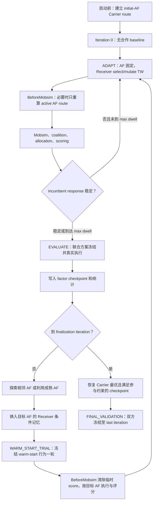
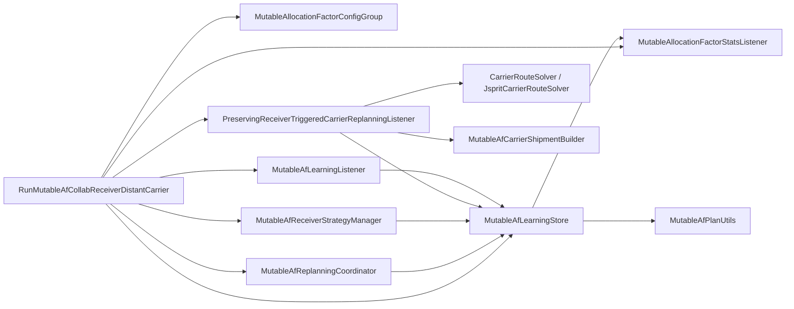

# Mutable Allocation Factor：Carrier–Receiver 双时间尺度协同学习

## 1. 文档目的

本文说明 `xp-collaboration` 中 Mutable Allocation Factor（以下简称 Mutable AF）的设计、实现和使用方法。主要入口是：

```text
org.matsim.contrib.freightcollaboration.run.RunMutableAfCollabReceiverDistantCarrier
```

本文不要求读者先阅读 Java 源码。读完后应能回答：

- Mutable AF 要解决什么研究问题；
- 为什么不能让 Carrier 和 Receiver 每轮无条件同时 mutation；
- Carrier 如何固定一个 AF，让 Receiver 在这个报价下学习时间窗响应；
- 如何判定一个 AF 下的响应已经“操作性稳定”；
- Carrier 何时探索相邻 AF、何时利用历史 AF；
- Carrier plan memory、Receiver 条件记忆和 checkpoint 有什么区别；
- jsprit 在什么条件下运行，哪些 CarrierPlan 会被修改；
- cooperation surplus 如何按当前 AF 分配并进入双方 score；
- 最后 10% iterations 如何选择和验证最终方案；
- 所有配置项、CLI 参数和 CSV 输出分别表示什么；
- 新实现对已有 fixed-AF Runs 是否有影响。

本文中的“均衡”是一个工程定义：在固定 AF 下，Receiver incumbent response、coalition、Carrier score、Receiver aggregate score 和 surplus 连续多轮足够稳定。它是一个经过验证的局部响应均衡，不宣称数学上的全局 Stackelberg equilibrium。

---

## 2. 研究目标和经济机制

### 2.1 Allocation Factor 的含义

Carrier–Receiver 合作允许 Receiver 放宽 delivery time window。更宽的时间窗可能使 Carrier 的 VRP 更容易求解，从而降低路线、车辆或司机成本。设：

- `S`：合作产生的 total cost savings；
- `phi_i`：allocation model 给 Receiver `i` 计算的边际贡献；
- `a`：Carrier 给出的 allocation factor，`0 <= a <= 1`。

在当前 `COST_SAVINGS` 机制下，可以把 Receiver 的合作收益概括为：

```text
Receiver i 的 transfer = a × phi_i
Carrier 支付给所有 Receiver 的 signed transfer = a × sum(phi_i)
```

`a` 越高，Carrier 愿意把越多合作价值转给 Receiver。Receiver 因此更可能接受较宽时间窗；更宽时间窗又可能创造更大的 `S`。

本实现希望捕捉的核心机制是：

> Carrier 提高 AF，可能诱导 Receiver 放宽 TW，产生更大的总节约；Carrier 即使让出更高比例，也可能因为总 surplus 增大而得到更高绝对收益。

Carrier 优化的不是单轮的 `a`，而是 Receiver 在该 `a` 下经过适应后的长期响应。

### 2.2 为什么旧的“每轮改变 AF”不够

如果 Carrier 每轮改变 AF，同时 Receiver 每轮选择或 mutation TW，那么一次 Carrier score 同时受到以下因素影响：

- 当前 AF；
- 当前 Receiver TW profile；
- 哪些 Receiver 加入 coalition；
- 当前 VRP route；
- MATSim 和 jsprit 的运行结果。

这样会把不同报价和不同 Receiver 状态下的单轮 score 混在一起。Carrier 无法判断“0.8 比 0.7 好”，还是“这一轮恰好有更多 Receiver 放宽 TW”。

新实现采用双时间尺度：

- 快时间尺度：AF 固定时，Receiver 自主选择或 mutation TW；
- 慢时间尺度：一个 AF 完成 adaptation 和 evaluation 后，Carrier 才决定是否切换 AF。

因此，Carrier 比较的是各 AF 下经过冻结验证的 response checkpoint，而不是任意 iteration 的 plan score。

---

## 3. 总体状态机



状态定义在 `MutableAfPhase`：

| Phase | 含义 | Carrier AF | Receiver | jsprit |
|---|---|---|---|---|
| `BASELINE` | iteration 0 基准 | initial AF 仅作为 plan 属性 | 原始计划 | 启动前已求解，profile 相同则复用 |
| `ADAPT` | 固定 AF 的响应学习 | 不变 | 0.7 选择、0.3 TW mutation | Receiver profile 变化时运行 |
| `EVALUATE` | 冻结联合 incumbent | 不变 | keep incumbent | 第一次 profile 变化时运行，之后复用 |
| `SWITCH_PENDING` | 下一次 replanning 执行 AF 切换 | 只切换一次 | context archive/restore | 尚未执行 |
| `WARM_START_TRIAL` | 新报价下的一轮冻结试运行 | 已切到目标 AF | keep warm-start selected，不选择、不 mutation、不 removal | 强制处理；profile 不同则求解，相同可复用 |
| `FINAL_VALIDATION` | 最终方案验证 | 固定 | 固定 | profile 不变时复用 |

时间语义非常重要：

1. iteration 0 不做 collaboration，只记录 baseline；
2. iteration 1 使用 initial AF，不能在开始时 mutation；
3. AF 只在一次 visit 完成后改变；
4. AF 切换发生在 replanning 开始；切换当轮先执行一次 `WARM_START_TRIAL`，Receiver 不做 selection 或 mutation；
5. trial 的真实目标-AF score 在 iteration end 写回后，下一轮才进入 `ADAPT`；
6. initial AF 不经过 warm-start trial，iteration 1 直接正常适应；
7. finalization 恢复 checkpoint 时直接进入 `FINAL_VALIDATION`，也不经过 warm-start trial；
8. finalization 默认从 iteration 90 开始，而不是等到 iteration 100 才恢复最佳方案。

---

## 4. 核心组件和职责



### 4.1 `MutableAllocationFactorConfigGroup`

这是 opt-in 配置模块。只有配置中存在该 module，allocation engine 才从 selected CarrierPlan 读取 per-coalition factor。没有该 module 时，原有 fixed `double ALLOCATION_FACTOR` 路径保持不变。

### 4.2 `MutableAfLearningStore`

这是 mutable run 专用单例，是整个状态机的唯一权威状态源。它负责：

- Carrier 到 Receiver 的所有权校验；
- 当前 factor、phase、visit、dwell 和 stability counter；
- live Carrier factor plans；
- Receiver factor-conditioned contexts；
- baseline；
- factor summary；
- checkpoint；
- 探索、利用和淘汰；
- final selection；
- 提供不可修改的输出 snapshot。

普通 `CarrierPlan.getScore()` 只表示该 plan 最近一次执行的分数。AF 的长期质量只来自 store 中稳定 evaluation 的 mean/variance。

### 4.3 `MutableAfReplanningCoordinator`

它是高优先级 `ReplanningListener`。每轮 replanning 先调用：

```java
learningStore.prepareReplanning(iteration);
```

该调用完成 phase transition、AF switch、Receiver context 换入或 finalization。它必须先于默认 Carrier 和 Receiver replanning listener 执行。

### 4.4 `MutableAfReceiverStrategyManager`

它只绑定在 mutable run 中，不修改 `freightreceiver` 的默认策略。它根据 store phase 决定：

- `ADAPT`：select 或 mutate；
- `WARM_START_TRIAL`：严格保持 selected warm-start plan；
- `EVALUATE`：选中当前 AF incumbent；
- `FINAL_VALIDATION`：保持 incumbent；
- 同一 Receiver 同一 iteration 最多处理一次。

### 4.5 `PreservingReceiverTriggeredCarrierReplanningListener`

这是 mutable-only 的 BeforeMobsim VRP listener。它先把 warm-start selected plan 的临时兼容分数清空，再重建 shipments，但只更新 selected CarrierPlan。Dormant factor plans 不能被覆盖。若存在 `WARM_START_TRIAL`，即使普通 Receiver replanning interval 判断为“本轮不处理”，该 listener 也必须执行。

### 4.6 `MutableAfLearningListener`

在 startup 初始化 store；在 IterationEnds 读取双方已完成 scoring 的 plan score，并推进 adaptation/evaluation 状态机。

### 4.7 `MutableAllocationFactorStatsListener`

它在 learning listener 之后运行，把 iteration snapshot 和新 checkpoint 追加到三个独立 CSV。

---

## 5. Carrier 的 AF 记忆

### 5.1 AF 使用 grid index 作为 key

内部不直接用 `double` 作为 map key。AF 被表示为：

```java
record FactorKey(Id<Carrier> carrierId, int gridIndex) {}
```

数值由配置统一转换：

```java
double factor = config.valueAt(gridIndex);
int gridIndex = config.indexOf(factor);
```

这样避免 `0.7` 与 `0.7000000000001` 被当作两个不同报价。

### 5.2 一个 AF 最多一个 live CarrierPlan

强约束是：

```text
一个 Carrier + 一个 gridIndex <=> 最多一个 live CarrierPlan
```

启动时若同一 Carrier 已有两个相同 grid index 的 plans，store 会立即失败。Carrier memory 不保存同一 AF 的多条局部 route 历史。

Live plan 保存：

- AF attribute；
- 该 AF 上次激活时的 route；
- 最近一次执行 score；
- route 对应的 Receiver profile hash attribute。

它不保存 AF 的长期平均质量。长期质量在 `FactorSummary`。

### 5.3 `FactorSummary`

每个尝试过的 factor 都有轻量统计：

```java
record FactorSummary(
    int gridIndex,
    double factor,
    int visits,
    int matureEvaluations,
    double carrierScoreMean,
    double carrierScoreVariance,
    int lastVisitedIteration,
    FactorMaturity maturity,
    boolean participationFeasible,
    boolean retained
) {}
```

`FactorMaturity` 含义：

| 值 | 含义 |
|---|---|
| `UNVISITED` | 有统计入口但尚未访问 |
| `ADAPTING` | 当前或历史 visit 尚未形成稳定验证 |
| `MATURE_STABLE` | 通过正常稳定判定并完成冻结 evaluation |
| `VALIDATED_UNSTABLE` | 到 max dwell 后强制 evaluation，不能正常 exploitation |
| `EVICTED` | live plan/context/checkpoint 已删除，仅保留轻量历史统计 |

### 5.4 Checkpoint 不等于 CarrierPlan

成熟 evaluation 会创建不可选择的 `FactorCheckpoint`。它不是第二个 MATSim plan，不占用 Carrier plan memory。它保存：

- Carrier scheduled tours 的深复制；
- Receiver 当前 factor context 的 plans 和 selected index；
- evaluation 起止 iteration；
- Carrier mean score；
- Receiver mean scores；
- total surplus mean；
- collaborating Receivers；
- maturity 和 participation feasibility。

用途是：

- 记录一个 factor 下经过共同执行的局部响应结果；
- finalization 恢复最佳联合状态；
- 为诊断 CSV 提供完整信息。

---

## 6. Receiver 的 AF 条件记忆

### 6.1 为什么必须按 AF 隔离

假设 Receiver plan `R1` 在 AF=0.8 下得分 100，`R2` 在 AF=0.5 下得分 80。直接放在同一个 MATSim plan memory 中比较是不合法的，因为它们面对的 Carrier 报价不同。

因此，活动 Receiver memory 始终只包含当前 AF context 的 plans。

每个 ReceiverPlan 都带三个 attributes：

```java
mutableAf.gridIndex
mutableAf.contextGeneration
mutableAf.outsideOption
```

AF 切换试运行中的 selected plan 还会临时带两个 attributes：

```java
mutableAf.pendingEvaluation
mutableAf.sourceFactorIndex
```

其中 `gridIndex` 永远表示当前目标 AF；`sourceFactorIndex` 只说明 warm-start 行为来自哪个 AF。`pendingEvaluation=true` 表示 plan 上暂存的 score 还不是目标 AF 下的观测，不能进入 selection、incumbent、稳定性判断或 checkpoint。

### 6.2 AF 切换时的 archive/restore

切换过程分为 outgoing archive、目标 context 恢复和一轮真实试运行：

1. 把 outgoing AF 的活动 Receiver plans 和 selected 引用存入该 AF archive；
2. outgoing context 的全部 plan 对象、scores 和 attributes 原样保留，不把整个 plan set 复制到新 AF；
3. 查找 target AF archive；
4. 若是首次访问，从 outgoing selected plan 深复制一个 adaptive seed；
5. seed 保留 TW、orders、attributes 和 outgoing score，并把这个 score 标记为 temporary compatibility score；
6. 若是重访，恢复 target AF 自己的 archived plans，优先选择该 context 原 selected；无有效分数时再选该 context 最佳非 pending plan或 outside option；
7. 从 `CollaborationDataStore` immutable original plan 创建/保留 outside option，其初始 score 明确使用 iteration-0 baseline；
8. 把 target context 安装为 Receiver 的唯一活动 plan set，并进入 `WARM_START_TRIAL`；
9. Replanning 阶段保持 warm-start selected，不 select、不 mutation、不 plan removal；
10. BeforeMobsim 清空 temporary score，按目标 AF 真实执行 VRP、collaboration、allocation 和 scoring；
11. IterationEnds 验证真实有限 score 后清除 pending 标记，下一轮才进入 `ADAPT`。

首次访问的核心代码语义可以概括为：

```java
ReceiverPlan adaptive = copyReceiverPlan(outgoingSelected, true);
tag(adaptive, targetGridIndex, generation, false);
markPendingEvaluation(adaptive, outgoingGridIndex);

ReceiverPlan outside = copyReceiverPlan(originalPlan, false);
tag(outside, targetGridIndex, generation, true);
outside.setScore(iteration0Baseline);
```

这里复制旧 score 是为了兼容现有 `ReceiverControlerListener` 在 Replanning 阶段执行的：

```java
receiver.setInitialCost(receiver.getSelectedPlan().getScore());
```

它不是新 AF 的质量估计。`MutableAfLearningStore.incumbent()` 和 Receiver ExpBeta 都显式过滤 pending plan；BeforeMobsim 又会把它清空，因此它不可能流入目标 AF 的学习统计。

Carrier 没有永久强迫 Receiver 选择历史 TW。仅在报价刚切换的一轮冻结该行为，让系统取得可归因于目标 AF 的首个真实 observation；下一轮 Receiver 仍可选择 outside option 或继续 mutation。

### 6.3 首次访问与重访的差异

首次访问新 AF：

- 只复制 outgoing selected behavior，不迁移 outgoing 全部 memory；
- outgoing selected score 必须非空且有限，否则明确失败，不回退为 `0`；
- 若 warm-start behavior 与 original outside option 完全相同，只保留 outside plan，并将它标记 pending；
- duplicate 情况下 Replanning 可读取 iteration-0 baseline，BeforeMobsim 仍会清空并重新评分。

重访历史 AF：

- 不复制当前 outgoing AF 的 selected plan；
- 恢复目标 AF 自己的完整 archived context；
- selected temporary score 是该目标 AF 的历史 score；
- `sourceFactorIndex` 等于 target factor，表示“重新验证本 AF 的历史经验”；
- archived selected 无有效 score 时依次回退到该 context 的最佳非 pending plan和 protected outside option；均不可用则明确失败。

### 6.4 Outside option

每个 context 至少有一个由原始 Receiver plan 生成的 outside option：

- lower/upper TW 来自 original plan；
- 不会被 plan removal 删除；
- 用 iteration 0 score 作为进入新 context 时的比较基准；
- 若实际执行，当前 iteration scoring 会再次更新它的 score。

如果 adaptive seed 与 outside option 行为完全相同，只保留 outside option，且 selected 必须指向活动 memory 中的该对象。

### 6.5 深复制范围

`MutableAfPlanUtils.copyReceiverPlan` 基于 ReceiverPlan 的 copy API，并显式复制 attributes、score policy 和 selected policy。需要保留的行为信息包括：

- time windows；
- receiver orders；
- product/order association；
- carrier association；
- collaboration attributes；
- mutable AF context attributes。

跨 context 新建 seed 时暂时复制 outgoing selected score并标记 pending；BeforeMobsim 清空。只有当轮 scoring 写回的目标-AF score 才会在 trial 完成后保留。同 context archive/restore 和 checkpoint copy 保留已验证 score。

---

## 7. Receiver replanning 规则

### 7.1 WARM_START_TRIAL 阶段

Mutable manager 对该 phase 执行严格的 `keepWarmStartSelected`：

- selected plan 必须属于 active factor context；
- `pendingEvaluation` 必须为 `true`；
- Replanning 阶段 temporary score 必须非空且有限；
- 不调用 ExpBeta；
- 不调用 TW mutation；
- 不选择 outside option替换 warm-start behavior；
- 不做 plan removal；
- 即使默认 listener 以累计 collection 多次调用 manager，同一 Receiver 也只校验/处理一次。

任一条件不满足都会抛出包含 Receiver ID、factor 和 phase 的异常，而不是在默认 listener 中以不透明的 NPE 失败。

### 7.2 ADAPT 阶段

默认固定策略权重是：

```text
ExpBeta-like selection = 0.7
TW upper-bound mutation = 0.3
```

选择时先把当前 context 中有限 score 归一化到 `[0,1]`，再计算：

```java
weight = exp(10.0 * normalizedScore);
```

高分 plan 更容易选中，但不是确定性 best-plan。

Pending plan 永远不在 ExpBeta 候选集合中。Trial 完成时 pending 已清除，下一 iteration 才恢复下面的普通 selection/mutation。

### 7.3 TW mutation

第一版 mutable-only mutation 规则是：

- 只改变第一个 TimeWindow 的 upper bound；
- lower bound 不变；
- 每次 `+1h` 或 `-1h`；
- upper bound 不能小于 immutable original upper bound；
- time-window width 最大 12 小时；
- upper bound 不晚于 18:00；
- mutation plan score 清空。

关键下界不是当前 plan 的 TW，而是：

```java
CollaborationDataStore.originalPlans[RECEIVER][receiverId]
    .timeWindows[0].end
```

所以 Receiver 可以撤回部分 relaxation，但不能比原始 TW 更严格。

### 7.4 EVALUATE 和 FINAL_VALIDATION

这两个 phase 不 mutation。Manager 选中当前 context 内 score 最高的 incumbent。Evaluation 记录的是这个联合 profile 被真实执行后的 score，不是把不同历史 plan 的分数拼在一起。

### 7.5 去重 freightreceiver listener 的累计调用

现有 `ReceiverControlerListener` 会在循环中多次调用 strategy manager，并传入逐渐增大的 Receiver collection。Mutable manager 用：

```text
processedIteration + processedReceiverIds
```

去重，保证一个 Receiver 每轮最多 replanning 一次。这个修复只存在于 mutable manager，没有修改 `freightreceiver` 全局 listener。

### 7.6 Receiver plan removal

默认每个 Receiver/AF 最多 5 个活动 plans，包括 outside option。超过上限时：

1. 优先找相同行为 signature 的低分、非 selected、非 outside duplicate；
2. 否则删除最低分的非 selected、非 outside plan；
3. unscored plan 的 removal priority 最低；
4. outside option 永不删除。

---

## 8. 驻留和稳定判定

### 8.1 Dwell

默认：

```text
新 AF minimum ADAPT dwell       = 6
有成熟 checkpoint 的 AF 重访   = 3
maximum ADAPT dwell             = 15
```

在 minimum dwell 之前，即使指标暂时稳定也不会 evaluation。这为 Receiver 提供了足够的适应时间。

实际 AF 切换后的 frozen trial 是该 target AF 的第一个真实 dwell observation。Trial 完成时状态为：

```text
dwell = 1
stableStreak = 0
previousAdaptObservation = trial observation
phase = ADAPT
```

它不会直接触发 evaluation，也不会增加 mature evaluation、stable mean/variance 或 checkpoint。后续 ADAPT observations 才能累积稳定 streak。`WARM_START_TRIAL` 固定一轮，不增加新的配置参数。

### 8.2 观察 incumbent response，而不是 selected 是否完全不变

多个 Receiver 每轮仍有 30% mutation 时，要求所有 selected plans 连续三轮完全不变几乎不可能。新实现观察：

- 每个 Receiver 当前 context 内最高分 plan 组成的 TW/profile signature；
- coalition Receiver membership；
- Carrier selected plan score；
- Receiver selected score aggregate；
- grand coalition surplus。

数值稳定使用：

```java
relativeDelta = abs(current - previous)
    / max(1.0, abs(current), abs(previous));
```

默认容差 `1e-3`。

### 8.3 进入 EVALUATE

同时满足以下条件才视为一次 stable comparison：

- incumbent profile 相同；
- coalition membership 相同；
- Carrier score relative delta 不超过 tolerance；
- Receiver aggregate score relative delta 不超过 tolerance；
- surplus relative delta 不超过 tolerance。

连续 `STABILITY_WINDOW=3` 次且达到 minimum dwell 后进入 EVALUATE。

### 8.4 最大 dwell 和不稳定验证

达到 `MAX_ADAPT_DWELL=15` 仍不稳定，也会冻结 evaluation，避免某个 factor 永久占用模拟。结果标记为：

```text
VALIDATED_UNSTABLE
```

它会被写入输出，可用于诊断，但：

- 不进入正常 exploitation candidate；
- finalization 不把它报告为成熟均衡；
- 若最终没有任何稳定可行 checkpoint，回退 baseline。

### 8.5 Evaluation window

默认冻结执行 3 轮：

1. Receiver 选中联合 incumbent；
2. 第一次 BeforeMobsim 在 profile 改变时重算 route；
3. 后续 profile 相同则复用 route；
4. 每轮经过真实 Mobsim、allocation 和 scoring；
5. 计算 Carrier mean/variance、Receiver means 和 surplus mean。

单轮高分不能成为成熟 factor，必须经过该窗口。

---

## 9. AF 探索与利用

### 9.1 决策时点

普通 Carrier `GenericPlanStrategy` 不再改变 AF。默认 Carrier manager 只有一个权重为 1 的 `KeepSelected`，防止默认 listener 进行第二次独立 mutation。

AF 决策只在 `SWITCH_PENDING` 由 learning store 执行一次。

### 9.2 探索概率

```java
coverage = 1.0 - retainedFactorCount / (double) maxFactorPlans;

pExplore = clamp(
    minExplorationProbability,
    maxExplorationProbability,
    mutationWeight * coverage
);
```

默认：

```text
min = 0.10
max = 0.80
mutationWeight = 1.0
```

含义：

- memory 空余越多，越倾向探索；
- memory 满后仍有 10% exploration；
- `MUTATION_WEIGHT` 现在是 exploration probability 倍率，不再是每轮 strategy weight。

### 9.3 相邻探索

- 内部 grid point：左右邻居等概率；
- 下边界：只能向上；
- 上边界：只能向下；
- 邻居已 retained：直接激活其 plan/context；
- 邻居未 retained：复制当前 physical plan 创建 target factor plan，清空 score 和 route-profile attribute，然后按需淘汰。

无论 unseen 还是 revisit，只要 AF 实际发生变化，就先进入一轮 `WARM_START_TRIAL`。新 plan 随后会因为 factor/profile 改变在 BeforeMobsim 求解正确 route；revisit plan 若保存的 route profile 与恢复的 Receiver profile一致，可以复用 route，但仍必须完成临时 score 清除、目标 AF allocation 和真实 scoring。

### 9.4 利用成熟 AF

利用候选必须：

- retained；
- 不是当前 AF；
- maturity 为 `MATURE_STABLE`。

Carrier stable mean 先归一化，再 softmax：

```java
normalized = (score - minScore) / (maxScore - minScore);
weight = exp(EXPLOITATION_BETA * normalized);
```

默认 `EXPLOITATION_BETA=4.0`。没有成熟 candidate 时强制相邻探索。

所有随机数来自 MATSim seeded RNG。相同 MATSim seed 和相同输入应产生相同决策序列。

---

## 10. Bounded memory 和淘汰

### 10.1 为什么不保存整个 grid

例如 grid 有 19 个点，但 `MAX_FACTOR_PLANS=5`。低 AF 可能长期不诱导合作，把所有 factor 都保存在 Carrier/Receiver memory 会：

- 增加 plan 管理成本；
- 让低质量历史长期占用内存；
- 与有限认知/有限策略记忆的行为假设不一致。

### 10.2 淘汰顺序

需要创建新 factor 且 memory 已满时，候选按以下优先级淘汰：

1. `VALIDATED_UNSTABLE`、`UNVISITED`、`ADAPTING` 等低 maturity；
2. 不满足参与约束的 mature factor；
3. Carrier stable mean 较低的可行 mature factor；
4. 相同质量时，较久未访问；
5. 再相同按 grid index，保证确定性。

当前全局最优且 participation-feasible 的 mature factor 被保护。

### 10.3 原子切换

切换顺序是：

1. archive outgoing Receiver context；
2. 选择合法 victim；
3. 创建并 select target CarrierPlan；
4. 激活 target context；
5. 删除 victim live plan/context/checkpoint。

因此 outgoing plan 即使是 victim，也是在 target 已 selected 后删除，不会让 Carrier 在 iteration 中途没有 selected plan。

### 10.4 被淘汰后保留什么

删除：

- live CarrierPlan；
- tours；
- Receiver context archive；
- checkpoint 重对象。

保留：

- visits；
- mature evaluation count；
- stable Carrier mean/variance；
- last visited iteration；
- maturity tombstone；
- 已经写入 CSV 的 local optimum history。

---

## 11. VRP 和 CarrierPlan 更新

### 11.1 启动前 bootstrap

Mutable run 在创建 `CollaborationModule` 之前完成：

1. Receiver orders 关联到 Carrier；
2. 根据 selected Receiver plans 重建 shipments；
3. 调用 jsprit 求初始 route；
4. 创建唯一 initial-AF CarrierPlan；
5. 设置 selected；
6. 保存 route profile attribute；
7. 再创建 CollaborationModule/DataStore。

简化代码：

```java
MutableAfCarrierShipmentBuilder.rebuild(scenario);
CarrierPlan initial = solver.solve(carrier, scenario);
CarrierAllocationFactor.set(initial, config.getInitialAllocationFactor(), config);
initial.getAttributes().putAttribute(CARRIER_ROUTE_PROFILE, receiverProfile);
carrier.clearPlans();
carrier.addPlan(initial);
carrier.setSelectedPlan(initial);
```

这消除了旧流程中 DataStore 初始化时 `selected plan might be null` 的警告，并确保 iteration 0 有可执行 baseline route。

### 11.2 每轮 shipment rebuild

`MutableAfCarrierShipmentBuilder` 先清空 Carrier services/shipments，再从所有 selected Receiver plans 重建 shipments。若 ReceiverOrder 尚未关联 Carrier，会明确失败。

### 11.3 只修改 active plan

Listener 的核心规则：

```java
CarrierPlan active = carrier.getSelectedPlan();
String profile = selectedReceiverProfile(...);

if (profile.equals(previousProfile) && !active.getScheduledTours().isEmpty()) {
    reuseRoute();
} else {
    CarrierPlan solved = routeSolver.solve(carrier, scenario);
    replaceToursOnly(active, solved);
    active.setScore(null);
    active.attributes.routeProfile = profile;
}
```

Dormant plans 的 tours、score、factor 和 attributes 完全不变。这是相对旧 mutable 实现最关键的行为修复之一。

### 11.4 深复制 tours

更新 route 时不直接共享 `ScheduledTour` 或 `Tour`：

```java
ScheduledTour.newInstance(
    source.getTour().duplicate(),
    source.getVehicle(),
    source.getDeparture()
)
```

因此 active/dormant plan 不会通过共享可变 tour 互相污染。

### 11.5 Solver 调用上限

每个 Carrier、每个需要更新的 iteration 最多调用一次 jsprit。以下情况触发：

- 新 factor plan；
- selected Receiver profile 变化；
- active plan 尚无 route；
- factor 重访时保存的 route profile 与当前 context 不同。

相同 profile 会复用 route，尤其减少 EVALUATE 和 FINAL_VALIDATION 的求解成本。

### 11.6 Warm-start 与 Receiver replanning interval

普通情况下 listener 只在 Receiver replanning interval 到期时重建 shipments/route。但 AF/context 切换不能等待到未来某轮，否则新的报价会配上旧的 Receiver/Carrier operational state。实现因此使用：

```java
boolean warmStartTrial = learningStore.hasPendingWarmStartTrial();
if (!normallyDue && !warmStartTrial) {
    return;
}
if (warmStartTrial) {
    learningStore.beginWarmStartExecution(iteration);
}
```

严格顺序为：

```text
Replanning：默认 Receiver listener 读取 temporary score
→ mutable Receiver manager 冻结 selected behavior
→ BeforeMobsim：清除 temporary score
→ rebuild shipments
→ 更新或复用 active CarrierPlan route
→ coalition / Mobsim / allocation / scoring
→ IterationEnds：校验真实 score并结束 trial
```

`beginWarmStartExecution` 会先验证所有 warm-start Receivers，再统一清分，避免多 Receiver 场景出现一部分已清、一部分失败的半完成状态。

---

## 12. Allocation 和双方 scoring

### 12.1 Fixed 与 mutable 路径隔离

`FreightCollaborationEngine` 检查 config module：

```java
if (config.getModules().get("mutableAllocationFactor") == null) {
    return createAllocationModel(fixedDoubleFactor);
}
return createAllocationModel(perCoalitionResolver);
```

因此所有旧 Runs 不添加 mutable config 时继续使用 `FreightCollaborationConfigGroup.ALLOCATION_FACTOR`。

### 12.2 Per-coalition factor resolver

Mutable `CARRIER_RECEIVER` coalition 必须有且只有一个 Carrier distributor。Resolver 从该 Carrier selected plan 读取：

```java
double factor = CarrierAllocationFactor.require(
    carrier.getSelectedPlan(), mutableConfig);
```

LSP coalition 仍走 fixed factor。第一版 mutable run 只允许：

```text
CARRIER_RECEIVER + COST_SAVINGS
```

其他 allocation value type 启动时失败。

### 12.3 DataStore 额外记录

Mutable allocation 会记录：

- coalition 实际使用的 factor；
- distributor 的 signed player transfer。

这些值不会修改原 `collaboration_data.xml` schema，用于 scoring、learning observation 和 CSV。

### 12.4 Receiver score

Receiver 继续使用现有 `ReceiverScoringFunctionFactoryUsecase`，合作 allocation 与 TW relaxation penalty 共同影响 score。

### 12.5 Carrier score

Mutable run 绑定 `MutableAfCarrierScoringFunctionFactory`。Carrier score 包括：

- driver leg cost；
- vehicle employment cost；
- driver activity cost；
- linked Receiver fee；
- signed transfer deduction。

Transfer 部分：

```java
return -dataStore.getDistributorPlayerTransfer(
    CollaboratorRole.CARRIER, carrier.getId());
```

因此提高 AF 会直接增加 Carrier 支付，但若它诱导更大 route saving，Carrier 总 score 仍可能提高。

---

## 13. Finalization 和参与约束

### 13.1 Finalization iteration

```java
firstIteration
    + round((lastIteration - firstIteration)
    * DISABLE_INNOVATION_FRACTION)
```

默认：

```text
first = 0
last = 100
fraction = 0.9
finalization = 90
```

iteration 90 的 replanning 开始即进入 `FINAL_VALIDATION`。

### 13.2 合法候选

最终候选必须：

- retained；
- `MATURE_STABLE`；
- 有 best stable checkpoint；
- Carrier mean score 不低于 iteration 0 baseline；
- 每个实际合作 Receiver mean score 不低于其 iteration 0 baseline。

比较允许 `PARTICIPATION_RELATIVE_TOLERANCE`，默认 `1e-6`。

Receiver welfare 是 participation constraint，不是最终优化目标。合法候选中选择 Carrier mean score 最高者。

### 13.3 恢复联合 checkpoint

最终选择同时恢复：

- target CarrierPlan；
- checkpoint tours 的深复制；
- target AF；
- checkpoint Receiver context；
- selected Receiver plans。

之后双方冻结到 last iteration，进行 out-of-sample-like final validation。

### 13.4 无可行成熟候选

若不存在合法候选：

- 恢复 baseline Carrier tours；
- 恢复 original Receiver plans；
- initial AF 仅保留为 plan/config 值；
- final status 为 `NO_FEASIBLE_MATURE_FACTOR`；
- 不把 unstable checkpoint 冒充为 equilibrium。

---

## 14. 配置详解

### 14.1 AF grid 与 memory

| Java/XML 参数 | 默认值 | 含义 |
|---|---:|---|
| `INITIAL_ALLOCATION_FACTOR` | `0.8` | iteration 1 使用的初始报价，必须在 grid 上 |
| `MIN_ALLOCATION_FACTOR` | `0.0` | AF 下界，必须在 `[0,1]` |
| `MAX_ALLOCATION_FACTOR` | `1.0` | AF 上界，必须在 `[0,1]` |
| `ALLOCATION_FACTOR_STEP` | `0.1` | 相邻探索步长，必须整除 `[min,max]` |
| `MAX_FACTOR_PLANS` | `5` | 每个 Carrier 最多 retained live AF plans；至少 2，可小于 grid 点数 |

Run 的实验默认与 ConfigGroup 的通用默认略有不同：Run 默认 `min=0.1`、`max=1.0`、`step=0.05`、`cap=5`。

### 14.2 驻留和 evaluation

| 参数 | 默认值 | 含义 |
|---|---:|---|
| `NEW_FACTOR_MIN_DWELL` | `6` | 首次访问/无成熟 checkpoint 的最少 ADAPT iterations |
| `REVISIT_FACTOR_MIN_DWELL` | `3` | 成熟 AF 重访时最少 ADAPT iterations |
| `STABILITY_WINDOW` | `3` | 连续稳定 comparison 数 |
| `MAX_ADAPT_DWELL` | `15` | 最长 ADAPT，达到后强制 unstable evaluation |
| `EVALUATION_WINDOW` | `3` | 冻结联合 incumbent 的执行轮数 |
| `STABILITY_RELATIVE_TOLERANCE` | `0.001` | Carrier/Receiver aggregate/surplus 相对变化容差 |
| `PARTICIPATION_RELATIVE_TOLERANCE` | `0.000001` | 最终参与约束浮点容差 |

### 14.3 探索和利用

| 参数 | 默认值 | 含义 |
|---|---:|---|
| `MUTATION_WEIGHT` | `1.0` | exploration probability 倍率，不是每轮 mutation weight |
| `MIN_EXPLORATION_PROBABILITY` | `0.10` | memory 满时仍保留的探索下限 |
| `MAX_EXPLORATION_PROBABILITY` | `0.80` | 探索概率上限 |
| `EXPLOITATION_BETA` | `4.0` | mature AF softmax 对高 Carrier score 的偏好强度 |
| `DISABLE_INNOVATION_FRACTION` | `0.9` | finalization 在总 iteration 区间中的比例 |

### 14.4 Receiver memory

| 参数 | 默认值 | 含义 |
|---|---:|---|
| `MAX_RECEIVER_PLANS_PER_FACTOR` | `5` | 每 Receiver、每 active AF context 的 plans 上限，包含 outside option |

以下值目前是 mutable strategy 的实现常量，不是 CLI 参数：

| 常量 | 值 |
|---|---:|
| Receiver selection weight | `0.7` |
| Receiver mutation weight | `0.3` |
| Receiver selection beta | `10.0` |
| TW mutation step | `3600 s` |
| 最大 TW width | `12 h` |
| 最晚 TW end | `18:00` |

### 14.5 校验规则

启动前会校验：

- min/max/step 有限且构成合法 grid；
- step 整除区间；
- initial AF 在 grid 上；
- `2 <= MAX_FACTOR_PLANS <= gridPointCount`；
- dwell/window 为正；
- `NEW_FACTOR_MIN_DWELL >= REVISIT_FACTOR_MIN_DWELL`；
- `MAX_ADAPT_DWELL >= NEW_FACTOR_MIN_DWELL`；
- probability 在 `[0,1]`，且 min 不大于 max；
- tolerance 有限且非负；
- exploitation beta 为正；
- finalization 前至少能完成一次 new-factor dwell 和 evaluation；
- 每个 Receiver 只能关联一个 mutable Carrier；
- 每个 mutable Carrier 至少拥有一个 Receiver。

---

## 15. 使用方法

### 15.1 推荐入口

不要修改或复用 fixed run 来开启 mutable 功能。直接运行：

```text
RunMutableAfCollabReceiverDistantCarrier
```

默认输出目录：

```text
output/mutableAfCollabReceiverDistantCarrier
```

### 15.2 CLI 参数

```text
--initial-allocation-factor=0.8
--allocation-factor-min=0.1
--allocation-factor-max=1.0
--allocation-factor-step=0.05
--allocation-factor-mutation-weight=1.0
--allocation-factor-freeze-fraction=0.9
--allocation-factor-max-plans=5
--allocation-factor-new-dwell=6
--allocation-factor-revisit-dwell=3
--allocation-factor-stability-window=3
--allocation-factor-max-dwell=15
--allocation-factor-evaluation-window=3
--allocation-factor-stability-relative-tolerance=0.001
--allocation-factor-min-exploration-probability=0.10
--allocation-factor-max-exploration-probability=0.80
--allocation-factor-exploitation-beta=4.0
--receiver-plans-per-factor=5
--last-iteration=100
```

还接受 fixed distant-carrier run 的共享场景参数：

```text
--network-size
--carrier-scenarios
--instances
--network-file
--output-base
--receiver-area
--reuse-network-file
```

### 15.3 示例：较粗 grid、较长 dwell

```bash
java ...RunMutableAfCollabReceiverDistantCarrier \
  --initial-allocation-factor=0.7 \
  --allocation-factor-min=0.3 \
  --allocation-factor-max=0.9 \
  --allocation-factor-step=0.1 \
  --allocation-factor-max-plans=4 \
  --allocation-factor-new-dwell=10 \
  --allocation-factor-revisit-dwell=5 \
  --allocation-factor-max-dwell=25 \
  --allocation-factor-evaluation-window=4 \
  --last-iteration=150
```

解释：

- 可探索 7 个 grid points；
- live memory 只保存 4 个；
- 新报价至少给 Receiver 10 轮适应；
- 25 轮仍不稳定则强制验证；
- 每个 checkpoint 冻结执行 4 轮；
- iteration 135 左右开始 final validation。

### 15.4 Java 配置

```java
MutableAllocationFactorConfigGroup mutable =
    new MutableAllocationFactorConfigGroup();

mutable.setMinAllocationFactor(0.2);
mutable.setMaxAllocationFactor(1.0);
mutable.setAllocationFactorStep(0.05);
mutable.setInitialAllocationFactor(0.8);
mutable.setMaxFactorPlans(5);
mutable.setNewFactorMinDwell(6);
mutable.setRevisitFactorMinDwell(3);
mutable.setStabilityWindow(3);
mutable.setMaxAdaptDwell(15);
mutable.setEvaluationWindow(3);
mutable.setMinExplorationProbability(0.10);
mutable.setMaxExplorationProbability(0.80);
mutable.setExploitationBeta(4.0);
mutable.validateGrid();

config.addModule(mutable);
```

不要在 overriding Guice module 中再次 `bind(MutableAllocationFactorConfigGroup.class)`。MATSim 的 `ExplodedConfigModule` 会自动绑定 ConfigGroup；重复绑定会产生 `BindingAlreadySet`。

### 15.5 XML 配置示意

```xml
<module name="mutableAllocationFactor">
    <param name="INITIAL_ALLOCATION_FACTOR" value="0.8" />
    <param name="MIN_ALLOCATION_FACTOR" value="0.1" />
    <param name="MAX_ALLOCATION_FACTOR" value="1.0" />
    <param name="ALLOCATION_FACTOR_STEP" value="0.05" />
    <param name="MAX_FACTOR_PLANS" value="5" />
    <param name="NEW_FACTOR_MIN_DWELL" value="6" />
    <param name="REVISIT_FACTOR_MIN_DWELL" value="3" />
    <param name="STABILITY_WINDOW" value="3" />
    <param name="MAX_ADAPT_DWELL" value="15" />
    <param name="EVALUATION_WINDOW" value="3" />
    <param name="STABILITY_RELATIVE_TOLERANCE" value="0.001" />
    <param name="PARTICIPATION_RELATIVE_TOLERANCE" value="0.000001" />
    <param name="MIN_EXPLORATION_PROBABILITY" value="0.10" />
    <param name="MAX_EXPLORATION_PROBABILITY" value="0.80" />
    <param name="EXPLOITATION_BETA" value="4.0" />
    <param name="MUTATION_WEIGHT" value="1.0" />
    <param name="DISABLE_INNOVATION_FRACTION" value="0.9" />
    <param name="MAX_RECEIVER_PLANS_PER_FACTOR" value="5" />
</module>
```

---

## 16. 输出文件

### 16.1 `mutable_allocation_factor_stats.csv`

每 iteration、每 Carrier 一行。主要字段：

| 字段 | 含义 |
|---|---|
| `iteration` | MATSim iteration |
| `carrierId` | Carrier ID |
| `phase` | 当前状态机 phase |
| `activeFactorIndex` / `activeFactor` | 当前 selected AF |
| `visit` | Carrier 已完成/正在进行的 factor visit 序号 |
| `dwell` | 当前 ADAPT dwell counter |
| `stableStreak` | 连续稳定 comparison 数 |
| `evaluationCount` | 当前 evaluation 已记录轮数 |
| `decision` | `INITIAL_FACTOR`、`WARM_START_EXPLORE_UNSEEN_TO_x`、`WARM_START_EXPLOIT_REVISIT_TO_x`、`WARM_START_TRIAL_COMPLETE`、final decision 等 |
| `routeReplanned` | 本轮 active route 是否重新求解 |
| `warmStartTrial` | iteration end 时 Carrier 是否仍处于冻结试运行 phase |
| `warmStartSourceFactorIndex` | warm-start behavior 的来源 AF；unseen 时是 outgoing AF，revisit 时是 target AF |
| `warmStartScoreClearedBeforeMobsim` | 本轮是否已在 BeforeMobsim 清除 temporary score并进入真实执行 |
| `carrierScore` | 最近一次执行 score |
| `carrierBaseline` | iteration 0 Carrier score |
| `stableMean` / `stableVariance` | 当前 AF 的成熟 evaluation 长期统计 |
| `incumbentProfileHash` | Receiver incumbent profile 的诊断 hash |
| `activeCoalition` | 当前是否有 Receiver coalition |
| `receiverCount` | 当前 coalition Receiver 数量 |
| `totalSurplus` | DataStore 中当前 coalition value |
| `signedTransfer` | Carrier 本轮向 players 的 signed transfer |
| `retainedFactorIndices` | 当前 live AF grid indices，以 `;` 分隔 |
| `evictionEvent` | 本轮淘汰的 factor；没有淘汰时为空 |
| `factorStates` | 所有轻量 factor records 的 `gridIndex:maturity` 列表 |
| `finalStatus` | `SELECTED_FACTOR` 或 `NO_FEASIBLE_MATURE_FACTOR` 等 |

### 16.2 `mutable_allocation_factor_local_optima.csv`

每次 checkpoint 形成时立即追加，不等待 run 结束。字段包括：

- sequence 和 event type；
- Carrier/factor/grid index/visit；
- maturity；
- evaluation start/end；
- Carrier mean、baseline 和 gain；
- total surplus；
- participation feasible；
- checkpoint 当时是否 retained；
- 是否为 final selection。

AF 后续被淘汰，已写入的历史记录不会删除；listener 会再追加一条 `EVICTION` event，明确该 checkpoint 已不再 retained。Warm-start trial 不是 local optimum，不写入该文件。

### 16.3 `mutable_allocation_factor_receiver_outcomes.csv`

对每个 checkpoint、每个 Receiver 一行：

- factor 和 checkpoint iteration；
- Receiver ID；
- TW start/end；
- 是否实际 collaborating；
- evaluation mean score；
- baseline；
- gain。

该文件用于分析“某个 AF 诱导哪些 Receiver 放宽了多少 TW”。

该文件同样只记录正式 evaluation checkpoint，不记录 temporary trial observation。

### 16.4 最终权威结果

最终 AF 需要联合查看：

1. `mutable_allocation_factor_local_optima.csv` 中 `FINAL_SELECTION`；
2. final iterations 的 `mutable_allocation_factor_stats.csv`；
3. final Carrier plan iteration output；
4. Receiver final iteration output。

根目录 snapshot 可能属于 controller output lifecycle 的较早阶段，不能单独作为最终 score/AF 的权威来源。

---

## 17. Run 装配和兼容性

Mutable run 单独安装：

```java
bind(CarrierStrategyManager.class)
    .toProvider(new MutableAfCarrierStrategyManagerProvider(mutableConfig));
bind(ReceiverStrategyManager.class)
    .to(MutableAfReceiverStrategyManager.class);
bind(MutableAfLearningStore.class).asEagerSingleton();
bind(CarrierScoringFunctionFactory.class)
    .to(MutableAfCarrierScoringFunctionFactory.class);

addControlerListenerBinding().to(MutableAfReplanningCoordinator.class);
addControlerListenerBinding().to(PreservingReceiverTriggeredCarrierReplanningListener.class);
addControlerListenerBinding().to(MutableAfLearningListener.class);
addControlerListenerBinding().to(MutableAllocationFactorStatsListener.class);
```

隔离保证：

- `RunCollabReceiverDistantCarrier` 未修改；
- 其他 fixed `Run*.java` 未修改；
- `FreightCollaborationConfigGroup.ALLOCATION_FACTOR` 的旧语义不变；
- 不添加 mutable config 时 allocation engine 走 fixed-double path；
- 原 receiver-trigger listener 的 destructive `clearPlans()` 行为未全局修改；
- `freightreceiver` listener/strategy 源码未修改；
- 现有 `collaboration_data.xml` schema 未修改。

旧的 `CarrierAllocationFactorPlanStrategy` 和通用 removal selector 为兼容外部源码保留并标记 deprecated，但 mutable run 不再绑定或调用它们。

---

## 18. 约束和当前边界

第一版明确限制：

- 只支持 `CARRIER_RECEIVER + COST_SAVINGS`；
- 每个 Receiver 必须且只能属于一个 mutable Carrier；
- 多 Carrier 只能在 Receiver 集合互不重叠时独立学习；
- 不解决同一 AF 下所有局部均衡，只接受 MATSim 找到并验证的一个局部 response；
- 不搜索连续 AF，只搜索离散 grid；
- 不保证在有限 iterations 内访问整个 grid；
- `VALIDATED_UNSTABLE` 只用于诊断/warm history，不作为正常最终均衡；
- final objective 是 Carrier score 最大化，Receiver welfare 只作为 participation constraint；
- 当前 Receiver mutation 的步长、权重和日内上界是代码常量。

研究结果中应使用“factor-conditioned validated local response”或“操作性稳定局部响应”，避免声称已求得全局 Stackelberg equilibrium。

---

## 19. 常见问题与排查

### 19.1 `MutableAllocationFactorConfigGroup was bound multiple times`

原因：ConfigGroup 已被 MATSim 自动绑定，又在 Guice overriding module 中显式 bind。

处理：只 `config.addModule(mutableConfig)`；不要第二次 bind ConfigGroup class。

### 19.2 `selected plan might be null`

Mutable run 应在 `CollaborationModule` 构造前 bootstrap initial Carrier route。如果仍出现，检查：

- Receiver orders 是否已经生成并 link；
- Carrier 是否有 vehicle/capabilities；
- jsprit 是否返回 plan；
- bootstrap 是否在 CollaborationModule 之前执行。

### 19.3 AF 每轮都变化

正常实现不会发生。检查是否错误地重新绑定了 deprecated `CarrierAllocationFactorPlanStrategy` 或给默认 Carrier manager 加了 mutation strategy。

### 19.4 Dormant Carrier plans 的 tours 被覆盖

检查是否安装了原 destructive receiver-trigger listener，或使用了旧 preserving listener。Mutable run 必须：

```java
receiverConfig.setReceiverTriggerCarrierReplanning(false);
```

并单独安装 `PreservingReceiverTriggeredCarrierReplanningListener`。

### 19.5 一个 AF 长期不切换

查看 stats：

- `dwell` 是否尚未到 minimum；
- `stableStreak` 是否被 incumbent/coalition/score/surplus 波动重置；
- `MAX_ADAPT_DWELL` 是否设置过大；
- Receiver mutation 是否过于剧烈；
- stability tolerance 是否过严。

达到 max dwell 后应进入 forced evaluation。

### 19.6 最终回退 baseline

`NO_FEASIBLE_MATURE_FACTOR` 表示没有同时满足：

- stable maturity；
- Carrier no-worse-than-baseline；
- 每个合作 Receiver no-worse-than-baseline。

应查看 local optima 和 Receiver outcomes，不应简单放宽约束前先判断是没有稳定 checkpoint，还是 participation constraint 失败。

### 19.7 输出中的 plan score 与 factor stable mean 不同

这是预期行为：

- plan score 是最近一次执行；
- stable mean 是该 factor 多次成熟 evaluation 的长期统计；
- final selection 使用 checkpoint/summary，而非任意单轮 plan score。

### 19.8 `ReceiverPlan score=null at ReceiverControlerListener`

历史问题发生在 AF 切换的 Replanning 阶段：跨 AF warm-start plan 一创建就把 score 设为 `null`，而未修改的 `freightreceiver` 默认 listener 会先执行：

```java
receiver.setInitialCost(receiver.getSelectedPlan().getScore());
```

Java 在这里对 `Double` 自动拆箱，从而抛出 NPE。

修复后的不变量是：

- AF switch 完成后、整个 Replanning 阶段，selected warm-start plan 必须持有有限 temporary score；
- plan 同时标记 `pendingEvaluation=true`，所以临时值不能参与选择或学习；
- 仅 `PreservingReceiverTriggeredCarrierReplanningListener` 在 BeforeMobsim 调用 `beginWarmStartExecution()` 时将 score 清为 `null`；
- IterationEnds 要求 scoring 已写回有限目标-AF score，否则抛出 `Warm-start trial completed without a finite Receiver score`；
- trial 完成后才清 pending 并进入 `ADAPT`。

若修复后仍在 Replanning 阶段看到 null，请检查：

1. mutable run 是否安装了 `MutableAfReplanningCoordinator` 和 `MutableAfReceiverStrategyManager`；
2. 是否有其他自定义 listener 在 Replanning 内提前清空 Receiver score；
3. stats 的 `warmStartTrial`、`warmStartSourceFactorIndex` 和 `warmStartScoreClearedBeforeMobsim` 是否符合预期；
4. outgoing selected plan 在切换前是否确实有有限 score。实现不会为缺失 score伪造 `0`。

---

## 20. 测试和验证

实现包含以下层次的测试：

- Config 默认值、非法 grid/dwell/probability 和 XML round trip；
- initial AF 在 iteration 1 保持不变；
- ADAPT → EVALUATE → SWITCH_PENDING 状态转换；
- `SWITCH_PENDING → WARM_START_TRIAL → ADAPT` 一轮冻结状态转换；
- Replanning temporary score 可读取、BeforeMobsim 清空、IterationEnds 真实 score写回；
- pending plan 不进入 ExpBeta、incumbent、稳定性或 checkpoint；
- checkpoint maturity 和防御性 snapshot；
- Receiver context 首访只复制 selected behavior、完整归档 outgoing context、outside 去重和 AF 重访隔离；
- 普通 replanning interval 未到时，warm trial 仍强制 route handling；
- 同一 AF 最多一个 CarrierPlan；
- overlapping Carrier context 启动失败；
- active-only route 更新、dormant plan 不变；
- receiver profile 不变时不重复 solver；
- mutable/fixed allocation resolver 和 signed transfer scoring；
- 三个 CSV 的 header、escaping 和 append 行为；
- 旧 fixed 路径回归。

推荐验证命令：

```bash
mvn -pl contribs/xp-collaboration -am test
mvn -pl contribs/xp-collaboration -am verify -Pjacoco
```

连续运行两次可以检查随机重现性、线程泄漏和测试输出污染。

---

## 21. 一次完整学习周期示例

假设：

```text
initial AF = 0.70
step = 0.05
new dwell = 6
stability window = 3
evaluation = 3
```

可能的运行序列：

| Iteration | Phase/动作 | AF | Receiver/Carrier 状态 |
|---:|---|---:|---|
| 0 | BASELINE | 0.70 | 原始 TW，无 collaboration，记录 baseline |
| 1 | ADAPT | 0.70 | Receiver 首次 select/mutate |
| 2–6 | ADAPT | 0.70 | TW response 逐渐形成，route 按 profile 更新 |
| 7–9 | EVALUATE | 0.70 | 联合 incumbent 冻结，执行三轮 |
| 9 end | CHECKPOINT | 0.70 | 保存 Carrier mean、Receiver means、surplus、TW profile |
| 10 | WARM_START_TRIAL | 0.75 | 创建/激活相邻 factor；Receiver 保持 warm-start TW；Replanning 临时 score在 BeforeMobsim 清空并重新评分 |
| 11–18 | ADAPT | 0.75 | 下一轮起 Receiver 才恢复 select/mutate；更高 offer 可能诱导更多 TW relaxation |
| 19–21 | EVALUATE | 0.75 | 验证新联合响应 |
| 22 | WARM_START_TRIAL | 0.70/0.80 | 按 coverage 和 mature score 决策后，先冻结重验目标 context 一轮 |
| … | … | … | bounded memory 中循环学习 |
| 90 | FINAL_VALIDATION | 最优可行 mature AF | 恢复对应 Carrier route + Receiver context |
| 90–100 | FINAL_VALIDATION | 固定 | 不再 AF/TW innovation，验证最终结果 |

如果 AF=0.75 让 Receiver 更愿意放宽 TW，使 total savings 显著上升，那么即使 Carrier 支付更多 transfer，它的 evaluation mean 仍可能高于 AF=0.70。这正是 Mutable AF 要识别的诱导效应。
