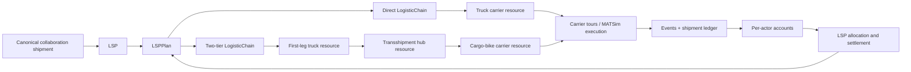
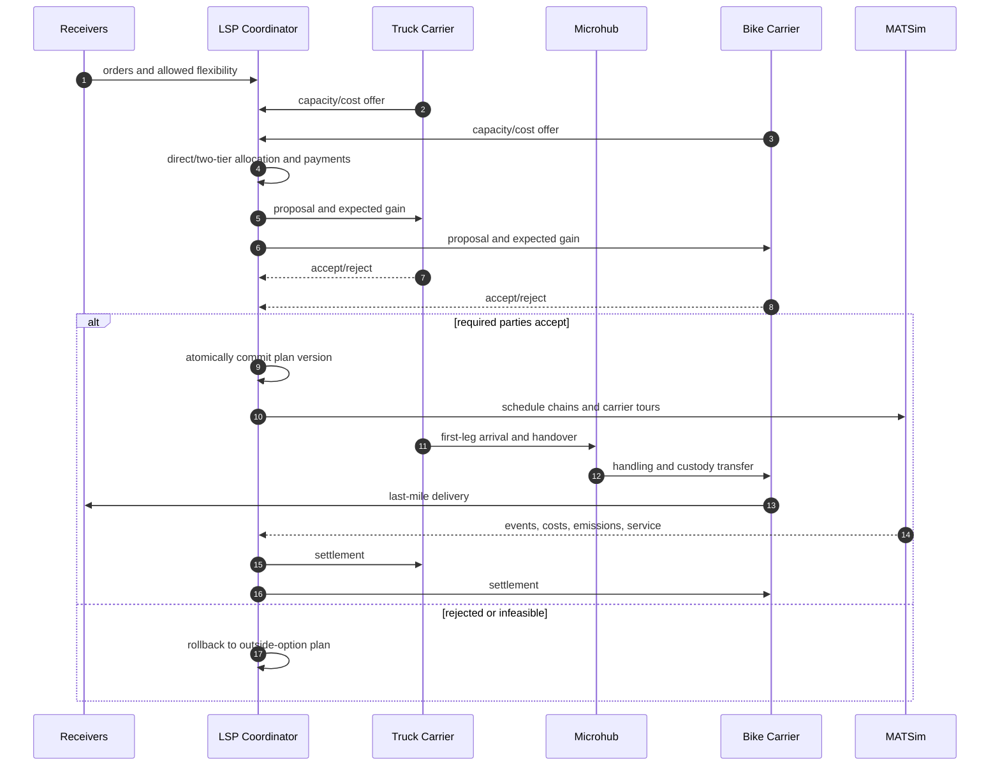
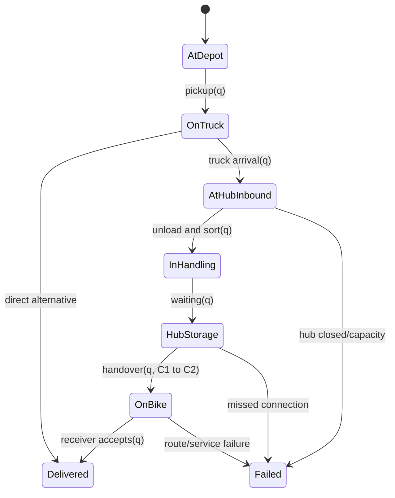
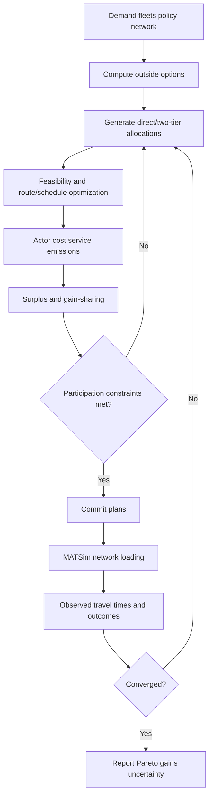

# LSP 协调的横向 Carrier 合作：Truck–Microhub–Cargo-bike Two-tier 研究与实现设计

> 审阅日期：2026-08-25  
> 目标分支：`integration/freightcollaboration`  
> 比较基线：`mutableAF`  
> 本文区分：当前代码已具备的表示能力、需要新增的合作机制，以及尚待实验检验的研究假设。

## 1. 研究问题的准确表述

研究对象是一个 LSP 协调的 two-tier urban delivery system。Carrier 1 拥有重型/轻型货车，可执行 depot→receiver 的 direct delivery，也可执行 depot→microhub 的 first tier；Carrier 2 拥有 cargo bikes，执行 microhub→receiver 的 second tier。LSP 汇集订单、资源和政策信息，决定 shipment 采用 direct 还是 via-hub、由哪个 carrier 执行各 leg，并通过结算或收益分摊使参与者愿意接受合作方案。

用户提供的论文（ScienceDirect PII `S1361920925003906`）可作为研究动机：access restriction 下，单一货车方案与单一 cargo-bike 方案可能分别在运营成本、容量、排放和服务效率上存在短板，异构组合可能形成 trade-off。该结论应在本模型的需求、网络、成本和排放边界下重新验证，不能被当作预设结果。

## 2. 首要概念澄清：是否真的是“横向合作”

|组织关系|更准确的术语|核心科学问题|
|---|---|---|
|同一企业拥有 LSP 与两个 carrier units|内部异构车队/two-echelon optimization|如何联合调度车辆、hub 和路线|
|LSP 是平台，两个独立 carriers 自主签约|platform-coordinated horizontal carrier collaboration|信息共享、参与约束、定价、收益分摊和稳定性|
|Carrier 1 把末端任务外包给 Carrier 2|vertical subcontracting|合同价格、服务水平和违约责任|

若目标是“横向合作”，两个 carriers 必须保留独立经济身份：各自的成本函数、容量承诺、信息边界、outside option、接受/拒绝权和结算账户。一个 LSP 能持有多个 carrier-backed `LSPResource`，只证明 MATSim 数据结构能够表示多个执行资源；它不等于已经存在一个会自主谈判并保证双方 gains 的合作机制。

## 3. 可行性、严谨性与创新性

### 3.1 运营可行性

Truck 适合大容量 line haul；cargo bike 在密集中心区、停车困难和车辆准入受限时可能具有末端优势；microhub 提供 consolidation 和 mode transfer。因此技术上可行，但优势具有明显条件性。可能使合作失效的因素包括：需求密度过低、hub 绕行过大、handling/租金过高、时间窗过紧、bike capacity/range 不足、first-tier 到达不稳定、access restriction 太弱、低排放货车已足够高效。

研究不应预设“组合一定更优”，而应识别 break-even region：在哪些 demand density、policy strictness、hub location/cost、fleet mix 和 service level 下形成正 surplus。

### 3.2 科学识别

至少要拆分四个效应：

1. heterogeneous-fleet effect；
2. two-echelon/microhub effect；
3. information-pooling effect；
4. economic collaboration/gain-sharing effect。

只比较 truck-only 与 truck+bike 会把四者混为一体，不能把差异归因于 horizontal collaboration。

### 3.3 创新性

Two-echelon VRP、urban microhub、cargo-bike last mile、access restriction 与 horizontal logistics collaboration 都已有较多研究。较强的创新点应位于其交叉处：

- 在 MATSim 的拥堵和政策反馈中内生调整 shipment allocation/coalition；
- carriers 保持独立目标与 participation constraints，LSP 作为信息与协调平台；
- 同时决定 direct/via-hub、carrier assignment、tour 和 gain-sharing；
- 将 receiver flexibility、服务可靠性和接受行为纳入合作；
- 研究合作稳定区域、surplus distribution 与政策强度之间的交互，而不仅是 central optimum。

## 4. 形式化问题

设 shipments 为 `S`，carriers 为 `K={1,2}`，车辆为 `V_k`，candidate hubs 为 `H`。每个 shipment `s` 具有 origin `o_s`、receiver `d_s`、quantity `q_s`、time window `[a_s,b_s]` 和 service time `tau_s`。

### 4.1 决策变量

- `z_s`：direct truck 或 two-tier；
- `h_sh`：选择哪个 microhub；
- `x_sak`：shipment/leg/activity 分给哪个 carrier；
- vehicle route、tour、arrival/departure variables；
- shipment splitting 时的 child quantities；
- hub arrival、handling、storage 和 bike departure times；
- carrier participation/contract variables；
- transfer payments 或 task prices；
- 可选 receiver flexibility/compensation decisions。

### 4.2 约束

1. assignment 唯一且 quantity 守恒；
2. first leg→handling→second leg precedence；
3. truck/bike capacity、fleet availability、driver hours、bike range/battery；
4. receiver time windows 与 service level；
5. hub dock、handling、storage、opening hours；
6. access restriction 的 time–space–vehicle eligibility；
7. route connectivity 和 MATSim mode/network compatibility；
8. carrier individual rationality：合作后的净 payoff 不低于 outside option；
9. budget balance（平台无外部补贴时）；
10. 可选 coalition stability：不存在使某子联盟所有成员都更好的可行偏离。

### 4.3 目标函数

不要一开始用一个未经标定的 weighted sum 隐藏 trade-off。先报告 Pareto frontier：operating cost、CO2e、NOx/PM、lateness、unserved shipments、network externality。之后再明确决策规则，例如“在 service-level 与 individual-rationality 约束下最小化社会成本”，或“LSP 最大化利润，监管政策改变可行域和价格”。

## 5. 强反事实设计

|场景|识别用途|
|---|---|
|Truck-only direct|传统基线|
|Cargo-bike-only，且包含真实 line haul/replenishment|检验 bike 体系，禁止货物凭空出现在 hub|
|两个 carriers 独立、无信息共享|non-cooperative baseline|
|固定 two-tier、无协作优化|识别 hub/转运本身|
|Central planner、无独立 carrier payoff|效率上界|
|LSP 信息共享，无 payment|检验是否有一方受损|
|LSP 协调加 gain-sharing|完整合作机制|
|以上场景乘以 no/weak/strong restriction|识别政策交互|
|以上场景乘以不同 hub cost/capacity|识别 break-even threshold|

所有场景必须使用相同 demand、fleet availability、service requirement、cost 和 emissions boundary。应采用 factorial/response-surface design，而不是只挑两个案例。

## 6. KPI

- 运营：total/actor cost、profit、vehicle-hours、VKT、empty VKT、tour count、load factor、hub throughput/dwell/queue；
- 服务：on-time rate、lateness、failed/unserved、receiver utility、可靠性分布；
- 环境：TTW 与 WTW 分开报告的 CO2e、NOx、PM、energy；
- 网络：travel time、拥堵外部性、受限区 vehicle entries、parking/service occupancy（若建模）；
- 合作：gross surplus、net gain per actor、payment、individual-rationality violation、coalition churn/stability；
- 公平：gain distribution、区域/receiver 服务差异、small carrier dependency；
- 计算：solve time、iteration convergence、optimality gap/heuristic stability。

## 7. MATSim logistics 映射

### 7.1 可复用抽象

优先复用当前版本中的 `LSP`、`LSPPlan`、`LogisticChain`/elements、carrier-backed `LSPResource`、transshipment/hub resource、`LSPShipment`、scheduler、simulation tracker、scorer 和 strategy/replanning 接口。具体 builder 和方法签名必须以当前 branch 为准，不能照搬 `mutableAF` 示例。

### 7.2 需要新增或强化

1. `CanonicalCollaborationShipment`：原订单、legs、split children、custody、plan version；
2. `CarrierParticipant`：独立成本/payoff、信息权限、capacity offer、outside option、accept/reject；
3. `TransferTask` 与 `ShipmentHandoverEvent`：quantity、双方、hub、time、责任状态；
4. microhub capacity/calendar/queue：非零 handling、storage 与 failure；
5. `CollaborationCoordinator`：proposal、feasibility、acceptance、atomic commit/rollback；
6. settlement/gain-sharing；
7. actor-level event accounting；
8. convergence monitor。

## 8. 协作时序

Atomic commit 很重要：不能在 C1 接受、C2 拒绝后，让 selected LSP plan 留下一条半完成 chain。

## 9. 货物流和 custody

每次 transition 都应产生可归属到 shipment、carrier、resource、plan version 和 iteration 的 event。Shipment splitting 需要 parent–child relation；children quantity 之和必须等于 parent，不能把完整 quantity 复制到两条 chains。

## 10. Simulation–optimization loop

必须定义停止标准，如 assignment change、actor payoff change 和 network travel-time change 小于阈值，并设最大 iteration 与 best-feasible fallback。还要说明 MATSim iteration 是求解循环还是现实运营日，不能把两者混用。

## 11. Gains 与治理

设 carrier `k` 的非合作 payoff 为 `pi_k^0`，合作运营 payoff 为 `pi_k^C`，转移支付为 `t_k`。Individual rationality 要求 `pi_k^C + t_k >= pi_k^0`。系统 surplus 为正不代表每个 actor 自动获益。

可比较 proportional allocation、Shapley value、nucleolus/least-core、Nash bargaining、task auction 或 bilateral subcontract rate。评价 efficiency、budget balance、individual rationality、stability、information requirement 与 manipulability。LSP 若收平台费，其 payoff 也必须显式进入预算。

Perfect information 只能作为上界。应加入 limited/noisy/delayed information、隐私和 bid shading 敏感性。

## 12. 可检验假设

- H1：restriction 越强，two-tier 相对 truck-only 的成本/排放 frontier 可能改善，但存在 hub-cost threshold；
- H2：只有 demand density 和 spatial concentration 超过阈值，bike second tier 才产生正 surplus；
- H3：加入 handling、queue 和 missed connection 后，静态 two-echelon 优势缩小；
- H4：central optimum 不保证 carrier-wise individual rationality，gain-sharing 扩大稳定合作区域；
- H5：limited information 降低效率，但未必消除收益；
- H6：receiver flexibility 改善 consolidation，但可能产生服务公平差异。

## 13. 威胁与验证

审查 construct、internal、external、behavioral、algorithmic 和 data validity。采用 synthetic verification 加 calibrated case study：前者用于手算 quantity/time/cost 和最优选择，后者用实际 travel time、tour、service、energy/cost 校准。报告多 seed、置信区间、效应量和 sensitivity surface，而非单次最优 run。

## 14. 分阶段路线图

1. **Phase 0：稳定 LSP–receiver 基座。** 建 canonical shipment ledger、iteration reset、event reconciliation 和 one-shipment integration test。
2. **Phase 1：集中式 MVP。** 一个 LSP、两个 carrier resources、固定 hub；禁止 split；先实现 direct/two-tier 可行选择，不先声称 bargaining。
3. **Phase 2：真实 hub 和 allocation。** handling/capacity/time、routing、restriction、truck/bike cost/emissions。
4. **Phase 3：独立 carrier agency。** outside option、account、accept/reject、atomic rollback 和 gain-sharing。
5. **Phase 4：MATSim 网络反馈。** event/travel-time feedback、convergence、多 seed。
6. **Phase 5：信息与策略行为。** limited information、bidding、privacy、platform fee、disruption。

## 15. MVP 验收标准

- [ ] 一个 shipment 的 direct/two-tier 选择能手算并由代码复现。
- [ ] Truck→hub→bike 的 quantity、custody、time 和 events 完整守恒。
- [ ] 两个 carriers 有独立成本账户和 outside-option plans。
- [ ] 仅双方接受时 selected plans 原子切换，拒绝自动回退。
- [ ] Hub handling 非零，容量和营业时间有效。
- [ ] Access restriction 是 routing feasibility，而不只是后处理罚分。
- [ ] 至少六个强反事实使用同一 demand/fleet/service 口径。
- [ ] 报告 actor gains、system metrics、失败订单和多-seed uncertainty。

## 16. 总体评价

技术上可行，MATSim logistics 的 LSP/chain/resource 架构能承载基础 two-tier 表示；难点是跨 carrier 一致状态、handover events、actor-level accounting 和 simulation–optimization coupling。科学潜力较高，但必须区分内部异构 fleet optimization、平台协调与真正 horizontal collaboration。Truck+microhub+cargo bike 本身不足以构成强创新；将独立 carrier 的稳定合作、receiver flexibility、政策与网络反馈内生化，才会形成更清晰的贡献。