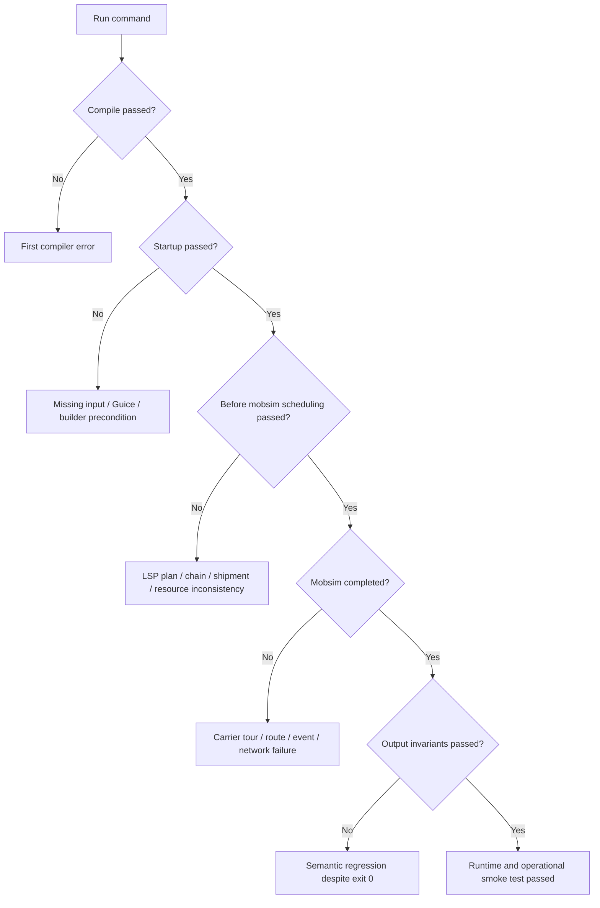
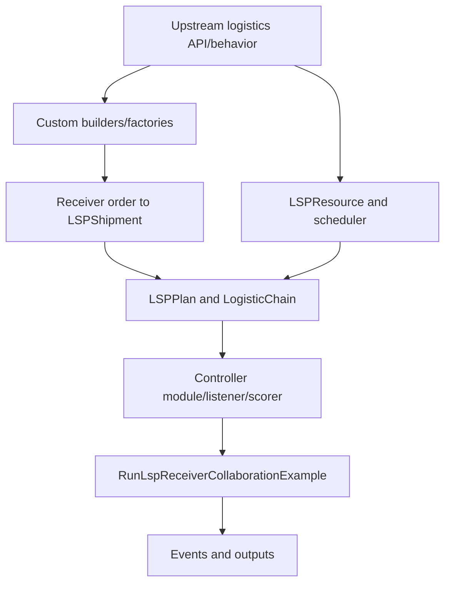

# MATSim-2026 合并后的 LSP 兼容性与运行评估

> 审阅日期：2026-08-25  
> 当前目标：`integration/freightcollaboration`  
> 比较基线：`mutableAF`  
> 检查对象：`RunLspReceiverCollaborationExample`

## 1. 判定规则

本检查严格区分四个层次：

1. **Source present**：能够定位 example；
2. **Compile**：包含 example 的 Maven module 与依赖编译成功；
3. **Run complete**：`main` 在记录的 working directory、输入和 timeout 下退出码 0；
4. **Model valid**：shipment、plan、event、cost 和 actor gains 满足业务/科学不变量。

只有第 3 层能回答“是否 run 起来不报错”；compile 通过不能替代运行。第 3 层通过也不自动证明第 4 层。

> 本文对应的自动审阅版本会把实际 Maven 命令、exit code、首个 compiler error/最内层 `Caused by` 和 diff 清单写入文末 evidence appendix。若你看到的版本没有这些自动字段，请使用同一 PR/交付包中的 `lsp_evidence.json` 和 `runtime-probe-summary.md`，不要把缺失日志解释为运行成功。

## 2. 可复现运行步骤

### 2.1 定位 example 和 module

```bash
EXAMPLE=$(git grep -l "class RunLspReceiverCollaborationExample" -- '*.java' | head -1)
echo "$EXAMPLE"
PACKAGE=$(grep '^package ' "$EXAMPLE" | sed -E 's/package ([^;]+);/\1/')
MAIN_CLASS="${PACKAGE}.RunLspReceiverCollaborationExample"
echo "$MAIN_CLASS"

# 从 example 向上寻找最近的 pom.xml；通常为 contribs/freight module
DIR=$(dirname "$EXAMPLE")
while [ "$DIR" != "." ] && [ ! -f "$DIR/pom.xml" ]; do DIR=$(dirname "$DIR"); done
echo "$DIR"
```

### 2.2 Clean compile

使用项目 wrapper（若存在）：

```bash
./mvnw -pl "$DIR" -am -DskipTests clean compile
```

没有 wrapper 时：

```bash
mvn -pl "$DIR" -am -DskipTests clean compile
```

记录 Java/Maven 版本、commit SHA、working directory、命令、exit code 和完整 log。若 compile 失败，example 不可能在该环境启动；先看第一条 Java compiler error，不要只引用最后的 `BUILD FAILURE`。

### 2.3 运行 example

一种可复现方式是 Maven exec plugin：

```bash
./mvnw -pl "$DIR" -DskipTests \
  org.codehaus.mojo:exec-maven-plugin:3.5.0:java \
  -Dexec.mainClass="$MAIN_CLASS"
```

若 module 已配置自己的 exec profile，应优先使用仓库声明的命令。IDE run configuration 不能作为唯一证据，因为它可能隐含 working directory、VM options、classpath 和本地绝对路径。

### 2.4 最小 smoke configuration

为排除长时间仿真：固定 seed、`lastIteration=0`、一个 receiver、一个 shipment、一个 carrier resource、一个 vehicle、一个 chain。运行成功后再恢复完整 example。

## 3. 错误定位顺序



### 3.1 Compile error

重点检查 MATSim-2026 合并后：

- constructor/builder 参数、factory 名称或 package 变化；
- interface 新增方法导致 custom implementation 未实现；
- collection getter 的 mutable/unmodifiable contract；
- receiver custom code 仍调用 mutableAF API；
- freight、vehicles、logistics modules 版本不一致；
- IDE/Maven 使用旧 snapshot 或 stale target classes。

### 3.2 Linkage/classpath error

`NoSuchMethodError`、`ClassNotFoundException` 通常说明编译与运行 classpath 不是同一版本。执行：

```bash
./mvnw -pl "$DIR" -am dependency:tree
find . -path '*/target/*' -type f -delete  # 谨慎；或使用 mvn clean
```

确认所有 MATSim modules 来自同一 reactor/version。

### 3.3 Startup/input error

相对路径取决于 working directory。将输入移入 versioned resources 或由 CLI/config 显式传入；禁止仅在作者机器存在的绝对路径。还要确认 network link IDs、vehicle types、carrier/LSP collections 已加入 controller 使用的 scenario。

### 3.4 Before-mobsim error

重点验证 selected `LSPPlan`、shipment assignment、chain topology、resource scheduler、carrier selected plan 和 plan version。MATSim-2026 的 scheduler/plan-element contract 即使编译兼容，也可能改变调用顺序或前置条件。

### 3.5 Exit 0 但结果错误

至少检查：orders、LSP shipments、assigned、scheduled、delivered、failed 的 reconciliation；quantity conservation；capacity/time feasibility；selected-plan version；event handler reset；per-actor cost/gain。

## 4. Branch diff 的正确比较范围

使用 endpoint diff：

```bash
git diff --name-status mutableAF..integration/freightcollaboration -- contribs/freight
git diff --stat mutableAF..integration/freightcollaboration -- contribs/freight
git diff --unified=0 mutableAF..integration/freightcollaboration \
  -- contribs/freight/src/main/java/org/matsim/freight/logistics
git log --oneline --decorate mutableAF..integration/freightcollaboration \
  -- contribs/freight/src/main/java/org/matsim/freight/logistics
```

该 range 是两个分支端点的净差异，不自动等于“MATSim-2026 上游变化”，因为 current branch 同时包含 freight collaboration custom code。归因需要 commit provenance。

## 5. 变化分类框架

### 5.1 Production API

对每个 `src/main/java/.../logistics` 文件检查：

|变化|可能兼容风险|验证|
|---|---|---|
|构造器/builder 参数|旧 helper 不编译，或默认语义改变|逐字段断言实际 resource/scheduler/scorer|
|接口方法增删/签名|custom implementation 漏 contract|搜索所有 implementations/anonymous classes|
|package/type rename|import/serialization/config 断裂|编译、reflection/config tests|
|collection mutability|原地 add/remove 失效或污染其他 plan|copy/ownership tests|
|ID/attribute handling|receiver order 与 LSP shipment 映射断裂|round-trip ID/event test|
|scheduler/plan elements|chain 不完整、时序不同|one-shipment sequence/time assertions|
|controller/module binding|类存在但 Guice 未安装|listener/scorer invocation integration test|
|scoring/replanning|运行成功但行为变化|固定 seed 的 score component/selected-plan regression|
|carrier API|resource wrapper 与 carrier plan 不同步|tour/service/vehicle/event ownership reconciliation|

### 5.2 Tests

不要只迁移 production code。测试变化常说明 upstream 新 contract，尤其关注：

- mandatory builder fields 与 exception type；
- shipment assignment 在 schedule 前后的合法状态；
- selected plan、copy plan、replanning 后的对象身份；
- chain element incoming/outgoing shipment collections；
- simulation tracker/event handler reset；
- multiple resources/chains 的处理顺序；
- immutable vs mutable views。

将 `mutableAF` custom collaboration tests 与当前 upstream logistics tests 并排运行。

### 5.3 Examples

Example 是 API 使用示范，不是稳定 compatibility layer。Custom production code 不应直接依赖 example helper。若 MATSim-2026 example 的 wiring 改变，应将必要逻辑移入有 contract tests 的本项目 factory/module。

### 5.4 Config 与 resources

比较 freight/logistics config group、XML schema、默认值、vehicle types、network modes、sample input 和 output format。默认值变化可能让 Java 编译和 example 运行都成功，却改变行为。

## 6. 上游与项目改动的归因

使用三层证据：

1. **Confirmed upstream**：commit SHA 可在 MATSim upstream 2026 branch/tag 找到，patch-id 一致；
2. **Confirmed project-specific**：仅存在于 freight-collaboration commits，增加 receiver/collaboration 专用实现；
3. **Mixed/conflict resolution**：merge commit 同时重写 core logistics 与 custom call sites，需要三方 diff。

推荐命令：

```bash
# 找 merge commit 及 parents
git log --merges --oneline --decorate --all

# 三方看一个可疑文件
git diff <merge-parent-1> <merge-commit> -- path/to/file
git diff <merge-parent-2> <merge-commit> -- path/to/file

# 与 upstream commit 比 patch-id
git show <commit> | git patch-id --stable
```

不能只凭路径归因：`org.matsim.freight.logistics` 下也可能有本项目直接修改；custom package 的机械适配也可能完全由 upstream API change 触发。

## 7. MATSim-2026 对 LSP–receiver 的影响链



每层有不同 failure signature：API 层 compile error；dependency 层 linkage error；builder 层 startup exception；scheduler 层 before-mobsim illegal state；input 层 missing file/link；execution 层 tour/event inconsistency；semantics 层 exit 0 但 shipment/gain 错误。

## 8. Migration checklist

1. 固定 upstream 基线 SHA、Java/Maven 版本和 profile，清理 stale snapshots。
2. 生成完整 name-status、numstat 和 public/protected API diff。
3. 逐个适配 custom implementations，禁止用 `null`/默认值只为让 compile 变绿。
4. 将 example 降为 one-shipment/zero-or-one-iteration smoke test。
5. 为 receiver order→`LSPShipment` 写字段 contract test。
6. 为 selected plan、chain topology、resource schedule 写 before-mobsim assertions。
7. 为 reset、shipment ledger、actor score 写 multi-iteration tests。
8. 用同 seed、同 input 比较 mutableAF 与 current，不只看 total score；比较 per-shipment state、tour、time、cost 和 event count。
9. 将 upstream compatibility fix 与新 collaboration feature 分成不同 commits。
10. 在 CI 加入 compile、bootstrap、one-iteration、invariant、regression 五层 gate。

## 9. CI 验收矩阵

|层级|检查|通过标准|
|---|---|---|
|API|module clean compile|无 compiler/linkage error|
|Bootstrap|zero-iteration example|scenario、LSP、receiver、resource 注册完整|
|Execution|one-iteration example|exit 0、无未处理异常、输出存在|
|Invariants|custom checker|quantity、capacity、time、plan version、event attribution 正确|
|Regression|mutableAF fixture|所有预期变化有说明，非预期变化失败|
|Stochastic|multi-seed|报告分布/区间，不依赖单 seed|

## 10. 运行结论的报告模板

不要写“可以运行”而不附证据。使用：

```text
Commit: <sha>
Java/Maven: <versions>
Working directory: <path>
Command: <exact command>
Compile exit code: <code>
Run exit code: <code>
Timeout: <seconds>
First root-cause evidence: <compiler line or innermost Caused by>
Input/config checksum: <hash>
Output invariant result: <pass/fail and details>
```

若因外部环境、缺失输入或 timeout 未得到 exit 0，应报告“本次无法证实 run complete”，而不是根据静态代码推断成功。