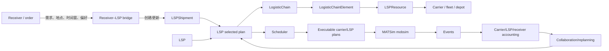
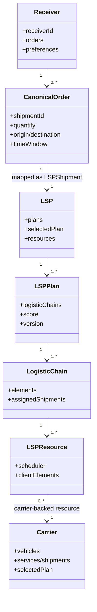
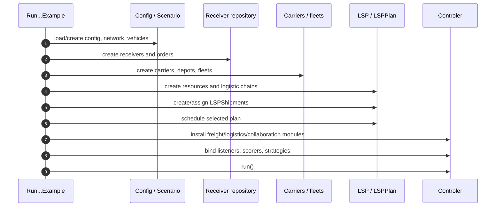
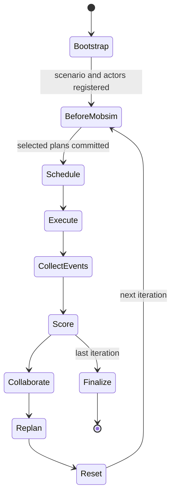
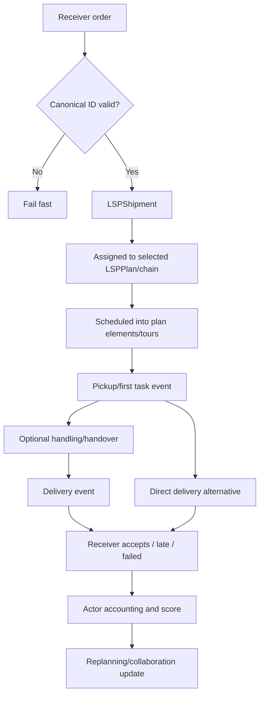

# LSP–Receiver 合作机制：架构、代码追踪与运行生命周期

> 审阅日期：2026-08-25  
> 目标分支：`integration/freightcollaboration`  
> 示例入口：`RunLspReceiverCollaborationExample`  
> 说明：当前 branch 已合并较新的 MATSim logistics API；builder、scheduler 和 module 的准确签名必须以本 branch 源码为准，不能直接照搬 `mutableAF`。

## 1. 阅读目标

本文面向第一次接触该模型的开发者。完成阅读后，应能回答：

1. receiver order 如何进入 LSP 侧，何时成为 `LSPShipment` 或 carrier job；
2. Receiver、LSP、`LSPPlan`、`LogisticChain`、`LSPResource`、Carrier 和 Vehicle 如何关联；
3. collaboration、assignment、scheduling、mobsim、scoring、replanning 分别发生在 controller 的哪个阶段；
4. 同一 shipment 的 ID、quantity、time、custody 和 score 如何贯穿全流程；
5. example “没有抛异常”与机制“业务正确/科学有效”有什么区别。

## 2. 一分钟概念图



必须区分三层：

- **需求层**：receiver 的业务 order、服务约束和接受行为；
- **物流计划层**：`LSPShipment`、chain、resource、selected `LSPPlan`；
- **执行层**：carrier tour、vehicle movement、service/handling、events 和 score。

只把 receiver order 转为 `LSPShipment` 并交给既有 LSP plan 执行，属于 integration bridge；只有 receiver/LSP 的目标、接受和 outcome 反馈到后续选择，才构成闭环 cooperation。

## 3. 代码定位

### 3.1 从 example 入口开始

在仓库根目录运行：

```bash
git grep -n "class RunLspReceiverCollaborationExample" -- '*.java'
git grep -n "RunLspReceiverCollaborationExample" -- 'pom.xml' '*.java' '*.xml'
```

打开匹配文件，先只读 `main`。将每条语句标成以下类别：config/scenario、network/vehicles、receivers/orders、carriers/resources、LSP/plan/chains、shipment conversion/assignment、controller modules/listeners/scoring、`run()`、output analysis。

### 3.2 建立相关类清单

```bash
git grep -n -i "lsp.*receiver\|receiver.*lsp\|receivercollaboration" -- 'contribs/**/*.java'
git grep -n "LSPShipment\|LogisticChain\|LSPResource\|LSPPlan" -- 'contribs/freight/**/*.java'
git grep -n "addOverridingModule\|addControlerListener\|bind.*Scor\|StrategyManager" -- 'contribs/freight/**/*.java'
```

对每个 custom class 记录 package、owner、输入、输出、mutable fields、controller phase 和 reset 行为。Core logistics 类型通常包括 `LSP`、`LSPPlan`、`LSPShipment`、`LogisticChain`、`LogisticChainElement`、`LSPResource` 及 carrier-backed/hub resources；准确 package 与 builder API 以当前 branch 的 `contribs/freight` 源码为准。

### 3.3 推荐 traceability 表

|业务职责|优先搜索的 symbol/模式|要确认的细节|
|---|---|---|
|Receiver/order 创建|`Receiver`、`Order`、receiver factory/builder|canonical ID、quantity、link、time window、preference|
|Order→LSP 转换|`LSPShipment` builder/factory、mapper/helper|字段单位、默认 origin、ID 可逆、是否复制 mutable object|
|Shipment assignment|`assign...Shipment`、chain assignment|每个 selected plan 中恰好一次；发生在 schedule 前|
|LSP plan 构建|`LSPPlan`、`LogisticChain` builder|selected plan、chain topology、resource ownership|
|Carrier resource|carrier-backed `LSPResource`|包装的是哪个 `Carrier`；fleet/depot/network 是否一致|
|Hub resource|transshipment/hub implementation|handling time、capacity、calendar、queue 是否真实存在|
|Scheduling|scheduler、`schedule...`、plan elements|assignment 已完成；时序单调；carrier tours materialized|
|Controller wiring|module/listener/Guice bindings|listener phase、scorer、strategy、event handler 是否真正安装|
|Scoring/replanning|scorer、strategy manager、plan selector|actor-specific objective、selected plan version、copy semantics|
|Output/accounting|events handler/analyzer|failed shipment、actor attribution、reset、quantity reconciliation|

## 4. 对象关系与 ownership



图中的 `CanonicalOrder` 是推荐的逻辑概念，不一定是当前类名。最重要的 ownership 规则是：

1. receiver order 是不可变 problem input 或有明确版本；
2. `LSPShipment` 与原 order 有一对一、可逆 ID 映射；
3. selected plan 中的 assignment 是本轮 decision state；
4. scheduler 产生的 plan elements/tours 是 executable state；
5. events/ledger 是 iteration-local execution state；
6. candidate plans 不能通过共享 mutable collection 互相污染。

## 5. 初始化流程



### 5.1 Config 与 scenario

确认 config、scenario、network、vehicle types、carriers 和 LSPs 是同一个 object graph。常见错误是先用 scenario A 创建 resource，之后 controller 却运行 scenario B。还要检查：

- freight/logistics config group 是否加载；
- routing mode 与 vehicle network compatibility；
- output directory、overwrite policy、last iteration；
- random seed；
- example 输入是否使用绝对或未提交的相对路径；
- emissions module（如有）与 vehicle types 的字段是否完整。

### 5.2 Receiver demand 映射

|Receiver 字段|目标字段|审查问题|
|---|---|---|
|Order ID|`LSPShipment`/carrier job ID|是否唯一、稳定、可从 event 反查|
|Receiver link/location|delivery link|network 中存在且相应 mode 可达|
|Quantity/size|capacity demand|单位一致；多 chain/split 时守恒|
|Earliest/latest time|delivery time window|routing、scheduler、receiver acceptance 使用同一语义|
|Service duration|delivery/handling duration|是否遗漏 loading、hub handling、parking/service time|
|Origin/pickup|depot/first resource|若 order 只给 destination，origin 是显式假设|
|Preference/flexibility|scoring/acceptance|不能只存 attribute 而未被消费|

建议写一个字段级 contract test：给定一笔 order，映射后逐字段断言，再通过 ID registry 反查原 order。

### 5.3 LSP plan/resource wiring

在 `controler.run()` 前验证：

- selected `LSPPlan` 非空；
- 每个 `LogisticChainElement` 的 predecessor/successor 拓扑完整；
- resource 包装的是预期 carrier/hub 实例；
- shipment assignment 在 scheduling 前完成；
- scheduler 后每笔 shipment 的所有 chain plan elements 完整；
- carrier selected plan 与 LSP selected plan 的 materialized tours 属于同一 version；
- 多个 candidate plans 不共享会被原地修改的 chain/resource collection。

## 6. Controller 生命周期



必须在代码中确认 collaboration 真实位于哪条边。三种设计含义不同：

1. **Pre-run centralized assignment**：只在 iteration 0 前合作，后面只执行；
2. **Between-iteration learning**：依据上一轮 events/score 生成下一轮 plan；
3. **Within-mobsim dynamic coordination**：运行中响应延误/容量，要求动态 scheduler 和事件驱动状态机。

Listener 每轮被调用并不意味着每轮都重新优化；必须检查它是否改变 proposal/selected plan，以及改变是否在 scheduling 前 commit。

## 7. 一笔 shipment 的端到端 trace



推荐显式 shipment ledger：

`CREATED → ASSIGNED → SCHEDULED → PICKED_UP → AT_HUB(optional) → OUT_FOR_DELIVERY → DELIVERED/FAILED → SETTLED`

每次 transition 记录 shipment、parent/child、from/to actor、quantity、time、link、iteration 和 plan version。这样才能检测 duplicate service、lost shipment、stale plan 和跨 iteration 泄漏。

## 8. 当前“合作机制”应如何判定

一个完整合作机制至少定义：

- **Information set**：各方观察哪些订单、成本、车辆、未来时间窗和竞争信息；
- **Decision right**：谁能分配 shipment、换 chain、改时间窗、拒单；
- **Objective**：LSP profit/cost、carrier payoff、receiver utility、emissions 如何进入选择；
- **Participation**：相对 outside option 是否不劣；
- **Settlement**：节省、hub/handling 与 transaction cost 如何分摊；
- **Failure fallback**：不可行、拒绝或容量不足时回到哪个 plan；
- **Iteration rule**：何时 proposal、accept、commit、reset；
- **Auditability**：能否从 events 重构每方 outcome。

缺少上述要素时，建议将当前实现表述为“LSP–receiver integration scaffold”或“demand-to-LSP execution bridge”，避免过度声称 bargaining/cooperation。

## 9. Scoring 与 replanning

### 9.1 分 actor 账户

至少分别输出：

- LSP：platform/coordination cost、resource payments、total revenue、profit；
- 每个 carrier：vehicle fixed cost、distance/time cost、handling、penalty、payment、net gain；
- receiver：delivery utility、lateness/failure disutility、flexibility compensation；
- system/regulator：emissions、congestion 或其他 externality。

一个总 score 无法证明各参与者 gains。

### 9.2 Plan version

每次 proposal/selected-plan 变化应生成 version ID，并写入 schedule 和 events。只有所有 required actors 接受且 validator 通过后才 atomic commit；拒绝/异常必须 rollback 到完整 outside-option plan，不能留下半更新的 LSP/carrier plans。

### 9.3 Reset

`reset(int iteration)` 应清空 event counts、delivery states、temporary assignments 和 score accumulators。Learning state、best plan 或 estimates 若需跨轮保留，应放在不同对象并明确更新规则。

## 10. 运行和调试方法

先定位 module 和 package：

```bash
EXAMPLE=$(git grep -l "class RunLspReceiverCollaborationExample" -- '*.java' | head -1)
echo "$EXAMPLE"
grep '^package ' "$EXAMPLE"
```

随后优先运行 module compile 和 example/test。准确命令及本次 exit code 记录在 `lsp-matsim-2026-migration-and-runtime-assessment.md`。调试时：

1. `lastIteration=0`，固定 seed；
2. 一个 receiver、一个 shipment、一个 carrier、一个 vehicle、一个 chain；
3. 在 order creation、mapping、assignment、schedule、pickup、delivery、score 处打印同一个 canonical ID；
4. 每轮输出 orders、LSP shipments、assigned、scheduled、delivered、failed；
5. 加入 quantity/capacity/time/plan-version assertions；
6. 再逐步增加多 receiver、多 plans、多 resources 和 replanning。

## 11. 新用户验收清单

- [ ] example 使用的 config/scenario 与 controller 是同一个对象图。
- [ ] receiver order 与 `LSPShipment` 有可逆 ID mapping。
- [ ] 每笔需求在 selected plan 中只分配一次，split 时 quantity 守恒。
- [ ] chain topology、resource ownership 和 scheduler 前置条件完整。
- [ ] selected LSP plan 与 executed carrier plan version 一致。
- [ ] controller module/listener/scorer/strategy 确实被调用。
- [ ] iteration-local state 被 reset；persistent state 有明确 contract。
- [ ] receiver preference/acceptance 真正进入 score 或下一轮决策。
- [ ] failed/unserved shipment 仍出现在 ledger 和 denominator。
- [ ] 分 actor baseline、cost、payment 和 net gain 可复核。
- [ ] 分别报告 compile success、run success、operational correctness 和 scientific validity。

## 12. 推荐的阅读与修改顺序

1. 跑 one-shipment smoke test 并建立 event ledger；
2. 修正 ID、quantity、reset、selected-plan consistency；
3. 写 receiver mapping/scoring contract tests；
4. 只在 L1 operational correctness 稳定后加入 carrier–carrier transfer；
5. 最后加入 payment、bargaining、limited information 和多-seed research experiments。

这种顺序能避免把 MATSim-2026 API migration、基础 accounting bug 与新 horizontal-collaboration 机制混在同一次改动中。