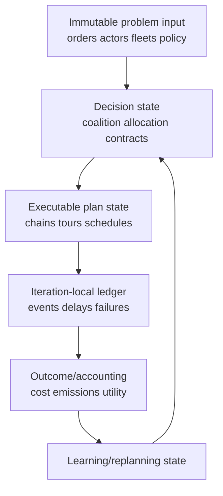
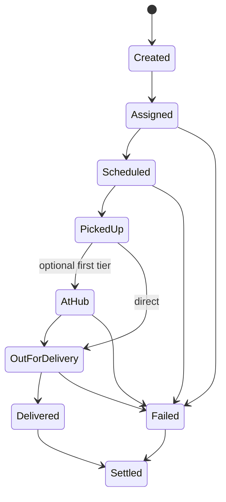
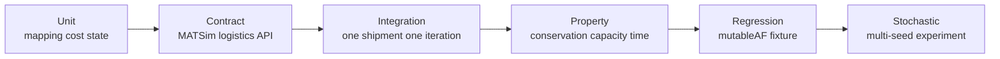

# LSP–Receiver 合作设计：代码、科学逻辑与语义风险审阅

> 审阅日期：2026-08-25  
> 目标分支：`integration/freightcollaboration`  
> 本文将“能够运行”“物流上可行”“行为语义有效”和“可以支持科研结论”分开评价。

## 1. 审阅框架

当前 scaffold 能启动只是必要条件。本审阅从四层检查：

1. **软件正确性**：对象身份、可变状态、iteration lifecycle、API contract；
2. **物流可行性**：容量、time window、chain precedence、handover、quantity conservation；
3. **经济与行为语义**：目标、信息、接受、payment、outside option；
4. **实验识别**：公平基线、随机性、因果归因和外部有效性。

建议将成熟度分为：

- L0 Integration：对象能建立、example 能结束；
- L1 Operational correctness：可行、守恒、event/accounting 一致；
- L2 Behavioral validity：各 actor 的目标、信息、接受和支付有明确语义；
- L3 Scientific validity：强基线、多 seed、sensitivity、calibration 和 validity analysis 支持结论。

## 2. 高优先级风险登记表

|ID|问题|典型定位|失败模式/科研后果|严重度|修复与验收|
|---|---|---|---|---|---|
|R01|Receiver order、`LSPShipment`、carrier job 使用不同或可碰撞 ID|order→shipment mapper、builder/helper、event analyzer|重复服务、覆盖 map entry、无法从 event 反查原订单|严重|canonical shipment ID + 双向 registry；重复 ID 启动失败；round-trip test|
|R02|多个 plan/actor 共享同一 mutable shipment、chain 或 resource|plan copy、builder、collaboration update|修改候选 B 污染 A；跨 iteration 泄漏|高|immutable problem input、solution deep copy、明确 owner；修改 B 后 A checksum 不变|
|R03|iteration-local collection 未在 `reset(int)` 清理|event handler、listener、tracker|delivery/cost 累计两次，旧 assignment 残留|严重|区分 persistent learning 与 iteration ledger；两轮计数 reconciliation|
|R04|合作决策发生在错误 controller phase|listener/strategy binding|schedule 后改 assignment，执行 plan 与 score plan 不一致|严重|decision→schedule→execute→score 状态机；listener-order integration test|
|R05|shipment 在复制、split 或多 chain 中不守恒|conversion、assignment、hub transfer|货物凭空增加/丢失，所有指标失真|严重|parent–child ledger；原子 transfer；输入量=delivered+failed+open|
|R06|receiver preference/time window 只存 attribute，未进入 routing/scoring|mapper、scorer、acceptance logic|所谓 LSP–receiver cooperation 没有因果作用|高|字段使用追踪；改变 preference/time window 应产生可解释结果变化|
|R07|LSP、carrier、receiver 的目标混为一个总成本|scorer、selector、output|无法证明“各方都有 gains”，合作可能被强制|严重|分 actor accounts、outside options、participation constraints|
|R08|遗漏 hub、handling、information、transaction 和 contract cost|cost calculator|系统性高估合作收益|高|activity-based cost；对 omitted cost 做 break-even sensitivity|
|R09|“完全信息”未定义时点、粒度和隐私|collaboration data exchange|前视偏差、不可实施机制、过度乐观|高|perfect/limited/delayed/noisy information scenarios|
|R10|一个 LSP 下两个 carrier 被称为横向合作，但无独立目标与退出权|LSP-resource ownership semantics|实为内部 fleet dispatch，研究命名和创新性错误|严重|定义 carrier economic agency、payoff、outside option、accept/reject|
|R11|selected LSP plan 与 carrier selected plan 不同步|scheduler、carrier-plan materialization|仿真执行旧 tours，评分新 plan|严重|plan/version ID 和 atomic commit；executed events 引用当前 version|
|R12|hub capacity/calendar/queue 缺失|hub/transshipment resource|无限吞吐、免费即时转运|高|dock/storage/handling capacity、opening hours、queue；峰值压力测试|
|R13|handover 无 custody、dwell、failure 和责任状态|multi-tier chain|货物“瞬移”，延误不传播，无法结算责任|严重|`TransferTask`/handover event/state machine；严格 precedence test|
|R14|quantity、time、cost、emissions 单位或边界不一致|mapper、vehicle type、analysis|结果数量级错误；TTW/WTW 混用|严重|单位文档和 dimension tests；手算 fixture|
|R15|access restriction 只做罚分，未影响 route feasibility|network/policy/routing|违规车辆仍穿越限制区，政策效果错误|严重|time–space–vehicle eligibility；违规进入数必须为 0|
|R16|random seed、solver seed 或 map iteration order 未固定|config、solver、collections|结果不可复现，branch diff 混入噪声|高|集中 seed、stable ordering、记录版本与输入 hash|
|R17|只用单 seed/单日需求|experiment runner|将随机实现当因果结论|高|多 seed、多 demand day、置信区间和效应量|
|R18|合作/replanning 震荡或不收敛|strategy manager、acceptance rule|最后 iteration 依赖任意停止点|高|assignment churn、payoff trend、best-so-far 和停止标准|
|R19|合作与 baseline 的 demand/fleet/service 不一致|scenario generation|所谓 gain 来自额外资源或漏单|严重|所有情景输入 hash、订单集合和服务约束一致|
|R20|只比较 truck-only 与 cargo-bike-only|experiment design|无法识别 hub、heterogeneity、information 和 collaboration 效应|高|加入 independent carriers、fixed two-tier、central planner、no-policy 等|
|R21|Receiver 只是 delivery-link 生成器，无拒绝/协商|receiver behavior|LSP–receiver collaboration 名不副实|高|receiver utility、acceptance、contract state 与 compensation|
|R22|失败订单被删除或不计 denominator|output analyzer|服务率与成本存在选择性偏差|严重|input=delivered+failed+cancelled+open；失败也计 penalty|
|R23|cost/emission events 无 actor/shipment attribution|event handlers|无法分摊 gains 或验证责任|高|event 带 operator/resource/vehicle/shipment/plan IDs|
|R24|并行 replanning 修改共享 collection|coordinator/custom strategy|race、非确定性、`ConcurrentModificationException`|高|immutable snapshot + synchronized/atomic commit；并发 stress test|
|R25|测试只断言“不抛异常”|example/smoke tests|科学和业务错误长期隐藏|高|contract、property、invariant、golden-event 与 mutation tests|

## 3. 五个最危险的语义陷阱

### 3.1 多 carrier 表示不等于 horizontal collaboration

若两个 carriers 只是同一 LSP 内部 resources，没有独立利润、信息边界、拒绝权和 outside option，模型更接近一个 operator 的 heterogeneous-fleet/two-echelon routing。要声称横向合作，必须把 carrier 作为经济主体并实现 participation 与 settlement。

### 3.2 总 surplus 为正不等于人人获益

设 actor `i` 的 non-cooperative payoff 为 `pi_i^0`，合作后的运营 payoff 为 `pi_i^C`，transfer payment 为 `t_i`，且预算平衡时 `sum(t_i)=0`。Individual rationality 要求：

`pi_i^C + t_i >= pi_i^0`，对所有参与者成立。

`sum(pi_i^C) > sum(pi_i^0)` 只说明有可分配 surplus；没有可行支付时，某个 carrier 或 receiver 仍可能拒绝。代码应输出每方 baseline、gross outcome、payment 和 net gain。

### 3.3 转运不是两个 service 的简单拼接

Truck→cargo bike 至少包含到达同步、卸货、分拣、暂存、装车、custody 转移、missed connection、损坏/丢失责任和失败回退。没有显式 handling/transfer task 和 event，会隐含“瞬时、免费、无限容量”的 microhub。

### 3.4 Receiver 不能退化为一个 link

若 receiver 的 time-window flexibility、可靠性偏好、价格和接受行为不影响 assignment/scoring，研究对象其实是 LSP routing。需要定义 receiver 提供什么 flexibility、获得什么 compensation、何时拒绝，以及 late/failed delivery 的 utility。

### 3.5 MATSim iteration 不自动等于现实谈判轮次

MATSim iteration 通常服务于 plan choice、replanning 与网络反馈。若把每轮解释成谈判，必须说明时间尺度；否则同一日订单被“重复服务”，求解状态和现实运营状态混在一起。应明确 iteration 是 simulation–optimization loop 还是 repeated operating day。

## 4. 推荐状态分层

禁止 execution ledger 反向污染 immutable problem input。需要跨轮保留的 learning state 必须有版本、更新规则和 reset contract。

## 5. Canonical shipment state machine

每次 transition 记录 `shipmentId`、parent/child ID、fromActor、toActor、quantity、time、link、iteration 和 `planVersion`。非法 transition 应抛出明确异常，而不是 silent ignore。

## 6. 每轮必须验证的不变量

1. `input quantity = delivered + failed + cancelled + remaining`；
2. 每个 shipment 恰有一个 terminal/open state；
3. 每段 transport/handling 的开始不早于前段结束；
4. 同一 vehicle 同时只执行一个 task，load 不超 capacity；
5. delivery link 对 vehicle/mode/policy 可达；
6. actor cost 总量与 task/event 明细聚合一致；
7. selected plan version 与 executed event version 一致；
8. service-rate denominator 包括失败与取消；
9. cooperative gain 相对完全相同的 baseline 计算；
10. iteration reset 后上一轮临时状态为零，persistent learning state 仅按规则保留。

## 7. 测试体系

### 7.1 三个最小 fixture

- **Identity fixture**：两个 receivers 使用容易混淆的 ID，验证无覆盖且 event 可逆映射；
- **Transfer fixture**：一个 shipment 必须经过 first leg、hub dwell、second leg，故意制造 missed connection，验证 custody 和 failure；
- **Iteration fixture**：运行两轮，第一轮计数在第二轮 reset 后不重复，只有允许的 learning state 继续存在。

### 7.2 建议 property tests

- 随机生成小订单集，任何 feasible result 都满足 quantity conservation；
- 任意打乱 collection insertion order，固定 seed 下 selected allocation 不应无解释变化；
- 将 capacity 降低到不可行时，系统应返回 failed/unserved 或 outside option，而非超载；
- 将 hub handling time 增大时，delivery time 不能反而提前；
- 将 access restriction 收紧时，违规 truck entries 不得增加；
- 将 cooperation payment 设为不可满足 individual rationality 时，proposal 必须被拒绝/回退。

## 8. 推荐代码结构

- immutable `CollaborationProblem`：orders、actors、fleets、network/policy references；
- `CollaborationProposal`：allocation、chain、expected actor accounts、payments、version；
- `ProposalValidator`：quantity、capacity、time、policy、budget、participation；
- `AtomicPlanCommitter`：只有全部 required actors 接受才更新 selected plans；
- `ShipmentLedger`：运行期 state transitions；
- `ActorAccountRepository`：cost/emission/service/payment reconciliation；
- `IterationState` 与 `LearningState` 分离；
- `CollaborationInvariantChecker`：before mobsim、after mobsim、iteration end 三次检查。

核心 production code 不应依赖 example helper；example 只负责 wiring 和演示。

## 9. 修复优先级

### P0：扩展 horizontal collaboration 前必须解决

R01、R03、R04、R05、R10、R11、R13、R19、R22。它们会使货物流、actor identity 或研究对象本身失真。

### P1：论文实验前必须解决

R06–R09、R12、R14–R18、R20–R23。它们决定结果是否有行为意义和实验可信度。

### P2：规模化前解决

R24、性能、内存、并行复现性，以及更全面的 mutation/stress testing。

## 10. Definition of Done

LSP–receiver framework 可被视为稳定基座，至少要满足：

- [ ] 单 shipment 手算结果与 model events/accounting 一致；
- [ ] multi-iteration reset 与 selected-plan version 有集成测试；
- [ ] receiver flexibility/acceptance 确实进入决策与 scoring；
- [ ] LSP、carrier、receiver 分 actor 计算 baseline 和 realized payoff；
- [ ] failed/unserved shipment 不被删除；
- [ ] quantity、capacity、time、policy 和 event attribution 自动校验；
- [ ] `mutableAF` 与当前 branch 的预期行为变化有 regression fixture；
- [ ] CI 不只检查 compile/not-crash，还检查 invariants；
- [ ] 多 seed 结果和不确定性可重复生成。

完成 L1 operational correctness 后再引入 carrier–carrier negotiation，会显著降低定位错误与解释科研结果的难度。